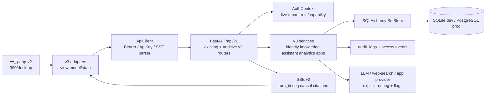
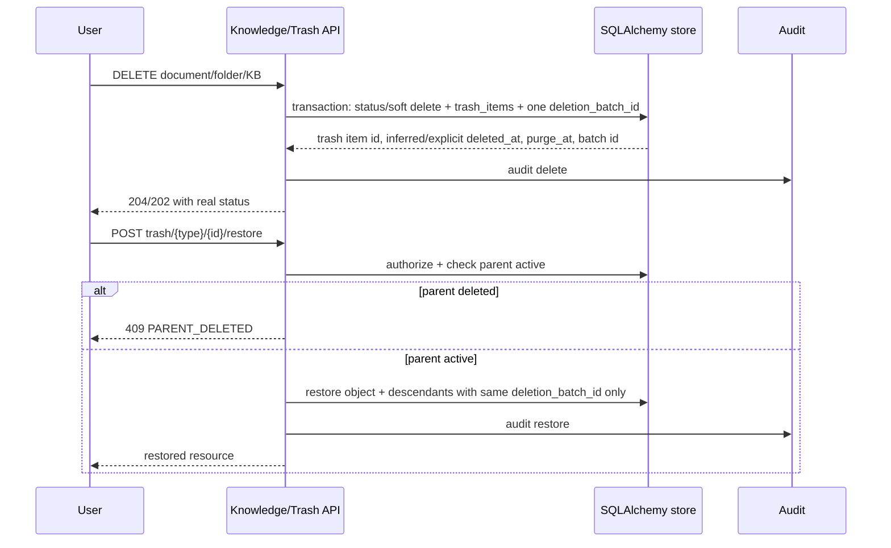

# EKB 设计稿十页全栈闭环 v3 技术规格

> 本规格是 v3 的 API、数据模型、前端边界和验证 authority。它把 [`01_requirements.md`](./01_requirements.md) 的 52 条 FR/18 条 NFR 转成可执行合同；执行任务见 [`03_plan.md`](./03_plan.md)，逐项证据见 [`04_verification-matrix.md`](./04_verification-matrix.md)。

## 1. 状态、范围与术语

**状态：已批准。** 规格中的所有选择已在 Decision Log 中闭合，没有未决问题；Sol 的 technical/security/QA document gate 已于 2026-08-10 通过。实现仍未发生；本 milestone 只产出文档，不声称代码、浏览器 QA 或 migration 已完成，也不声称用户审阅了最终文字。

术语：

- `tenant`：当前请求的租户边界；所有用户、角色、资源、事件和应用安装默认带 `tenant_id`。
- `subject`：已认证的用户或 API key 解析出的用户主体。
- `capability`：服务端按实时租户角色计算的权限字符串，例如 `team:user:read`、`app:manage`。
- `resource ACL`：KB、文档、文件夹或会话等资源自身的授权关系；租户角色不能绕过平台/资源策略的安全上限。
- `policy_version`：租户权限策略版本；角色/权限/分配变更时单调递增。
- `v3 adapter`：`apps/web/src/app-v2/adapters/**` 下只暴露 v2 view model 和 state 的 facade，不把 API 类型或 token 解析泄露给页面。

## 2. 现状代码路径与差距

### 2.1 后端现状

| 现状路径 | 已有职责 | v3 复用/扩展 |
|---|---|---|
| `apps/api/ekb_api/main.py` | FastAPI app、`/api/v1` router、CORS、request id、metrics | 保留入口；增量注册 v3 routers 和 migration verification hooks。 |
| `apps/api/ekb_api/core/db.py` | SQLite/PostgreSQL engine、imports all ORM models、`Base.metadata.create_all` before manual migrations | v3 must add a metadata boundary/guard so v3-owned tables are excluded from `create_all`; only `v3_00N_*.py` modules create them. `v3_fullstack.py` is aggregator/CLI only and has no table ownership/checksum. |
| `apps/api/ekb_api/models.py` | Tenant/User/KB/Document/Conversation/QA/Audit/ACL/Review/Version/Sync ORM | 保留已有模型；新增 v3 表，不删除或重命名旧列。 |
| `apps/api/ekb_api/core/auth.py` | Bearer 解析、`AuthContext`、refresh/revoke；当前 access token policy 固定为 1 | v3 保留 Bearer 和现有 JSON-body refresh；从持久化 `auth_sessions`、当前 DB membership/role 解析 subject/tenant/capability，不再信任旧 token capabilities。 |
| `apps/api/ekb_api/core/authorization.py` | `kb:read/write`、`qa:ask`、`audit:read`、`tenant:provision` | 保留旧常量；新增团队/应用/用户/回收/分析/项目等 capability。 |
| `apps/api/ekb_api/core/audit.py` + `store.py` | 脱敏 metadata、写读 audit、tenant filter | 复用脱敏与 trace；补高价值 read/access event 和 v3 actions。 |
| `apps/api/ekb_api/routers/kb.py` | KB/文档上传、软删除、重试、members | 旧路径兼容；新增分页文档、folder、tag、share、favorite、trash contracts。 |
| `apps/api/ekb_api/routers/admin.py` | users invite、tenants、ops dashboard、audit、reviews、sync、backup | 旧路径兼容；新增 users/roles/apps/analytics contracts。 |
| `apps/api/ekb_api/routers/qa.py` | SSE v1/v2、turn/cancel/citations | additive 扩展 request options 和 capability，不改变 envelope 主字段。 |
| `apps/api/ekb_api/schemas.py` | Pydantic request/response | 新增 v3 schemas；旧 schema 字段和 status 保持。 |
| `apps/api/ekb_api/store.py` | 所有 SQLAlchemy CRUD、租户过滤、聚合 | 以 domain service/store 方法承载事务和租户边界，router 不直接拼 SQL。 |

### 2.1 只读审计得到的兼容/安全债

以下事实是当前实现基线，不是目标行为，必须在对应前置竖切中清除：

1. `GET /me` 当前使用 store 的 first/dev user/tenant；access token 的 `policy_version` 固定为 1，AuthContext 信任 token capabilities。v3 的 `/me`、refresh 和每请求授权必须从 `auth_sessions` + live tenant membership/role 解析，并以双主体双租户测试证明不再 fallback。
2. QA turn get/cancel 当前只按 tenant，`is_cancelled`、seq 和终态更新甚至只按 `turn_id`；v3 必须让 actor+tenant 贯穿读取、取消、协作检查、seq、终态和独立 cancel audit。既有 QA-STREAM-09 的 Last-Event-ID replay 设计若未来纳入，必须另建 replay 表、合同和测试；`qa_turns` 不是 replay log，本 v3 不把它改称 replay log。
3. `GET /admin/ops/dashboard?days=` 当前接收参数但 store 未按日期过滤；analytics 竖切必须直接修复兼容端点并覆盖 1 天、90 天和边界日期测试。
4. 现有 `DocumentResponse` 没有 `file_size`，`Document` 也没有可靠 file size/object ref；KB create payload 虽有 tags 形状，但模型/store 未持久化 tags。v3 用 additive optional 列和 response 字段，旧数据默认 `null`，不猜测内容。
5. 现有 `PATCH /conversations/{id}` 已支持 rename/archive；v2 adapter 的 rename unavailable 声明过时，v3 只补 adapter/UI 映射，不添加重复 endpoint。
6. 当前文档版本 ingest 递增不可靠，diff 只有 added/removed/unchanged；v3 以事务锁/唯一约束保证递增，并 additive 增加 `changed`，保持旧 diff 字段。
7. SQLite 当前 `create_all` + ALTER 没有 version ledger/rollback；PostgreSQL pgvector 初始化异常被吞掉。五个 immutable migration 版本必须显式记录 checksum、verify、rollback，并对 pgvector 初始化失败 fail closed。
8. 现有 document idempotency 是先查后写且无唯一约束；QA quota 在 SQLite 并发下可能重复计数。迁移和兼容测试必须增加唯一索引、事务冲突测试和原子 quota 更新。
9. 现有 `POST /admin/users` 仅使用 `kb:write`；v3 引入 `team:user:manage`/更精确 capability，但保留旧端点和旧 capability 映射，contract test 证明旧调用不破坏。
10. `qa_turns`/messages 已存在，但 citations 当前不持久化；`message_citations` 是 additive relation/read model，不是重复替代。
11. `tenants.policy_version` 已存在且从 1 开始；v3 不重新拥有基础列，只增加与 role/assignment 同事务的原子递增和 live enforcement。
12. `document_versions` 已存在并有 checksum/version/chunk_count/snapshot 及 store create/list；`v3_002_content` 增加 tenant-safe FK/UNIQUE/backfill/version increment/changed 语义，不把版本概念误称为全新表。
13. 当前 app/provider secrets 只在 environment/in-memory 边界；v3 才新增租户级 Fernet 加密持久化、轮换和脱敏读取。
14. 当前 `init_db` 会先由 ORM metadata 创建所有已导入表；v3 migration/production verification 必须 fail closed 地证明 fresh/upgraded DB 的 v3 表不来自 `create_all`，并暴露可检索 audit/health 信号。开发/测试在 vector 非必需时可保留 fallback。

### 2.2 前端现状

| 现状路径 | 现状 | v3 目标 |
|---|---|---|
| `apps/web/src/app-v2/routes.ts` | 十个 hash routes 已定义 | 保持十页 route id；页面数据全部来自 v3 adapter。 |
| `apps/web/src/app-v2/AppV2.tsx` | 创建 ApiClient 并注入 auth/knowledge/doc/qa/admin services | 注入 v3 identity/knowledge/assistant/analytics/apps/trash/profile services。 |
| `apps/web/src/app-v2/pages/KnowledgePage.tsx`、`DocumentsPage.tsx` | 既有 KB/文档端点接入，部分高级操作显示缺口状态 | 替换为分页、folder、tag、share、favorite、batch、trash 真实 state。 |
| `apps/web/src/app-v2/pages/AssistantPage.tsx` | SSE v2/cancel/citation/feedback 已接入，模型/附件/联网等仍缺后端 | 接入项目、附件、model capability、deep thinking、web search。 |
| `apps/web/src/app-v2/pages/TeamPage.tsx`、`ProfilePage.tsx` | M5 已接入 me/members/invite/tenant 既有端点 | 接入用户目录、角色、profile/password/preferences/API key。 |
| `apps/web/src/app-v2/pages/AnalyticsPage.tsx`、`AppsPage.tsx`、`RecyclePage.tsx` | 存在占位/不可用状态 | 接入真实 analytics/apps/trash contracts。 |
| `apps/web/src/app-v2/adapters/*.ts` | adapter facade 与 v2 view model 已有边界 | 新增 v3 adapter，禁止页面直接导入 `src/lib/api.ts`。 |
| `apps/web/src/app-v2/tests/*.test.ts` | M2–M5 contract tests 为内联 runner | 为每个 vertical slice 增加真实 payload、错误、权限和状态断言。 |

### 2.3 不在当前代码中但由本规格新增的路径

实现阶段允许创建以下路径；本 doc-only milestone 不创建它们：

```text
apps/api/ekb_api/migrations/__init__.py
apps/api/ekb_api/migrations/v3_001_identity.py
apps/api/ekb_api/migrations/v3_002_content.py
apps/api/ekb_api/migrations/v3_003_assistant.py
apps/api/ekb_api/migrations/v3_004_analytics.py
apps/api/ekb_api/migrations/v3_005_apps.py
apps/api/ekb_api/migrations/v3_fullstack.py  # aggregator/CLI only; no table ownership
apps/api/ekb_api/routers/identity_v3.py
apps/api/ekb_api/routers/knowledge_v3.py
apps/api/ekb_api/routers/assistant_v3.py
apps/api/ekb_api/routers/analytics_v3.py
apps/api/ekb_api/routers/apps_v3.py
apps/api/ekb_api/routers/trash_v3.py
apps/api/ekb_api/routers/profile_v3.py
apps/api/ekb_api/services/v3_*.py
apps/api/tests/v3/test_*.py
apps/web/src/app-v2/adapters/v3*.ts
apps/web/src/app-v2/types/v3*.ts
apps/web/src/app-v2/tests/v3*.test.ts
```

## 3. Decision Log

| # | 选择 | 选项与权衡 | 决定与理由 |
|---|---|---|---|
| D1 | 运行时架构 | (a) 新微服务；(b) FastAPI 单体内模块化 router/service；(c) serverless functions。新服务隔离好但引入部署/一致性成本；serverless 与现有 SQLAlchemy/SQLite 不合。 | 选 (b)。保持现有单体、store、AuthContext 和审计边界，减少切换风险；以模块和 service 文件隔离复杂度。 |
| D2 | migration 机制 | (a) 立即引入 Alembic；(b) 继续只用 `create_all`；(c) 保留 create_all 兼容启动路径，增加五个 immutable、按竖切归属的版本函数和 aggregator。Alembic 更强但改变依赖与现状；单一 checksum 会在后续竖切追加实体时失效。 | 选 (c)。`v3_001_identity`→`v3_005_apps` 各自写 ledger/checksum；aggregator 只按顺序调用，verify/rollback 可按版本操作，不扩展依赖选型。 |
| D3 | 租户角色模型 | (a) 继续把 role/capabilities 放 token；(b) tenant roles + assignments + policy version + live `/me`；(c) 外部 policy service。token stale；外部服务越界。 | 选 (b)。内置角色 immutable、自定义角色租户内 CRUD，`/me` 不再取 first/dev store 对象，refresh/每请求授权读 live membership/role；`policy_version` 作为缓存失效键。 |
| D4 | API key 认证 | (a) 明文 key 落库；(b) prefix lookup + hash constant-time verify；(c) 只支持 OAuth client credentials。明文不可接受，OAuth 超出本范围。 | 选 (b)。创建响应一次性显示完整 key，后续 prefix-only；Bearer 用户 token 与 `Authorization: ApiKey` 兼容并独立审计。 |
| D5 | 通用资源关系 | (a) 每个资源单独 favorites 表；(b) `resource_favorites` 通用表；(c) 仅前端 local state。方案 (b) 减少重复 schema，需严格类型/唯一键；(c) 不持久化。 | 选 (b)。覆盖 KB/DOCUMENT/CONVERSATION，枚举约束和资源授权检查保证安全。 |
| D6 | trash 语义 | (a) 只用既有 `deleted_at/status`；(b) 独立 `trash_items` metadata + deletion batch；(c) 物理删除后无法恢复。现有 Document 没有 deleted_at，KB 删除会批量把文档 status 置 DELETED。 | 选 (b)。KB/Folder 级联后代共享 `deletion_batch_id`；独立删除使用自己的 batch；回填 Document 时以 `updated_at` 作为 inferred deleted_at 并写 `metadata.inferred=true`，父级恢复只恢复同 batch 后代。 |
| D7 | 访问分析事件 | (a) 只从 audit_logs 临时聚合；(b) 独立 bounded `resource_access_events`；(c) 引入事件队列。audit 维度不稳定，队列超出范围。 | 选 (b)。读事件体积可控、专用索引和 retention；关键 audit 仍写 `audit_logs`，事件写失败不阻塞问答但报警。 |
| D8 | 应用凭据 | (a) 使用 token secret；(b) 专用 Fernet key `EKB_APP_CREDENTIAL_KEY`；(c) 明文交给 provider。 | 选 (b)。密钥域隔离、可轮换、响应/审计可脱敏；生产缺 key 禁止启用 credential 写入。 |
| D9 | 应用安装与同步 | (a) install 自动创建并运行 sync；(b) installation/connect/run 与 sync source 分离；(c) 只保留 sync 当作安装。 | 选 (b)。用户可以区分“已安装”“已连接”“最近运行”和“下游同步”，避免成功语义混淆；不引入 queue/worker，v3 run 使用同步 provider call。 |
| D10 | 分页合同 | (a) 改旧 list 返回 envelope；(b) 新 list 使用 envelope，旧 list 保持数组；(c) 只返回 total。 | 选 (b)。旧 app-v2 和客户端不破坏；新列表统一 `{items,next_cursor,page_size}`，稳定 sort 防止重复/遗漏。 |
| D11 | web search 缺 provider | (a) 返回静态/模拟结果；(b) 隐藏能力；(c) 返回 capability disabled 或 409 capability unavailable，并说明配置路径。 | 选 (c)。产品真实表达部署差异；只有该非核心外部能力可在缺 provider 时 disabled，不能将核心需求泛化为缺口。 |
| D12 | SSE v2 扩展 | (a) 另开 v3 stream；(b) 在既有 v2 request/payload/envelope 上 additive 扩展；(c) 回退到 v1。 | 选 (b)。保留 turn/seq/cancel/citations/feedback 和旧 adapter 解析，未知字段可忽略，新增字段按 capability 控制。 |
| D13 | 前端切换 | (a) 立即替换旧 App；(b) app-v2 并行建设，完整验证后切换并审计删除；(c) 复用旧 UI 组件。 | 选 (b)。满足设计稿真值和 rollback，避免未完成页面接管生产；旧 UI 仅在无引用后删除。 |
| D14 | Sol/Luna 执行 | (a) 多 writer 并行改工作区；(b) Sol 串行调度一个 luna writer；(c) 直接把大需求交给一个执行器。 | 选 (b)。计划记录 `execution_mode=subagent-driven` 以便每任务隔离 review，但工作区写入严格单 writer 串行，符合本项目调度契约。 |
| D15 | refresh session 持久化 | (a) 继续 in-memory revoked JTIs；(b) 新建 `auth_sessions`，保存 jti hash、设备指纹和生命周期；(c) 只依赖 access token expiry。in-memory 无法跨进程/重启且无法列设备；只依赖 expiry 无法实现改密失效。 | 选 (b)。login/refresh/logout/password change 和 `/me/sessions` 都使用持久会话；密码变更撤销全部既有会话并要求重新认证。 |
| D16 | QA replay 与作用域 | (a) 把 `qa_turns` 当 replay log；(b) 当前 v3 只修 actor+tenant scope/cancel audit，Last-Event-ID 仍遵循 QA-STREAM-09；(c) 本期新增 replay 表和完整重放合同。 | 选 (b)。不伪称已有 replay；若另行纳入，必须新增专用表、contract 和 test，不改变本期范围。 |
| D17 | App run 执行语义 | (a) 202 QUEUED/RUNNING 但无 worker；(b) 同步 provider call，200 返回 `SUCCEEDED|FAILED`，504 可重试；(c) 增加可恢复 worker/claim loop。 | 选 (b)。保持单体无 queue/worker；UI 在请求期间显示 pending，服务端不创建不会完成的 durable job。 |
| D18 | legacy role backfill | (a) 把未知值静默映射为 `member`；(b) 按旧值建立确定性兼容角色，无法解析即失败；(c) 让 `platform_role` 覆盖 tenant role。静默映射会越权，平台角色与租户授权混淆边界。 | 选 (b)。`OWNER→owner`、`ADMIN→admin`、`MEMBER→member`、`CUSTOMER→legacy_customer`；后者仅有 `kb:read` + `qa:ask`，是 assigned 时不可删除的系统保护兼容角色，Team 明确显示 legacy compatibility；null/unknown role 或 unresolved tenant 是 hard verification failure，`platform_role` 独立保留。 |

## 4. 总体架构与数据流

### 4.1 系统架构



### 4.2 角色刷新与授权流

```mermaid
sequenceDiagram
  participant B as Browser
  participant A as Auth adapter
  participant API as FastAPI
  participant DB as Tenant DB
  B->>A: POST /auth/refresh JSON {refresh_token}
  A->>API: refresh token in request body
  API->>DB: hash jti lookup + session status + live membership/role
  DB-->>API: active session, actor, tenant, role, capabilities, policy_version
  API-->>A: new access token; GET /me separately returns live capability response
  A-->>B: AuthSession(policyVersion, capabilities)
  Note over API,DB: access token claims are advisory; request authorization uses live DB/cache keyed by policy_version
```

### 4.3 文档删除/恢复流



### 4.4 App credential / run 流

```mermaid
sequenceDiagram
  participant U as Admin
  participant API as Apps API
  participant DB as SQLAlchemy store
  participant P as Provider adapter
  U->>API: POST installation + configure credential
  API->>API: tenant/capability/flag/key validation
  API->>DB: installation + Fernet ciphertext
  API-->>U: prefix-only status (full secret only on create response)
  U->>API: POST connect/run
  API->>DB: read/decrypt credential in memory
  API->>P: provider handshake or run
  P-->>API: result/error
  API->>DB: synchronous result status + redacted audit; optional downstream sync state
  API-->>U: installation state and run result, never credential
  Note over API,P: no queue/worker; 200 SUCCEEDED|FAILED, provider timeout is 504 retryable
```

## 5. 数据模型与实际 SQL

### 5.1 数据类型与兼容规则

新表使用现有项目可映射的 `VARCHAR/TEXT/INTEGER/BOOLEAN/JSON` 类型；SQLite 允许 JSON 文本存储，PostgreSQL 映射为 JSONB 时由 SQLAlchemy dialect 处理。所有 id 使用 UUID 字符串以兼容现有 `String(36)`；时间沿用现有 UTC ISO 字符串。

DDL 的 ownership 是 immutable chain：`v3_001_identity` 负责 `schema_migrations`、身份/角色/profile/API key/`auth_sessions`；`v3_002_content` 负责 folder、文档组织关系、tags/favorites/shares/trash 以及既有 `documents` 的 additive `file_size/object_ref`/幂等/version 约束；`v3_003_assistant` 负责项目、附件、model options、web-search provider；`v3_004_analytics` 负责 access events；`v3_005_apps` 负责 app catalog/install/credentials/runs。以下 SQL 仍按表列出以便审查，但实现必须按 ownership 分文件执行，不能由一个全量 migration source 追加所有表。

### 5.2 v3 DDL

以下是 migration 必须执行的逻辑 DDL。`IF NOT EXISTS`、事务和 ledger 由 migration 函数统一处理；DDL 中的约束不得通过 `create_all` 隐式替代。

```sql
CREATE TABLE IF NOT EXISTS schema_migrations (
  version VARCHAR(64) PRIMARY KEY,
  applied_at VARCHAR(32) NOT NULL,
  checksum VARCHAR(128) NOT NULL
);

CREATE TABLE IF NOT EXISTS tenant_roles (
  id VARCHAR(36) PRIMARY KEY,
  tenant_id VARCHAR(36) NOT NULL,
  slug VARCHAR(64) NOT NULL,
  display_name VARCHAR(128) NOT NULL,
  description TEXT NOT NULL DEFAULT '',
  is_builtin BOOLEAN NOT NULL DEFAULT FALSE,
  is_system_protected BOOLEAN NOT NULL DEFAULT FALSE,
  created_by VARCHAR(36),
  created_at VARCHAR(32) NOT NULL,
  updated_at VARCHAR(32) NOT NULL,
  UNIQUE (tenant_id, slug),
  UNIQUE (tenant_id, id),
  FOREIGN KEY (tenant_id) REFERENCES tenants (id),
  FOREIGN KEY (created_by) REFERENCES users (id),
  CHECK (is_builtin IN (FALSE, TRUE)),
  CHECK (is_system_protected IN (FALSE, TRUE))
);

CREATE TABLE IF NOT EXISTS tenant_memberships (
  id VARCHAR(36) PRIMARY KEY,
  tenant_id VARCHAR(36) NOT NULL,
  user_id VARCHAR(36) NOT NULL,
  role_id VARCHAR(36) NOT NULL,
  status VARCHAR(32) NOT NULL DEFAULT 'ACTIVE',
  joined_at VARCHAR(32) NOT NULL,
  suspended_at VARCHAR(32),
  created_at VARCHAR(32) NOT NULL,
  updated_at VARCHAR(32) NOT NULL,
  UNIQUE (tenant_id, user_id),
  FOREIGN KEY (tenant_id) REFERENCES tenants (id),
  FOREIGN KEY (user_id) REFERENCES users (id),
  FOREIGN KEY (tenant_id, role_id) REFERENCES tenant_roles (tenant_id, id),
  CHECK (status IN ('ACTIVE', 'INVITED', 'SUSPENDED'))
);

CREATE TABLE IF NOT EXISTS role_permissions (
  role_id VARCHAR(36) NOT NULL,
  tenant_id VARCHAR(36) NOT NULL,
  capability VARCHAR(128) NOT NULL,
  created_at VARCHAR(32) NOT NULL,
  PRIMARY KEY (role_id, capability),
  FOREIGN KEY (tenant_id, role_id) REFERENCES tenant_roles (tenant_id, id),
  CHECK (capability <> '')
);

CREATE TABLE IF NOT EXISTS user_profiles (
  user_id VARCHAR(36) NOT NULL,
  tenant_id VARCHAR(36) NOT NULL,
  display_name VARCHAR(255) NOT NULL,
  department VARCHAR(255),
  locale VARCHAR(32) NOT NULL DEFAULT 'zh-CN',
  timezone VARCHAR(64) NOT NULL DEFAULT 'Asia/Shanghai',
  avatar_url VARCHAR(1024),
  created_at VARCHAR(32) NOT NULL,
  updated_at VARCHAR(32) NOT NULL,
  PRIMARY KEY (tenant_id, user_id),
  FOREIGN KEY (tenant_id, user_id) REFERENCES tenant_memberships (tenant_id, user_id)
);

CREATE TABLE IF NOT EXISTS user_preferences (
  user_id VARCHAR(36) NOT NULL,
  tenant_id VARCHAR(36) NOT NULL,
  notifications JSON NOT NULL,
  preferences JSON NOT NULL,
  updated_at VARCHAR(32) NOT NULL,
  PRIMARY KEY (tenant_id, user_id),
  FOREIGN KEY (tenant_id, user_id) REFERENCES tenant_memberships (tenant_id, user_id)
);

CREATE TABLE IF NOT EXISTS user_notifications (
  id VARCHAR(36) PRIMARY KEY,
  tenant_id VARCHAR(36) NOT NULL,
  user_id VARCHAR(36) NOT NULL,
  notification_type VARCHAR(64) NOT NULL,
  title VARCHAR(255) NOT NULL,
  body TEXT NOT NULL,
  metadata JSON NOT NULL,
  read_at VARCHAR(32),
  created_at VARCHAR(32) NOT NULL,
  FOREIGN KEY (tenant_id, user_id)
    REFERENCES tenant_memberships (tenant_id, user_id),
  CHECK (notification_type <> '')
);

CREATE TABLE IF NOT EXISTS api_keys (
  id VARCHAR(36) PRIMARY KEY,
  tenant_id VARCHAR(36) NOT NULL,
  user_id VARCHAR(36) NOT NULL,
  name VARCHAR(128) NOT NULL,
  prefix VARCHAR(16) NOT NULL,
  secret_hash VARCHAR(128) NOT NULL,
  status VARCHAR(32) NOT NULL DEFAULT 'ACTIVE',
  expires_at VARCHAR(32),
  last_used_at VARCHAR(32),
  created_at VARCHAR(32) NOT NULL,
  revoked_at VARCHAR(32),
  UNIQUE (prefix),
  FOREIGN KEY (tenant_id, user_id) REFERENCES tenant_memberships (tenant_id, user_id),
  CHECK (status IN ('ACTIVE', 'REVOKED', 'EXPIRED'))
);

CREATE TABLE IF NOT EXISTS auth_sessions (
  session_id VARCHAR(36) PRIMARY KEY,
  tenant_id VARCHAR(36) NOT NULL,
  user_id VARCHAR(36) NOT NULL,
  jti_hash VARCHAR(128) NOT NULL,
  status VARCHAR(32) NOT NULL DEFAULT 'ACTIVE',
  created_at VARCHAR(32) NOT NULL,
  last_used_at VARCHAR(32) NOT NULL,
  expires_at VARCHAR(32) NOT NULL,
  revoked_at VARCHAR(32),
  ip_hash VARCHAR(128),
  user_agent_hash VARCHAR(128),
  UNIQUE (jti_hash),
  FOREIGN KEY (tenant_id, user_id)
    REFERENCES tenant_memberships (tenant_id, user_id),
  CHECK (status IN ('ACTIVE', 'REVOKED', 'EXPIRED'))
);

CREATE TABLE IF NOT EXISTS folders (
  id VARCHAR(36) PRIMARY KEY,
  tenant_id VARCHAR(36) NOT NULL,
  kb_id VARCHAR(36) NOT NULL,
  parent_id VARCHAR(36),
  name VARCHAR(255) NOT NULL,
  deleted_at VARCHAR(32),
  deleted_by VARCHAR(36),
  created_by VARCHAR(36) NOT NULL,
  created_at VARCHAR(32) NOT NULL,
  updated_at VARCHAR(32) NOT NULL,
  UNIQUE (tenant_id, kb_id, parent_id, name),
  UNIQUE (tenant_id, id),
  UNIQUE (tenant_id, kb_id, id),
  FOREIGN KEY (tenant_id) REFERENCES tenants (id),
  FOREIGN KEY (kb_id) REFERENCES knowledge_bases (id),
  FOREIGN KEY (tenant_id, kb_id, parent_id) REFERENCES folders (tenant_id, kb_id, id),
  FOREIGN KEY (tenant_id, deleted_by) REFERENCES tenant_memberships (tenant_id, user_id),
  FOREIGN KEY (tenant_id, created_by) REFERENCES tenant_memberships (tenant_id, user_id)
);

CREATE TABLE IF NOT EXISTS document_folder_links (
  tenant_id VARCHAR(36) NOT NULL,
  document_id VARCHAR(36) NOT NULL,
  folder_id VARCHAR(36) NOT NULL,
  created_at VARCHAR(32) NOT NULL,
  PRIMARY KEY (tenant_id, document_id),
  FOREIGN KEY (document_id) REFERENCES documents (id),
  FOREIGN KEY (tenant_id, folder_id) REFERENCES folders (tenant_id, id)
);

CREATE TABLE IF NOT EXISTS tags (
  id VARCHAR(36) PRIMARY KEY,
  tenant_id VARCHAR(36) NOT NULL,
  name VARCHAR(64) NOT NULL,
  color VARCHAR(32),
  created_at VARCHAR(32) NOT NULL,
  UNIQUE (tenant_id, name),
  FOREIGN KEY (tenant_id) REFERENCES tenants (id)
);

CREATE TABLE IF NOT EXISTS resource_tags (
  tenant_id VARCHAR(36) NOT NULL,
  resource_type VARCHAR(32) NOT NULL,
  resource_id VARCHAR(36) NOT NULL,
  tag_id VARCHAR(36) NOT NULL,
  created_at VARCHAR(32) NOT NULL,
  PRIMARY KEY (tenant_id, resource_type, resource_id, tag_id),
  FOREIGN KEY (tenant_id, tag_id) REFERENCES tags (tenant_id, id),
  CHECK (resource_type IN ('KB', 'DOCUMENT', 'CONVERSATION'))
);

CREATE TABLE IF NOT EXISTS resource_favorites (
  tenant_id VARCHAR(36) NOT NULL,
  user_id VARCHAR(36) NOT NULL,
  resource_type VARCHAR(32) NOT NULL,
  resource_id VARCHAR(36) NOT NULL,
  created_at VARCHAR(32) NOT NULL,
  PRIMARY KEY (tenant_id, user_id, resource_type, resource_id),
  FOREIGN KEY (tenant_id, user_id) REFERENCES tenant_memberships (tenant_id, user_id),
  CHECK (resource_type IN ('KB', 'DOCUMENT', 'CONVERSATION'))
);

CREATE TABLE IF NOT EXISTS document_shares (
  id VARCHAR(36) PRIMARY KEY,
  tenant_id VARCHAR(36) NOT NULL,
  document_id VARCHAR(36) NOT NULL,
  subject_type VARCHAR(32) NOT NULL,
  subject_id VARCHAR(36) NOT NULL,
  permission VARCHAR(32) NOT NULL,
  granted_by VARCHAR(36) NOT NULL,
  expires_at VARCHAR(32),
  created_at VARCHAR(32) NOT NULL,
  revoked_at VARCHAR(32),
  UNIQUE (tenant_id, document_id, subject_type, subject_id),
  FOREIGN KEY (document_id) REFERENCES documents (id),
  FOREIGN KEY (tenant_id, granted_by) REFERENCES tenant_memberships (tenant_id, user_id),
  CHECK (subject_type IN ('USER', 'ROLE')),
  CHECK (permission IN ('READ', 'COMMENT'))
);

CREATE TABLE IF NOT EXISTS trash_items (
  id VARCHAR(36) PRIMARY KEY,
  tenant_id VARCHAR(36) NOT NULL,
  resource_type VARCHAR(32) NOT NULL,
  resource_id VARCHAR(36) NOT NULL,
  parent_type VARCHAR(32),
  parent_id VARCHAR(36),
  deleted_by VARCHAR(36) NOT NULL,
  deleted_at VARCHAR(32) NOT NULL,
  deletion_batch_id VARCHAR(36) NOT NULL,
  purge_at VARCHAR(32) NOT NULL,
  restored_at VARCHAR(32),
  purged_at VARCHAR(32),
  metadata JSON NOT NULL,
  UNIQUE (tenant_id, resource_type, resource_id),
  FOREIGN KEY (tenant_id, deleted_by) REFERENCES tenant_memberships (tenant_id, user_id),
  CHECK (resource_type IN ('KB', 'DOCUMENT', 'FOLDER')),
  CHECK (purge_at >= deleted_at)
);

CREATE TABLE IF NOT EXISTS projects (
  id VARCHAR(36) PRIMARY KEY,
  tenant_id VARCHAR(36) NOT NULL,
  name VARCHAR(255) NOT NULL,
  description TEXT NOT NULL DEFAULT '',
  owner_id VARCHAR(36) NOT NULL,
  created_at VARCHAR(32) NOT NULL,
  updated_at VARCHAR(32) NOT NULL,
  deleted_at VARCHAR(32),
  UNIQUE (tenant_id, id),
  FOREIGN KEY (tenant_id) REFERENCES tenants (id),
  FOREIGN KEY (tenant_id, owner_id) REFERENCES tenant_memberships (tenant_id, user_id)
);

CREATE TABLE IF NOT EXISTS project_members (
  tenant_id VARCHAR(36) NOT NULL,
  project_id VARCHAR(36) NOT NULL,
  user_id VARCHAR(36) NOT NULL,
  role VARCHAR(32) NOT NULL DEFAULT 'MEMBER',
  created_at VARCHAR(32) NOT NULL,
  PRIMARY KEY (tenant_id, project_id, user_id),
  FOREIGN KEY (tenant_id, project_id) REFERENCES projects (tenant_id, id),
  FOREIGN KEY (tenant_id, user_id) REFERENCES tenant_memberships (tenant_id, user_id),
  CHECK (role IN ('OWNER', 'MEMBER'))
);

CREATE TABLE IF NOT EXISTS conversation_projects (
  tenant_id VARCHAR(36) NOT NULL,
  conversation_id VARCHAR(36) NOT NULL,
  project_id VARCHAR(36) NOT NULL,
  created_at VARCHAR(32) NOT NULL,
  PRIMARY KEY (tenant_id, conversation_id, project_id),
  FOREIGN KEY (conversation_id) REFERENCES conversations (id),
  FOREIGN KEY (tenant_id, project_id) REFERENCES projects (tenant_id, id)
);

CREATE TABLE IF NOT EXISTS conversation_attachments (
  id VARCHAR(36) PRIMARY KEY,
  tenant_id VARCHAR(36) NOT NULL,
  conversation_id VARCHAR(36) NOT NULL,
  document_id VARCHAR(36) NOT NULL,
  added_by VARCHAR(36) NOT NULL,
  source VARCHAR(32) NOT NULL,
  created_at VARCHAR(32) NOT NULL,
  removed_at VARCHAR(32),
  FOREIGN KEY (conversation_id) REFERENCES conversations (id),
  FOREIGN KEY (document_id) REFERENCES documents (id),
  FOREIGN KEY (tenant_id, added_by) REFERENCES tenant_memberships (tenant_id, user_id),
  CHECK (source IN ('EXISTING', 'UPLOAD'))
);

CREATE TABLE IF NOT EXISTS message_citations (
  id VARCHAR(36) PRIMARY KEY,
  tenant_id VARCHAR(36) NOT NULL,
  message_id VARCHAR(36) NOT NULL,
  document_id VARCHAR(36),
  turn_id VARCHAR(64),
  citation_index INTEGER NOT NULL,
  source_type VARCHAR(32) NOT NULL,
  source_ref VARCHAR(1024) NOT NULL,
  quote TEXT,
  created_at VARCHAR(32) NOT NULL,
  UNIQUE (tenant_id, message_id, citation_index),
  FOREIGN KEY (message_id) REFERENCES messages (id),
  FOREIGN KEY (document_id) REFERENCES documents (id),
  CHECK (source_type IN ('DOCUMENT', 'WEB', 'OTHER')),
  CHECK (citation_index >= 0)
);

CREATE TABLE IF NOT EXISTS tenant_model_options (
  tenant_id VARCHAR(36) NOT NULL,
  model_id VARCHAR(128) NOT NULL,
  display_name VARCHAR(255) NOT NULL,
  capabilities JSON NOT NULL,
  enabled BOOLEAN NOT NULL DEFAULT TRUE,
  created_at VARCHAR(32) NOT NULL,
  updated_at VARCHAR(32) NOT NULL,
  PRIMARY KEY (tenant_id, model_id),
  FOREIGN KEY (tenant_id) REFERENCES tenants (id)
);

CREATE TABLE IF NOT EXISTS web_search_providers (
  id VARCHAR(36) PRIMARY KEY,
  tenant_id VARCHAR(36) NOT NULL,
  provider VARCHAR(64) NOT NULL,
  encrypted_config TEXT NOT NULL,
  key_version VARCHAR(32) NOT NULL,
  previous_key_version VARCHAR(32),
  previous_encrypted_config TEXT,
  previous_expires_at VARCHAR(32),
  enabled BOOLEAN NOT NULL DEFAULT FALSE,
  created_by VARCHAR(36) NOT NULL,
  created_at VARCHAR(32) NOT NULL,
  updated_at VARCHAR(32) NOT NULL,
  UNIQUE (tenant_id, provider),
  FOREIGN KEY (tenant_id) REFERENCES tenants (id),
  FOREIGN KEY (tenant_id, created_by) REFERENCES tenant_memberships (tenant_id, user_id)
);

CREATE TABLE IF NOT EXISTS resource_access_events (
  id VARCHAR(36) PRIMARY KEY,
  tenant_id VARCHAR(36) NOT NULL,
  actor_id VARCHAR(36),
  resource_type VARCHAR(32) NOT NULL,
  resource_id VARCHAR(36) NOT NULL,
  action VARCHAR(64) NOT NULL,
  result VARCHAR(32) NOT NULL,
  trace_id VARCHAR(64) NOT NULL,
  created_at VARCHAR(32) NOT NULL,
  FOREIGN KEY (tenant_id) REFERENCES tenants (id),
  FOREIGN KEY (tenant_id, actor_id)
    REFERENCES tenant_memberships (tenant_id, user_id),
  CHECK (result IN ('SUCCESS', 'FAILURE', 'DENIED'))
);

CREATE TABLE IF NOT EXISTS support_feedback (
  id VARCHAR(36) PRIMARY KEY,
  tenant_id VARCHAR(36) NOT NULL,
  user_id VARCHAR(36) NOT NULL,
  page_path VARCHAR(255) NOT NULL,
  category VARCHAR(64) NOT NULL,
  message TEXT NOT NULL,
  request_id VARCHAR(128),
  status VARCHAR(32) NOT NULL DEFAULT 'OPEN',
  created_at VARCHAR(32) NOT NULL,
  updated_at VARCHAR(32) NOT NULL,
  FOREIGN KEY (tenant_id, user_id)
    REFERENCES tenant_memberships (tenant_id, user_id),
  CHECK (status IN ('OPEN', 'CLOSED')),
  CHECK (message <> '')
);

CREATE TABLE IF NOT EXISTS app_catalog (
  slug VARCHAR(64) PRIMARY KEY,
  display_name VARCHAR(128) NOT NULL,
  provider_name VARCHAR(128) NOT NULL,
  description TEXT NOT NULL,
  category VARCHAR(64) NOT NULL,
  capabilities JSON NOT NULL,
  recommended_rank INTEGER NOT NULL DEFAULT 0,
  enabled BOOLEAN NOT NULL DEFAULT TRUE,
  created_at VARCHAR(32) NOT NULL,
  updated_at VARCHAR(32) NOT NULL,
  CHECK (slug IN ('feishu', 'wecom', 'github', 'tencent-docs', 'analytics-pro', 'audit'))
);

CREATE TABLE IF NOT EXISTS app_installations (
  id VARCHAR(36) PRIMARY KEY,
  tenant_id VARCHAR(36) NOT NULL,
  app_slug VARCHAR(64) NOT NULL,
  status VARCHAR(32) NOT NULL DEFAULT 'INSTALLED',
  config JSON NOT NULL,
  installed_by VARCHAR(36) NOT NULL,
  installed_at VARCHAR(32) NOT NULL,
  updated_at VARCHAR(32) NOT NULL,
  uninstalled_at VARCHAR(32),
  UNIQUE (tenant_id, app_slug),
  UNIQUE (tenant_id, id),
  FOREIGN KEY (tenant_id) REFERENCES tenants (id),
  FOREIGN KEY (app_slug) REFERENCES app_catalog (slug),
  FOREIGN KEY (installed_by) REFERENCES users (id),
  FOREIGN KEY (tenant_id, installed_by)
    REFERENCES tenant_memberships (tenant_id, user_id),
  CHECK (status IN ('INSTALLED', 'CONFIGURED', 'CONNECTED', 'UNINSTALLED'))
);

CREATE TABLE IF NOT EXISTS app_credentials (
  id VARCHAR(36) PRIMARY KEY,
  tenant_id VARCHAR(36) NOT NULL,
  installation_id VARCHAR(36) NOT NULL,
  credential_name VARCHAR(128) NOT NULL,
  prefix VARCHAR(32) NOT NULL,
  ciphertext TEXT NOT NULL,
  key_version VARCHAR(32) NOT NULL,
  previous_ciphertext TEXT,
  previous_key_version VARCHAR(32),
  previous_expires_at VARCHAR(32),
  status VARCHAR(32) NOT NULL DEFAULT 'ACTIVE',
  created_at VARCHAR(32) NOT NULL,
  updated_at VARCHAR(32) NOT NULL,
  revoked_at VARCHAR(32),
  UNIQUE (tenant_id, installation_id, credential_name),
  FOREIGN KEY (tenant_id, installation_id)
    REFERENCES app_installations (tenant_id, id),
  CHECK (status IN ('ACTIVE', 'REVOKED'))
);

CREATE TABLE IF NOT EXISTS app_runs (
  id VARCHAR(36) PRIMARY KEY,
  tenant_id VARCHAR(36) NOT NULL,
  installation_id VARCHAR(36) NOT NULL,
  run_type VARCHAR(64) NOT NULL,
  status VARCHAR(32) NOT NULL,
  sync_source_id VARCHAR(36),
  result_redacted JSON NOT NULL,
  started_at VARCHAR(32) NOT NULL,
  completed_at VARCHAR(32),
  error_code VARCHAR(64),
  error_message TEXT,
  FOREIGN KEY (tenant_id, installation_id)
    REFERENCES app_installations (tenant_id, id),
  FOREIGN KEY (sync_source_id) REFERENCES sync_sources (id),
  CHECK (status IN ('SUCCEEDED', 'FAILED'))
);
```

### 5.2.1 Version ownership, FK/CHECK 和既有表 additive SQL

五个 migration 文件的执行顺序和可验证对象如下；每个版本成功后立刻写自己的 `schema_migrations` 行，之后任何 source 改动都必须生成新版本，不能修改已应用文件：

| Version | 首个竖切 | 本版本新增/变更 | rollback 顺序 |
|---|---|---|---|
| `v3_001_identity` | V3-T01 | `schema_migrations`、roles/membership/profile/preferences/`user_notifications`/API keys/`auth_sessions` | 删除 v3_001 新表，先撤销 notifications/session/key，再 role/profile，再 membership/roles；旧 users/tenants 不删 |
| `v3_002_content` | V3-T07 | folder/content relation/tags/favorites/shares/trash；existing `documents` optional columns/indexes；version uniqueness/diff contract | 先清理 v3 trash/relations，再删新表；旧 documents optional columns 保留以便兼容 |
| `v3_003_assistant` | V3-T13 | projects/attachments/message_citations/model options/web-search provider | 先撤销 provider/citations/attachments/relation，再删 project tables |
| `v3_004_analytics` | V3-T19 | bounded `resource_access_events`、`support_feedback`、时间/资源/反馈索引 | 先停止 event/feedback writer，再按 feedback/event table/index 回滚 |
| `v3_005_apps` | V3-T25 | six-row catalog/install/credentials/runs | runs→credentials→installations→catalog，audit 不动 |

`v3_fullstack.py` 是唯一 aggregator/verify/rollback CLI，按上述顺序调用五个 immutable module；它不能包含第二份 `CREATE TABLE` 或共同 checksum。其 `--verify` 必须列出五个 version/checksum、各版本 table/index、FK/CHECK、backfill counts、six catalog rows；其 `--rollback --dry-run --reverse` 按反序输出 down plan，真实 down 需要显式 `--allow-data-loss` 且先证明没有活动安装、运行、未过 retention 的 trash。

对跨 SQLite/PostgreSQL 都可执行的关键 FK/CHECK，实际 `CREATE TABLE` 必须包含上方约束；migration runner 的建表顺序为 `tenant_roles → tenant_memberships → profiles/preferences/notifications/keys/sessions`，避免循环依赖。`user_notifications` 和 `support_feedback` 的 tenant/user 外键禁止跨租户写入；`app_credentials`/`app_runs` 的复合 installation 外键禁止把一租户的 installation 绑定到另一租户。多态资源（`resource_tags.resource_id`、`resource_favorites.resource_id`、`trash_items.resource_id`、share subject）无法用单一跨表 FK 表达，采用 `service + verifier`：写入事务必须先做同 tenant/resource type 存在和 ACL 查询，verify fixture 插入跨 tenant/id 不匹配并必须失败；这不是省略校验。

```sql
-- v3_002_content：只在列不存在时由 dialect-aware runner 执行；两列都 nullable，旧响应保持兼容。
ALTER TABLE documents ADD COLUMN file_size INTEGER;
ALTER TABLE documents ADD COLUMN object_ref VARCHAR(1024);

-- 旧文档不可靠 size/object ref 不猜测；response 映射为 null，上传/新 ingest 才写真实值。
CREATE UNIQUE INDEX IF NOT EXISTS uq_documents_tenant_idempotency
  ON documents (tenant_id, idempotency_key)
  WHERE idempotency_key IS NOT NULL;
CREATE UNIQUE INDEX IF NOT EXISTS uq_document_versions_tenant_doc_version
  ON document_versions (tenant_id, doc_id, version);
CREATE INDEX IF NOT EXISTS ix_auth_sessions_user_status
  ON auth_sessions (tenant_id, user_id, status, last_used_at DESC);
CREATE INDEX IF NOT EXISTS ix_auth_sessions_jti_status
  ON auth_sessions (jti_hash, status);
CREATE INDEX IF NOT EXISTS ix_notifications_user_unread
  ON user_notifications (tenant_id, user_id, read_at, created_at DESC);
CREATE INDEX IF NOT EXISTS ix_trash_batch
  ON trash_items (tenant_id, deletion_batch_id, resource_type, restored_at, purged_at);
```

Migration preflight first reports duplicate `(tenant_id,idempotency_key)` and duplicate document versions. It does not delete or merge rows automatically; a non-empty duplicate report blocks that phase. On SQLite, the runner executes `PRAGMA foreign_keys=ON` on every connection and verifier asserts `PRAGMA foreign_keys` equals `1`; PostgreSQL verification uses `pg_constraint` and `EXPLAIN`. PostgreSQL pgvector extension/initialization errors are returned as migration failures and are not swallowed.

Existing `Document` deletion semantics are explicit: `Document` has no `deleted_at`; standalone document deletion and KB cascade use `status='DELETED'` and set `updated_at` to deletion time. During `v3_002_content` backfill, `trash_items.deleted_at = documents.updated_at`, `metadata = {"inferred":true,"source":"documents.updated_at","reason":"legacy_status_deleted"}`, and `deletion_batch_id` is a new batch per legacy delete group. A legacy KB cascade is one group; an independently deleted document gets its own group. New KB/Folder cascade allocates one batch id and writes it to every affected descendant. Restoring a parent updates only rows whose `deletion_batch_id` equals the parent batch; independent child rows remain deleted. Purge never removes `audit_logs`.

`resource_tags` is the persistence layer for KB/document tags; the existing KB create `tags` request field is not treated as already persisted until this migration/service path writes it. `DocumentResponse.file_size` and `object_ref` are additive optional fields with `null` default/backfill; contract tests assert old clients deserialize the response and new clients do not display a guessed size. Version ingest locks the document row, chooses `max(document_versions.version)+1`, writes a unique version row and sets `Document.version` in one transaction. Diff keeps `added/removed/unchanged` and adds `changed[]` matched by stable chunk identity where content hash or metadata differs.

### 5.2.2 Existing model backfill and citation history

`message_citations` is the durable citation read model. V3-T13 creates it with message/document FK checks, unique `(tenant_id,message_id,citation_index)` and indexes; V3-T17 writes citations in the same transaction as the final assistant message (or an explicit terminal partial message), and conversation/message reads join it after hard reload. Web citations use `source_type=WEB` and authorized provider metadata only; purge removes business citation rows according to message retention but preserves audit.

`init_db` metadata boundary is mandatory: legacy `Base.metadata.create_all` may create only an allowlisted legacy table set; a v3 table name in the `create_all` allowlist is a verification failure. The runner registers v3 DDL outside that metadata call, applies the five immutable versions, then writes ledger/checksum. Fresh and upgraded fixtures must compare `sqlite_master`/PostgreSQL catalog provenance against the ledger and fail if a v3 table exists without its version row. PostgreSQL vector initialization is environment-sensitive: when vector is required by migration/production verification, an exception aborts startup/migration and writes a visible health/audit failure; when vector is explicitly not required in dev/test, fallback is allowed only with a health signal stating `vector_required=false`.

`document_versions` is an existing table/model with store create/list. `v3_002_content` validates every legacy row's `tenant_id,doc_id` against `documents`, adds/verifies a cross-dialect FK to `documents(id)`, enforces UNIQUE `(tenant_id,doc_id,version)` (contract alias `document_id`), and backfills only verified history. Ingest locks the document row, picks `max(version)+1`, writes the version and updates `Document.version` atomically; diff preserves `added/removed/unchanged` and adds `changed[]`. Rollback removes only v3 indexes/constraints and never deletes version history; verification checks row counts/checksums before and after dry-run.

All commands in this document and plan are planned future gates, not current evidence: v3 migration modules, v3 tests, aggregator CLI behavior, frontend test runner, and browser evidence are created/configured by the named tasks. The doc-only milestone has not run them.

### 5.3 Seed and migration invariants

1. 五个 ledger version 分别固定自己的 source checksum；同 version 重跑 checksum 相同才返回 already-applied，checksum mismatch 是 hard stop；aggregator 不产生单一全量 checksum。
2. 每个已有 tenant 创建内置 `owner/admin/member/auditor` role 和 `role_permissions`，并按旧值做非升级性 backfill：`OWNER→owner`、`ADMIN→admin`、`MEMBER→member`、`CUSTOMER→legacy_customer`。`legacy_customer` 的 slug 固定、`is_system_protected=true`、display label 为 `Customer (legacy compatibility)`，且 `role_permissions` 恰好只有 `kb:read` 与 `qa:ask`；它被分配时 role API/UI 返回 409 拒绝删除并显示兼容标识。每个已有 user 创建一个 `tenant_memberships`；null/unknown `users.role`、无法唯一解析的 `users.tenant_id` 或 unresolved tenant 都是 migration verification failure，绝不猜测；旧 `platform_role` 独立保留，不参与 tenant role 映射。
3. 既有 `status=DELETED` 的 KB/document 使用 legacy backfill：KB 的 status cascade 视为一个 `deletion_batch_id`，独立 document 视为单独 batch；Document 的 `updated_at` 是 inferred deleted_at，metadata 必须包含 `inferred=true`，`purge_at=deleted_at+30d`；现有 audit 不回填为 access event。
4. `file_size`/`object_ref` 是 nullable additive columns，旧 documents backfill 为 null；重复 document idempotency/version 先报告并阻止 migration，不做无授权合并。
5. app_catalog 只 seed 六条固定 slug；重复 seed 使用 upsert，不覆盖 tenant installation/config。`app_runs` 是同步 provider call 的结果记录，只允许 `SUCCEEDED|FAILED`，不 seed QUEUED/RUNNING durable job。
6. migration 在事务中创建自己的表和普通索引；PostgreSQL 使用 dialect transaction，SQLite 使用 `IF NOT EXISTS`，每个 SQLite connection 开启并验证 `PRAGMA foreign_keys=ON`。
7. 关键新表使用 FK/CHECK；多态资源关系由 service authorization + migration verifier 补偿，verify 必须包含跨租户/错误 parent/app installation fixture。
8. Legacy role backfill 是可审计、非升级性且可回滚验证的单独步骤：先报告 null/unknown role、unresolved tenant 和既有重复 membership，任一非空即停止；通过后只写确定性 mapping 和 exact `legacy_customer` capabilities。rollback dry-run 在兼容角色仍被 assignment 时阻止删除并保留数据，flag-off 由旧代码忽略新增角色；未分配的纯 v3 seed role 才可在显式 `--allow-data-loss` 下逆序移除，`platform_role` 与旧 user 记录不改写。

### 5.4 索引与查询预算

```sql
CREATE INDEX IF NOT EXISTS ix_memberships_tenant_status
  ON tenant_memberships (tenant_id, status, updated_at DESC);
CREATE INDEX IF NOT EXISTS ix_memberships_tenant_user
  ON tenant_memberships (tenant_id, user_id);
CREATE INDEX IF NOT EXISTS ix_auth_sessions_user_status
  ON auth_sessions (tenant_id, user_id, status, last_used_at DESC);
CREATE INDEX IF NOT EXISTS ix_auth_sessions_jti_status
  ON auth_sessions (jti_hash, status);
CREATE INDEX IF NOT EXISTS ix_roles_tenant_builtin
  ON tenant_roles (tenant_id, is_builtin, slug);
CREATE INDEX IF NOT EXISTS ix_folders_tenant_kb_parent
  ON folders (tenant_id, kb_id, parent_id, deleted_at, name);
CREATE INDEX IF NOT EXISTS ix_doc_folder_tenant_folder
  ON document_folder_links (tenant_id, folder_id, document_id);
CREATE INDEX IF NOT EXISTS ix_tags_tenant_name
  ON tags (tenant_id, name);
CREATE INDEX IF NOT EXISTS ix_resource_tags_lookup
  ON resource_tags (tenant_id, resource_type, resource_id);
CREATE INDEX IF NOT EXISTS ix_favorites_user_resource
  ON resource_favorites (tenant_id, user_id, resource_type, created_at DESC);
CREATE INDEX IF NOT EXISTS ix_shares_document_active
  ON document_shares (tenant_id, document_id, revoked_at, expires_at);
CREATE INDEX IF NOT EXISTS ix_trash_tenant_purge
  ON trash_items (tenant_id, purged_at, purge_at, deleted_at DESC);
CREATE INDEX IF NOT EXISTS ix_trash_batch
  ON trash_items (tenant_id, deletion_batch_id, resource_type, restored_at, purged_at);
CREATE INDEX IF NOT EXISTS ix_projects_tenant_updated
  ON projects (tenant_id, deleted_at, updated_at DESC);
CREATE INDEX IF NOT EXISTS ix_conversation_project_lookup
  ON conversation_projects (tenant_id, project_id, created_at DESC);
CREATE INDEX IF NOT EXISTS ix_attachments_conversation_active
  ON conversation_attachments (tenant_id, conversation_id, removed_at, created_at);
CREATE INDEX IF NOT EXISTS ix_message_citations_message
  ON message_citations (tenant_id, message_id, citation_index);
CREATE INDEX IF NOT EXISTS ix_message_citations_document
  ON message_citations (tenant_id, document_id, created_at DESC);
CREATE INDEX IF NOT EXISTS ix_model_options_tenant_enabled
  ON tenant_model_options (tenant_id, enabled, model_id);
CREATE INDEX IF NOT EXISTS ix_access_events_tenant_time
  ON resource_access_events (tenant_id, created_at DESC, resource_type);
CREATE INDEX IF NOT EXISTS ix_access_events_resource
  ON resource_access_events (tenant_id, resource_type, resource_id, created_at DESC);
CREATE INDEX IF NOT EXISTS ix_support_feedback_tenant_status
  ON support_feedback (tenant_id, status, created_at DESC);
CREATE INDEX IF NOT EXISTS ix_app_installations_tenant_status
  ON app_installations (tenant_id, status, updated_at DESC);
CREATE INDEX IF NOT EXISTS ix_app_credentials_installation_status
  ON app_credentials (tenant_id, installation_id, status);
CREATE INDEX IF NOT EXISTS ix_app_runs_installation_time
  ON app_runs (tenant_id, installation_id, started_at DESC);
```

Dashboard queries must use `ix_access_events_tenant_time` for date-bounded counts and `ix_access_events_resource` for recent resource joins. The verification script runs `EXPLAIN`/`EXPLAIN QUERY PLAN` and fails if the bounded queries scan the full events table in the synthetic 1,000,000-events-per-tenant/90-day fixture.

### 5.5 Migration and rollback scripts

- Forward aggregator: `cd /Users/alin/EKB/apps/api && /Users/alin/EKB/.venv/bin/python -m ekb_api.migrations.v3_fullstack --database-url "$EKB_DATABASE_URL" --through v3_005_apps --verify`. It invokes `v3_001_identity`, `v3_002_content`, `v3_003_assistant`, `v3_004_analytics`, `v3_005_apps` in order; each module owns only its vertical slice.
- Verify: `cd /Users/alin/EKB/apps/api && /Users/alin/EKB/.venv/bin/python -m ekb_api.migrations.v3_fullstack --database-url "$EKB_DATABASE_URL" --through v3_005_apps --verify --expect-versions v3_001_identity,v3_002_content,v3_003_assistant,v3_004_analytics,v3_005_apps` must print every version/checksum, `tables=29`, `indexes>=26`, `seed_apps=6`, backfill counts, FK/CHECK and `status=PASS`.
- Pre-production rollback: `cd /Users/alin/EKB/apps/api && /Users/alin/EKB/.venv/bin/python -m ekb_api.migrations.v3_fullstack --database-url "$EKB_DATABASE_URL" --through v3_005_apps --rollback --dry-run --reverse --expect-versions v3_001_identity,v3_002_content,v3_003_assistant,v3_004_analytics,v3_005_apps` must list `v3_005_apps` through `v3_001_identity`, only v3-owned objects, no audit deletion, and no destructive action. Executing down requires `--allow-data-loss`, zero active installations/runs and an explicit trash retention check.
- Production rollback: disable v3 flags and deploy the previous compatible code. New additive tables/columns remain untouched so old code can read existing contracts; this is the data-preserving rollback. A later cleanup is a separately approved version, never an edit to an applied migration.
- Migration failure: the current version transaction rolls back with no partial ledger row; previous applied versions remain recorded. A checksum mismatch, FK/CHECK violation, duplicate idempotency/version, missing `EKB_APP_CREDENTIAL_KEY` for credential migration, or swallowed pgvector initialization error is a hard stop, not an auto-repair.

## 6. 通用 API 合同

### 6.1 Base URL、认证、分页与错误

- Base URL: `/api/v1`；所有新增 path 均在此 prefix 下。
- User auth: `Authorization: Bearer <access_token>`；API key auth: `Authorization: ApiKey ekb_<prefix>_<secret>`。Because the ApiKey header carries no tenant, `prefix` is globally unique; lookup uses prefix, cryptographic hash verification occurs before resolving the row's tenant membership and live role/capabilities, and the client cannot provide tenant/role as an authority.
- New list response is exactly JSON `{items,next_cursor,page_size}` (no alternate `total` envelope): `items` is an array, `next_cursor` is an opaque string or null, and `page_size` is the effective integer 1–100. Response `Content-Type: application/json`; every response inherits/sets `X-Request-Id` equal to the request trace id. Cursor binds query/tenant/subject, and sort uses a whitelist plus stable tie-breaker.
- Error response（由现有 error handler 统一包裹）：`{ "error": { "code": "CODE", "message": "safe message", "request_id": "req...", "details": {} } }`。常用 status：400 validation、401 unauthenticated/key invalid、403 permission denied、404 authorized scope not found、409 conflict/state、410 expired、413 size、429 quota/rate、503 provider unavailable、504 timeout。
- 审计：每个写接口至少写一条 `audit_logs`；role/policy/key/credential/trash/app/backup/permission read 以及 dashboard/access 事件按下表写入。DENIED 也记录，但 metadata 只保留 ids、action、reason code，不保留 secret/content。

### 6.2 Identity/team/profile API contracts

| Method/path | Request/query | 2xx response | Errors | Permission | Audit |
|---|---|---|---|---|---|
| `GET /tenants/{tenant_id}/users` | `query?,role?,status?,sort=updated_at_desc,cursor?,page_size?` | page of `{id,email,display_name,department,role,role_id,status,joined_at,updated_at}` | 401/403/404/400 | `team:user:read` + same tenant | `team.users.list` access event + query metadata |
| `GET /tenants/{tenant_id}/users/{user_id}` | none | same user detail plus `capabilities[]`, `last_seen_at` | 401/403/404 | `team:user:read` | `team.user.read` + access event |
| `PATCH /tenants/{tenant_id}/users/{user_id}` | `{display_name?,department?,status?}` | updated detail | 400/403/404/409 | `team:user:manage` | `team.user.update` |
| `POST /tenants/{tenant_id}/users/invites` | `{email,name,password,role_id?,expires_at?}` | 201 `{id,email,display_name,role,status,invite_expires_at}`; password never echoed | 400/403/409/429 | `team:user:manage` | `team.user.invite`, redacted email hash/role |
| `POST /tenants/{tenant_id}/users/{user_id}/role` | `{role_id}` | `{user_id,role_id,role,policy_version,updated_at}` | 400/403/404/409 | `team:role:assign` | `team.role.assign`, policy bump |
| `GET /tenants/{tenant_id}/users/export` | same filters, `format=csv` | `200 text/csv` with safe columns, `Content-Disposition` | 400/403/429 | `team:user:export` | `team.users.export` |
| `GET /tenants/{tenant_id}/roles` | `include_permissions=true,cursor?,page_size?` | page of `{id,slug,display_name,is_builtin,is_system_protected,permissions[],created_at,updated_at}`; `legacy_customer` is labeled `Customer (legacy compatibility)` | 401/403/404 | `team:role:read` | `team.roles.list` |
| `POST /tenants/{tenant_id}/roles` | `{slug,display_name,description,permissions[]}` | 201 role | 400/403/409 | `team:role:manage` | `team.role.create`, policy bump |
| `PATCH /tenants/{tenant_id}/roles/{role_id}` | `{display_name?,description?,permissions[]?}` | updated role | 400/403/404/409 | `team:role:manage`; built-in 409 | `team.role.update`, policy bump |
| `DELETE /tenants/{tenant_id}/roles/{role_id}` | none | 204 | 403/404/409 assigned/builtin/system-protected | `team:role:manage` | `team.role.delete`, policy bump |
| `POST /auth/login` (existing path) | JSON `{email,password}` plus request IP/user-agent | existing login response; server creates `auth_sessions` row and binds refresh jti hash | existing 401/429 | credential + live user/tenant mapping | `auth.login`, hashes only |
| `POST /auth/refresh` (existing path) | JSON body `{refresh_token}`; refresh token is not an Authorization header | `{access_token,expires_in,token_type:"Bearer"}`; session jti/status and live membership resolve new access token | 400/401/403/409 | active `auth_sessions` + live membership | `auth.refresh` |
| `POST /auth/logout` (existing path) | JSON body `{refresh_token}` | `{status:"ok"}`; matching session `REVOKED` | 400/401/404 | session owner | `auth.logout` |
 | `PATCH /me/profile` | `{display_name?,department?,locale?,timezone?,avatar_url?}` | updated profile | 400/401 | authenticated subject | `profile.update` |
| `POST /me/password` | `{current_password,new_password}` | `{status:"updated",session_reauth_required:true,revoked_session_count:n}`; all existing sessions, including current, become `REVOKED` and login is required | 400/401/429 | authenticated subject | `profile.password.change`, no values |
 | `GET /me/preferences` | none | `{notifications:{...},preferences:{...},updated_at}` | 401 | authenticated subject | `profile.preferences.read` |
 | `PATCH /me/preferences` | `{notifications?,preferences?}` | updated preferences | 400/401 | authenticated subject | `profile.preferences.update` |
| `GET /me/sessions` | `status=ACTIVE|REVOKED?,cursor?,page_size?` | page `{session_id,status,created_at,last_used_at,expires_at,revoked_at,ip_hash_masked,user_agent_hash_masked,current}` | 401 | authenticated subject only | `auth.sessions.list` |
| `DELETE /me/sessions/{session_id}` | query `revoke_all=false|true` | `{revoked_count,status:"REVOKED"}`; true revokes every session for the subject, false only target owned session | 401/404/409 | authenticated subject; no cross-user/tenant access | `auth.session.revoke` or `auth.sessions.revoke_all` |
| `GET /me/notifications` | `unread_only?,cursor?,page_size?` | page `{id,notification_type,title,body,read_at,created_at}` | 401/400 | authenticated subject; tenant and user scoped | `notification.list` |
| `PATCH /me/notifications/{notification_id}` | `{read:true}` | `{id,read_at}` | 400/401/404 | authenticated subject; target must belong to current tenant/user | `notification.read` |
| `POST /me/api-keys` | `{name,expires_at?}` | 201 `{id,name,prefix,secret,expires_at,created_at}`; only response with secret | 400/401/409 | authenticated subject + `profile:api_key:manage` | `api_key.create`, metadata excludes secret; globally colliding prefix generation retries, never cross-tenant reuses |
| `GET /me/api-keys` | `status?,cursor?,page_size?` | page `{id,name,prefix,status,last_used_at,expires_at,created_at,revoked_at}` | 401 | authenticated subject | `api_key.list` |
| `DELETE /me/api-keys/{key_id}` | none | 204 | 401/404 | owner or `profile:api_key:manage` | `api_key.revoke` |

`GET /me` remains the existing response contract and may add `tenant_id`/`role_id` fields only as optional fields; v3 implementation must resolve the actor and tenant from the authenticated session/live membership, never `store.first`/dev user/tenant. It must return live `capabilities` and current DB `policy_version`; access token claims are advisory. Existing admin, tenant, ops dashboard and audit paths remain available and are not renamed. The existing `POST /admin/users` keeps its old `kb:write` compatibility mapping while v3 Team uses `team:user:manage`; the compatibility test proves no unauthorized escalation. V3 adds the tenant-scoped user list at `GET /tenants/{tenant_id}/users`; there is no claim that a legacy admin user-list GET exists.

### 6.3 Compatibility contracts (one endpoint per row)

These rows are explicit compatibility authority; v3 may add fields only when marked optional and must not rename or change required fields/status semantics.

| Method/path | Request/query | 2xx response | Errors | Permission | Audit |
|---|---|---|---|---|---|
| `GET /me` (existing) | no body; Bearer/API key session | existing `user,tenants,capabilities,policy_version` plus optional `tenant_id,role_id`; actor/tenant are live session-resolved | 401/403 | authenticated live session; suspended user denied | `me.read` with request id |
| `POST /auth/refresh` (existing) | JSON body `{refresh_token}`; no refresh Authorization header | existing `access_token,expires_in,token_type`; server validates jti/session and live membership | 400/401/403/409 | active owned session | `auth.refresh` |
| `PATCH /conversations/{conversation_id}` (existing) | `{title?,archived?}` | existing `{id,title,archived_at,updated_at}`; rename/archive persisted | 400/401/403/404 | conversation owner + tenant | `conversation.update` |
| `GET /kb` (existing) | existing `page?,page_size?` query | existing KB array/required fields unchanged; v3 list envelope is not imposed on this path | 401/403 | tenant + KB ACL | existing KB list audit/access |
| `GET /kb/{kb_id}/docs` (existing) | existing filters/page query | existing document array/required fields unchanged; optional `file_size/object_ref` may be added nullable | 401/403/404 | tenant + KB ACL | existing document list access |
| `POST /kb/{kb_id}/docs` (existing) | existing multipart upload and `Idempotency-Key` | existing accepted response/status; optional document fields are additive | existing 400/401/403/404/409/413/429 | `kb:write` + ACL | existing upload audit |
| `POST /admin/users` (existing) | existing create-user body and response | existing create-user response/status unchanged; legacy `kb:write` mapping remains | existing 400/401/403/409/429 | existing `kb:write` compatibility mapping | existing admin user-create audit |
| `GET /admin/ops/dashboard` (existing) | `days=1..90` | existing response fields unchanged, now date-bounded | 400/401/403/429 | existing admin/audit compatibility permission | existing ops dashboard audit |
| `GET /admin/sync/sources` (existing) | existing KB/status filters | existing sync source list response unchanged | 401/403/404 | existing `kb:write`/audit semantics | existing sync list audit |
| `POST /admin/sync/sources/{source_id}/run` (existing) | existing run request | existing sync run response/status unchanged; app relation is additive only when explicit | 400/401/403/404/409/503 | existing sync permission | existing sync run audit |
| `POST /search` (existing/additive) | `{query,kb_ids?,top_k?}` | existing search response/required fields unchanged; results are additionally filtered by live tenant/subject/KB ACL | 400/401/403/404/429/504 | `kb:read` + per-result ACL | `search.query` + resource access events |
| `POST /help/feedback` (new) | `{page_path,category,message,request_id?}` | 201 `{id,status:"OPEN",created_at}`; message is never echoed to unauthorized readers | 400/401/413/429 | authenticated subject; same tenant | `support.feedback.create`, redacted content |

### 6.4 Knowledge/document API contracts

| Method/path | Request/query | 2xx response | Errors | Permission | Audit |
|---|---|---|---|---|---|
| `POST /knowledge-bases/{kb_id}/documents/notes` | `{title,content,folder_id?,tags?}` + optional `Idempotency-Key` | 201 document with additive `source:"NOTE"`, `file_size:null|0`, `object_ref:null` | 400/403/404/409/413 | `kb:write` + KB ACL | `document.note.create` |
| `GET /knowledge-bases/{kb_id}/folders` | `parent_id?,include_deleted=false,cursor?,page_size?` | page `{id,parent_id,kb_id,name,child_count,document_count,deleted_at}` | 401/403/404 | `kb:read` + ACL | `folder.list` + access event |
| `POST /knowledge-bases/{kb_id}/folders` | `{name,parent_id?}` + optional `Idempotency-Key` | 201 folder | 400/403/404/409 | `kb:write` + ACL | `folder.create` |
| `PATCH /folders/{folder_id}` | `{name?,parent_id?}` | updated folder | 400/403/404/409 `FOLDER_CYCLE` | `kb:write` + ACL | `folder.update` |
| `DELETE /folders/{folder_id}` | `{mode:"trash"}` | 202 `{trash_id,purge_at,affected_count}` | 403/404/409 | `kb:write` + ACL | `folder.delete` |
| `GET /knowledge-bases/{kb_id}/documents` | `query?,folder_id?,status?,mime_type?,tag?,sort,cursor?,page_size?` | page `{id,kb_id,title,status,folder_id,tags[],version,file_size?,object_ref?,updated_at,updated_by,share_count}`; new optional fields default null for legacy rows | 400/403/404 | `kb:read` + ACL | `document.list` + access event |
| `POST /knowledge-bases/{kb_id}/documents/batch` | `{operation:"move"|"tag"|"favorite"|"trash",document_ids[],folder_id?,tag_ids?}` + key | `{operation,results:[{id,status,error_code?}],succeeded,failed}` | 400/403/404/409/429 | `kb:write` + per-doc ACL | `document.batch` per item summary |
| `GET /documents/{document_id}/tags` | none | `{items:[{id,name,color}],next_cursor:null,page_size:...}` | 403/404 | `kb:read` + doc ACL | `document.tags.list` |
| `PUT /documents/{document_id}/tags` | `{tags:[{name,color?}]}` | `{document_id,tags[],updated_at}` | 400/403/404/409 | `kb:write` + doc ACL | `document.tags.replace` |
| `GET /documents/{document_id}/shares` | `cursor?,page_size?` | page `{id,subject_type,subject_id,permission,expires_at,revoked_at}` | 403/404 | `kb:share` + doc ACL | `document.share.list` |
| `PUT /documents/{document_id}/shares` | `{subject_type:"USER"|"ROLE",subject_id,permission:"READ"|"COMMENT",expires_at?}` | share relation | 400/403/404/409 | `kb:share` + doc ACL | `document.share.grant` |
| `DELETE /documents/{document_id}/shares/{share_id}` | none | 204 | 403/404 | `kb:share` + doc ACL | `document.share.revoke` |
| `GET /favorites` | `resource_type=KB|DOCUMENT|CONVERSATION,cursor?,page_size?` | page `{resource_type,resource_id,created_at,summary}` | 400/401 | authenticated subject + resource read filtering | `favorite.list` |
| `PUT /favorites/{resource_type}/{resource_id}` | none + key | 201/200 `{resource_type,resource_id,created_at}` | 400/403/404/409 | resource read | `favorite.add` |
| `DELETE /favorites/{resource_type}/{resource_id}` | none | 204 | 403/404 | resource read | `favorite.remove` |
| `GET /knowledge-bases/{kb_id}/overview` | `at=timestamp?` | `{document_count,folder_count,shared_document_count,member_count,recent_documents[],popular_tags[],health:{score,signals[]},generated_at}` | 403/404/504 | `kb:read` + ACL | `kb.overview.read` + access event |
| `GET /trash` | `resource_type?,kb_id?,deletion_batch_id?,cursor?,page_size?` | page `{id,resource_type,resource_id,parent_id,deletion_batch_id,deleted_at,purge_at,days_remaining,metadata}`; legacy Document rows expose inferred timestamp and `metadata.inferred=true` | 401/403/400 | `trash:read` + tenant | `trash.list` |
| `POST /trash/{resource_type}/{resource_id}/restore` | none + key | `{status:"restored",resource_type,resource_id,restored_count,deletion_batch_id}`; only same-batch descendants are restored | 403/404/409 `PARENT_DELETED` | `trash:restore` + resource scope | `trash.restore` |
| `DELETE /trash/{resource_type}/{resource_id}` | `{confirm:true}` | 204 | 400/403/404/409 | `trash:purge` | `trash.purge`, audit retained |
| `POST /trash/clear` | `{before?,resource_types?,confirm:true}` | `{requested,cleared,failed:[...]}` | 400/403/409/429 | `trash:purge` | `trash.clear` |

Existing `/kb`, `/kb/{id}`, `/kb/{id}/docs`, `/kb/{id}/members` and upload/delete/retry remain compatible; new adapters migrate to the paginated/additive paths when the corresponding flag is enabled.

### 6.5 Assistant/project/QA API contracts

| Method/path | Request/query | 2xx response | Errors | Permission | Audit |
|---|---|---|---|---|---|
| `GET /projects` | `query?,cursor?,page_size?` | page `{id,name,description,owner_id,member_count,conversation_count,updated_at}` | 401/400 | `project:read` + tenant | `project.list` |
| `POST /projects` | `{name,description?,owner_id?}` + key | 201 project | 400/403/409 | `project:manage` | `project.create` |
| `PATCH /projects/{project_id}` | `{name?,description?,owner_id?}` | updated project | 400/403/404 | `project:manage` | `project.update` |
| `DELETE /projects/{project_id}` | none | 204; conversations retained, relation removed | 403/404/409 | `project:manage` | `project.delete` |
| `GET /projects/{project_id}/members` | `cursor?,page_size?` | page `{user_id,display_name,role,created_at}` | 401/403/404 | `project:read` + project member/owner | `project.members.list` |
| `POST /projects/{project_id}/members` | `{user_id,role:"OWNER"|"MEMBER"}` | 201 member | 400/403/404/409 | `project:manage` + same tenant | `project.member.add` |
| `PATCH /projects/{project_id}/members/{user_id}` | `{role:"OWNER"|"MEMBER"}` | updated member | 400/403/404/409 | project owner or `project:manage` | `project.member.role` |
| `DELETE /projects/{project_id}/members/{user_id}` | none | 204 | 403/404/409 last-owner | project owner or `project:manage` | `project.member.remove` |
| `PUT /conversations/{conversation_id}/project` | `{project_id|null}` | `{conversation_id,project_id,updated_at}` | 403/404/409 | conversation owner + project member/manage | `conversation.project.assign` |
| `POST /conversations/{conversation_id}/attachments` | `{document_id}` or multipart upload with title/file | 201 `{id,document_id,title,source,created_at}` | 400/403/404/413/415/409 | conversation owner + doc read or `kb:write` upload | `conversation.attachment.add` |
| `DELETE /conversations/{conversation_id}/attachments/{attachment_id}` | none | 204 | 403/404 | conversation owner | `conversation.attachment.remove` |
| `GET /conversations/{conversation_id}/messages` (existing/additive) | existing query | existing message fields plus optional durable `citations[]` loaded from `message_citations` | 401/403/404 | conversation owner + tenant | `conversation.messages.read` |
| `GET /messages/{message_id}/citations` | `cursor?,page_size?` | page `{id,message_id,document_id,source_ref,quote,citation_index,created_at}` | 401/403/404 | message owner + document ACL | `message.citations.read` |
| `GET /assistant/web-search/providers` | `cursor?,page_size?` | page `{provider,enabled,key_version,previous_key_version,updated_at}`; no secret/config ciphertext | 401/403 | `assistant:web_search:read` | `web_search.provider.list` |
| `PUT /assistant/web-search/providers/{provider}` | `{enabled,config,secret?}`; full secret accepted only on write | redacted provider `{provider,enabled,key_version,previous_key_version,updated_at}` | 400/403/409/503 | `assistant:web_search:manage` + tenant admin | `web_search.provider.configure` |
| `POST /assistant/web-search/providers/{provider}/rotate` | `{secret,config?}`; full secret write only | redacted active/previous key versions and bounded expiry | 400/403/409/503 | `assistant:web_search:manage` | `web_search.provider.rotate` |
| `DELETE /assistant/web-search/providers/{provider}` | query `disable=true` | `{provider,enabled:false,updated_at}` | 401/403/404/409 | `assistant:web_search:manage` | `web_search.provider.disable` |
| `GET /assistant/capabilities` | none | `{models:[{id,label,enabled}],deep_thinking:{enabled,reason?},web_search:{enabled,provider?},attachments:{enabled}}` | 401/403 | authenticated; model list tenant scoped | `assistant.capabilities.read` |
| `POST /qa/ask` (existing path, additive body) | existing fields plus optional `project_id`, `attachment_ids[]`, `model_id`, `deep_thinking`, `web_search`; `options.stream_version=2` | existing SSE v2 envelopes; request payload echoes accepted capability ids; citations remain authorized | existing 400/401/403/404/409/429/503/504 plus 409 `CAPABILITY_UNAVAILABLE` for requested web search/deep/model | `qa:ask`, KB/doc ACL, tenant routing | existing QA audit + selected model/options redacted |
| `GET /qa/turns/{turn_id}` (additive) | none | `{turn_id,tenant_id,actor_id,status,last_seq,finish_reason,created_at,completed_at}` with actor masked unless owner/auditor | 401/403/404 | actor + tenant + turn owner/auditor | `qa.turn.read` |
| `POST /qa/turns/{turn_id}/cancel` (existing path) | none, idempotent | existing `{turn_id,status,accepted,message?}`; status `cancelled/already_completed/not_found` | existing 401/403/404 | actor + tenant + turn owner | independent `qa.turn.cancel` audit on every decision |
| `POST /qa/messages/{message_id}/feedback` (existing path) | existing `{rating,reason,comment?}` | existing `{status:"recorded",message_id}` | existing 400/401/404 | message owner/authorized | existing feedback record + audit extension |

SSE v2 wire format is explicit: the SSE `event:` field carries the event name (for example `token`, `citation`, `done`, `error`); the SSE `data:` JSON is exactly `{turn_id,request_id,seq,timestamp,payload}` and does not nest an `event` key. New payload fields are optional and ignored by old clients. `content_delta`, `citations`, `done` keep existing sequence and citation semantics. v3 does not implement `Last-Event-ID` replay and does not claim that `qa_turns` is a replay log; a reconnect starts a new request or receives a terminal state from the normal turn read path.

### 6.6 Dashboard/analytics API contracts

| Method/path | Request/query | 2xx response | Errors | Permission | Audit |
|---|---|---|---|---|---|
| `GET /admin/dashboard/summary` | `from=YYYY-MM-DD&to=YYYY-MM-DD&kb_id?` | `{range,metrics:{qa_total,answered,refused,timeout,error,docs_active,unique_users},timeseries[],distributions:{...},activity[],recent_access[],tags[],health:{...},generated_at}` | 400/403/429/504 | `analytics:read`/existing `audit:read` compatibility mapping | `dashboard.summary.read` + bounded access event |
| `GET /admin/dashboard/recent-access` | `from?,to?,resource_type?,cursor?,page_size?` | page `{resource_type,resource_id,label,action,result,actor_id_masked,created_at}` | 400/403/429 | `analytics:read` | `dashboard.recent_access.read` |
| `GET /admin/audit` (existing) | existing filters/pagination | existing audit envelope; v3 actions included | existing | existing `audit:read` tenant/platform semantics | query itself existing audit |

`summary` uses one service transaction/snapshot boundary and caps `to-from` at 90 days; `activity`, `recent_access` and tag labels are already redacted for actor privacy. The existing `GET /admin/ops/dashboard?days=` remains compatible and must call the corrected date-bounded service; contract tests cover `days=1` and `days=90` plus a row just outside each boundary. It may not return all-time values merely because the query parameter is accepted.

### 6.7 Apps API contracts

| Method/path | Request/query | 2xx response | Errors | Permission | Audit |
|---|---|---|---|---|---|
| `GET /apps/catalog` | `query?,view=all|installed|recommended,cursor?,page_size?` | page `{slug,display_name,provider_name,description,category,capabilities[],recommended_rank,installation:{status,configured,connected,last_run_at}|null}` | 400/401 | authenticated; installation projection tenant scoped | `app.catalog.read` |
| `GET /apps/catalog/{slug}` | none | catalog entry + installation state + allowed config schema (no secret) | 403/404 | authenticated | `app.catalog.detail` |
| `POST /apps/installations` | `{app_slug,config?,idempotency_key}` | 201 `{id,app_slug,status:"INSTALLED",config_redacted,created_at}` | 400/403/404/409/503 | `app:manage` | `app.install` |
| `PATCH /apps/installations/{installation_id}` | `{config?}` | updated installation, redacted | 400/403/404/409 | `app:manage` | `app.configure` |
| `POST /apps/installations/{installation_id}/credentials` | `{credential_name,secret}` + key | 201 `{id,credential_name,prefix,status,key_version,created_at}`; full secret not returned | 400/403/404/409/503 | `app:manage` | `app.credential.create`, no secret |
| `PUT /apps/installations/{installation_id}/credentials/{credential_id}` | `{secret}`; full secret accepted only on write | `{id,credential_name,prefix,status,key_version,previous_key_version,previous_expires_at,updated_at}`; no secret | 400/403/404/409/503 | `app:manage` + installation owner | `app.credential.update`, no secret |
| `POST /apps/installations/{installation_id}/credentials/{credential_id}/rotate` | `{secret}`; same write-only rule | redacted active/previous key versions; dual-decrypt window bounded by config | 400/403/404/409/503 | `app:manage` + installation owner | `app.credential.rotate`, no secret |
| `POST /apps/installations/{installation_id}/connect` | none + key | `{status:"CONNECTED"|"FAILED",provider_request_id?,error_code?}` | 403/404/409/503/504 | `app:manage` | `app.connect` |
| `POST /apps/installations/{installation_id}/run` | `{run_type, sync_source_id?}` + key | 200 `{run_id,status:"SUCCEEDED"|"FAILED",installation_status,result_redacted,started_at,completed_at,error_code?}`; UI may show pending while request is open; no durable queued/running state; provider timeout is 504 and retryable | 400/403/404/409/503/504 | `app:run` | `app.run` |
| `GET /apps/installations/{installation_id}/runs` | `cursor?,page_size?` | page `{id,run_type,status,sync_source_id,result_redacted,started_at,completed_at,error_code}` | 403/404 | `app:read` | `app.run.list` |
| `DELETE /apps/installations/{installation_id}` | `{confirm:true}` | 204, credentials revoked and state `UNINSTALLED` | 400/403/404/409 | `app:manage` | `app.uninstall`, no credential |
| `GET/POST /admin/sync/sources`, `POST /admin/sync/sources/{id}/run` | existing schemas/fields | existing responses | existing | existing `kb:write` | existing sync audit + installation relation only when explicit |

The six catalog seed rows are exact and immutable in slug. The seed fixture is:

| slug | display_name | provider_name | category | capabilities | recommended_rank |
|---|---|---|---|---|---:|
| `feishu` | 飞书集成 | Feishu | collaboration | `DOCUMENT_READ,DOCUMENT_WRITE,SYNC` | 1 |
| `wecom` | 企业微信 | WeCom | collaboration | `MESSAGE,SYNC` | 2 |
| `github` | GitHub | GitHub | development | `REPOSITORY_READ,ISSUE_READ,SYNC` | 3 |
| `tencent-docs` | 腾讯文档 | Tencent Docs | documents | `DOCUMENT_READ,SYNC` | 4 |
| `analytics-pro` | 数据看板 Pro | Analytics Pro | analytics | `DASHBOARD_READ,SYNC` | 5 |
| `audit` | 权限审计 | Audit | governance | `AUDIT_READ,EXPORT` | 6 |

The migration test compares all six columns and rejects a seventh row or a capability/rank drift. `run` may create/update a downstream `sync_source_id` only when the request explicitly supplies/authorizes it; install/connect alone never implies source creation.

## 7. 安全与数据保护

### 7.1 Tenant and object authorization

1. `get_auth_context` first validates Bearer/API key cryptography, then loads user status, membership, tenant policy version and role permissions. Claims are hints for routing only.
2. Every new store method requires `tenant_id` in its query and uses authorized resource lookup before returning 404/409. Cross-tenant existence is never distinguished.
3. Dashboard aggregates and access events filter by `tenant_id`; platform admin cross-tenant access requires the existing explicit platform capability and is audit logged.
4. Folder moves use an ancestor walk/recursive query with bounded depth and reject self/descendant parent; batch operations evaluate each resource under the same transaction boundary.

`tenants.policy_version` is the existing authority column and starts at 1; v3 does not create a second owner. Role, permission, membership, and assignment mutations update the role rows and atomically increment this column in the same transaction under a tenant-row lock or serializable retry. Every refresh and protected request loads live membership/role capabilities and rejects a stale token when its policy version is lower than the database value. The concurrency fixture runs two simultaneous assignments and asserts no lost increment and no request observes a partially committed role.

Tenant-sensitive relations are checked with composite foreign keys where both parent columns exist, and with service transaction plus migration verifier invariants where legacy tables cannot be altered. Negative fixtures cover project owner/member, conversation project, attachment actor/document, and access-event actor/resource; a cross-tenant insert/update must be rejected before commit and must not leak existence.

### 7.2 Secrets

- Passwords use existing `hash_password`/`verify_password` contract; no password response.
- API keys use `ekb_` prefix, 32-byte random secret, stored `pbkdf2_sha256` hash; lookup uses globally unique indexed `prefix`, then `hmac.compare_digest`, then resolves live `tenant_memberships(tenant_id,user_id)`; prefix is the only list/display value. Prefix collision fails generation and retries within a bounded loop.
- App/web-search credentials use Fernet with `EKB_APP_CREDENTIAL_KEY`; required in production and rejected if equal to `EKB_TOKEN_SECRET`. Ciphertext is decrypted only inside provider call scope and never put in ORM domain objects returned to routers. Rotation atomically moves the active ciphertext/key version into `previous_*`, writes the new active key version, and retains a bounded dual-decrypt window controlled by `EKB_CREDENTIAL_DUAL_DECRYPT_SECONDS`; after expiry the previous material is revoked/cleared by retention task. Full secrets are accepted only on create/update/rotate request bodies and never returned.
- `redact_metadata` covers `password`, `token`, `refresh_token`, `access_token`, `secret`, `api_key`, `authorization`; v3 adds `ciphertext`, `credential`, `web_search_key` and nested values.

### 7.3 Audit and retention

Audit action names use stable names listed in API tables. `resource_access_events` is bounded to 1,000,000 events per tenant over 90 days by a scheduled admin/ops cleanup command; `audit_logs` retention is controlled by existing compliance policy and survives business purge. Cleanup metrics record rows scanned/deleted, tenant count and failures without resource content.

## 8. Feature flags, configuration and rollout

| Config/flag | Default | Scope | Behavior |
|---|---|---|---|
| `EKB_V3_IDENTITY_ENABLED` | `false` | env/tenant | enables user/role/profile/API-key read/write adapters after migration. |
| `EKB_V3_KNOWLEDGE_ENABLED` | `false` | env/tenant | enables folders/tags/shares/favorites/trash/paginated docs. |
| `EKB_V3_ASSISTANT_ENABLED` | `false` | env/tenant | enables projects/attachments/model options and additive QA fields. |
| `EKB_V3_ANALYTICS_ENABLED` | `false` | env/tenant | enables access-event writes and dashboard v3 aggregates. |
| `EKB_V3_APPS_ENABLED` | `false` | env/tenant | enables six-entry catalog and installation lifecycle. |
| `EKB_WEB_SEARCH_ENABLED` | `false` | env | provider capability gate; no provider means truthful disabled/409. |
| `EKB_APP_CREDENTIAL_KEY` | absent | secret | Fernet key; production app credential writes fail closed without it. |
| `EKB_V3_EVENT_RETENTION_DAYS` | `90` | env | bounded access event retention, min 7/max 365. |
| `EKB_V3_ANALYTICS_MAX_DAYS` | `90` | env | server-side date range cap. |

Rollout order:

1. Run migration in shadow/read-only mode; verify tables, indexes, backfills and rollback dry-run.
2. Enable identity/knowledge for internal tenant with writes guarded by existing capabilities; compare old and v3 reads.
3. Enable assistant additive fields and SSE contract tests; provider-specific web search remains off until explicit configuration.
4. Enable analytics event writes before dashboard reads; compare bounded aggregates with audit samples.
5. Enable apps catalog read, then installation/config/connect/run per tenant; never enable credential writes without key check.
6. Switch app-v2 pages after browser gates; retain feature-flag/API compatibility to the last new-UI slice for the rollback window; remove unreferenced legacy UI only after import audit, never restore it as a rollback target.

Rollback is flag-off + previous compatible code for normal incidents; migration rollback script is used only before production data is accepted or with explicit data-loss approval.

## 9. 前端 app-v2 规格

### 9.1 Adapter facade and state

```text
AppV2
├── auth: AuthSession {subjectId, tenantId, role, capabilities, policyVersion}
├── identity: users/roles/profile/preferences/notifications/apiKeys
├── knowledge: kb/folders/documents/tags/shares/favorites/overview/trash
├── assistant: conversations/projects/attachments/modelCapabilities/qaStream
├── analytics: summary/recentAccess
├── apps: catalog/installations/credentials/runs
└── navigation: routes.ts + module map + shell search/help/profile menu
```

All operations return `AdapterResult<T> = {state:'loading'|'ready'|'empty'|'error'|'permission-denied'|'unavailable'; data?; error?; refreshedAt?}`. `unavailable` is reserved for deployment/provider capability or an explicit migration/flag state visible to operators; v3 core behavior after enablement must resolve to ready/empty/error/permission-denied with an actionable message.

### 9.2 Component and state mapping

| Page | Adapter | Components/state | Core interaction |
|---|---|---|---|
| Dashboard | `analytics`, `knowledge`, `apps` | new `DashboardMetricCard`, `DashboardPanel`, `QuickActionBar`, `RecentAccessSection`, `V3StatePanel` | exact actions: note dialog → note create, upload → existing upload, KB create → existing create, smart import → Apps `intent=import`; date range/activity click reauthorize. |
| Knowledge | `knowledge` | new `KnowledgeSpaceRail`, `KnowledgeDocumentTable`, `FolderTree`, `BatchActionBar`, `ShareDialog`, `TrashPanel`, `V3StatePanel` | tree menu/drawer owns KB/folder CRUD; row menu owns tag/favorite/share/trash; batch bar, overview tab, confirmation and parent-conflict recovery are server-backed. |
| Assistant | `assistant`, `qaStream`, `search` | new `AssistantSidebar`, `ProjectPicker`, `AttachmentList`, `AssistantComposer`, `CitationPanel`, `FeedbackDialog`, `ProviderDrawer`, `V3StatePanel` | visible cancel/feedback controls, citation reload, project/attachment drawers, admin-only provider configure/rotate/disable drawer; send always calls API/SSE. |
| Documents | `knowledge`, `search` | new `DocumentTable`, `FilterBar`, `Pagination`, `VersionPanel`, `BatchActionBar`, `RetryAction`, `V3StatePanel` | row menu/details drawer owns upload/retry/version/diff/delete; batch menu owns move/tag/favorite/trash; hard reload restores query. |
| Team | `identity`, `knowledge` | new `UserTable`, `UserDetailDrawer`, `RoleEditor`, `PermissionMatrix`, `InviteDialog`, `ExportAction`, `V3StatePanel` | row menu/detail drawer owns status/role; role tab edits matrix; every write refreshes live policy. |
| Analytics | `analytics` | new `RangePicker`, `TrendChart`, `DistributionPanel`, `AccessTable`, `HealthPanel`, `V3StatePanel` | server date range; loading/empty/error/permission/retry; resource click-through reauthorizes. |
| Apps | `apps` | new `AppCatalog`, `LifecycleDrawer`, `CredentialField`, `ConnectionStatus`, `RunHistory`, `V3StatePanel` | install opens config→credential write-once→connect→synchronous run→sync/history/retry→uninstall steps; exact six slugs. |
| Recycle | `knowledge`/`trash` | new `RetentionNotice`, `TrashTable`, `RestoreDialog`, `PurgeConfirm`, `V3StatePanel` | row menu/detail drawer owns retention, confirm, restore, purge, clear; 409 parent conflict offers restore-parent action. |
| Profile | `identity` | new `ProfileForm`, `PasswordForm`, `PreferenceTabs`, `SecuritySessions`, `ApiKeyTable`, `NotificationPanel`, `V3StatePanel` | profile menu reaches tabs; security owns password/sessions, API tab create/copy-once/revoke, notification panel list/read. |
| Module Map | `navigation` + auth | new nine-tile `ModuleTile` grid + `V3StatePanel` | exact nine tiles show live capability/data state; unauthorized/disabled reason is truthful and tile click navigates, never writes. |

No v3 page imports `src/pages/**`, `src/components/**`, `src/styles.css`, `src/lib/api.ts` or calls `fetch`. The only API-client imports are adapter files. Existing `ApiClient` methods remain for v1/v2 compatibility; v3 methods are grouped by capability, not exposed directly to pages. Shared states are new stateless primitives created inside `apps/web/src/app-v2/components/**`; no old page/layout/component/CSS is retained as a visual or rollback dependency.

## 10. Edge cases and state transitions

| Case | Required behavior |
|---|---|
| stale policy version | Request resolves live DB role; refresh returns newer policy version; cached old capability cannot authorize a write. |
| user suspended mid-session | next request returns 403 `USER_SUSPENDED`, no resource existence leak; auth adapter clears session on 401/403 policy response according to existing behavior. |
| folder cycle/name conflict | transaction rejects 409 with `FOLDER_CYCLE` or `FOLDER_NAME_CONFLICT`; no partial move. |
| batch partial failure | response includes every requested id and safe code; successful rows commit atomically only when operation is declared all-or-nothing; default batch is per-item idempotent. |
| deleted parent restore | 409 `PARENT_DELETED` and parent id/type in details; user can restore parent first. |
| purge before 30 days | allowed only `trash:purge` + explicit confirm; regular clear selects expired rows, admin action may override retention and is audited. |
| project contains deleted conversation | relation is hidden in default list, project count reports active count; restore does not silently re-add unauthorized relation. |
| attachment revoked after ask starts | authorization is checked before retrieval and at citation emission; revoked attachment is omitted and audit records filtered result. |
| model disabled | `GET /assistant/capabilities` excludes/marks model; ask with stale model id returns 409 `MODEL_NOT_ALLOWED`. |
| web search no provider | capability disabled and ask returns 409 `CAPABILITY_UNAVAILABLE`; no result/citation is fabricated. |
| cancel race | cancel is idempotent; before first visible output hides placeholder assistant message; after output retains partial answer with `finish_reason=cancelled`. |
| API key revoked/expired | prefix lookup rejects with 401; no timing distinction for valid prefix vs unknown prefix beyond bounded hash work. |
| app credential key missing | catalog remains readable; configure/connect returns 503 `CREDENTIALS_NOT_CONFIGURED`; no plaintext fallback. |
| app uninstall during run | 409 while run active or marks run cancelled through explicit state transition; credentials revoked; audit retained. |
| analytics event write failure | core request continues only for non-critical access event; metrics/log alert records failure; audit for security-sensitive writes remains blocking. |
| SQLite/PostgreSQL difference | migration verification runs both dialect fixtures; JSON defaults and index syntax use dialect helpers; no PG-only constraint is silently emitted to SQLite. |

## 11. Testing and verification commands

### 11.1 Backend

```bash
cd /Users/alin/EKB/apps/api
EKB_ENV=test /Users/alin/EKB/.venv/bin/pytest -q tests/test_api.py tests/test_tenant_isolation.py tests/test_security_regression.py
EKB_ENV=test /Users/alin/EKB/.venv/bin/pytest -q tests/v3
/Users/alin/EKB/.venv/bin/ruff check ekb_api tests
/Users/alin/EKB/.venv/bin/python -m ekb_api.migrations.v3_fullstack --database-url sqlite:///./ekb_v3_verify.db --through v3_005_apps --verify --expect-versions v3_001_identity,v3_002_content,v3_003_assistant,v3_004_analytics,v3_005_apps --explain
/Users/alin/EKB/.venv/bin/python -m ekb_api.migrations.v3_fullstack --database-url sqlite:///./ekb_v3_verify.db --through v3_005_apps --rollback --dry-run --reverse --expect-versions v3_001_identity,v3_002_content,v3_003_assistant,v3_004_analytics,v3_005_apps
```

Expected: pytest/lint exit 0; migration output contains `status=PASS`, six app seeds, all v3 tables and indexes; rollback dry-run lists v3-owned tables and says `audit_logs=preserved`.

### 11.2 Frontend and contract

```bash
cd /Users/alin/EKB/apps/web
npm run build
npm run typecheck
npm test -- --run src/app-v2/tests/v3.identity.test.ts src/app-v2/tests/v3.knowledge.test.ts src/app-v2/tests/v3.assistant.test.ts src/app-v2/tests/v3.analytics.test.ts src/app-v2/tests/v3.apps.test.ts src/app-v2/tests/v3.pages.test.ts
```

`npm test` and `npm run typecheck` are future gates: V3-T01 must first add the approved Vitest package/config and scripts to `apps/web/package.json`/lockfile, and only then may later tasks invoke them. The current web checkout has no frontend test runner or lint script; this doc-only milestone does not claim these commands have run.

Expected: build/type/contract runners exit 0; tests assert response fields and state transitions, not only status codes.

### 11.3 API and security smoke

```bash
cd /Users/alin/EKB
/Users/alin/EKB/.venv/bin/pytest -q apps/api/tests/v3/test_contracts.py apps/api/tests/v3/test_tenant_isolation.py apps/api/tests/v3/test_api_keys.py apps/api/tests/v3/test_apps_credentials.py
if rg -n "fetch\(|src/lib/api|src/pages|src/components|styles\.css" apps/web/src/app-v2/pages apps/web/src/app-v2/components apps/web/src/app-v2/layouts; then
  echo "forbidden direct API or legacy UI import found"
  exit 1
else
  echo "adapter-boundary=PASS"
fi
rg -n "secret|ciphertext|password|access_token|refresh_token" apps/api/tests/v3/test_secret_regression.py
```

Expected: all contract/security tests pass; the import scan returns no forbidden production imports; secret regression only asserts redaction and never prints values.

### 11.4 Browser verification

Serve through HTTP, not `file://`:

```bash
cd /Users/alin/EKB/apps/web && npm run build
cd /Users/alin/EKB && python3 -m http.server 4173 --directory apps/web/dist
```

The user-selected Codex in-app Browser must authenticate with a test tenant and visit all ten hashes at 1440x1000 and 390x844. Each scenario records screenshot, DOM snapshot, network/API evidence, console output, and a hard reload. At least one denied/error path is forced on every domain. Expected final output: `10/10 routes`, `P0=0 P1=0 P2=0`, `console errors=0`, and core writes survive reload. A browser CLI is optional and is not a current gate; if later approved, V3-T01 must add its package/config/fixture before a task invokes it.

## 12. Rollout and cutover gates

1. **Migration gate**：SQLite + PostgreSQL verification, index plan, backfill counts, checksum and rollback dry-run all pass.
2. **API gate**：OpenAPI/contract snapshots show old paths unchanged; new error/permission/audit cases pass.
3. **Security gate**：cross-tenant, stale-policy, revoked-key, credential-redaction, parent-conflict and purge/audit tests pass.
4. **Vertical gate**：each plan phase ends with backend tests, adapter tests, and at least one browser flow; provider-only failure may be recorded as non-blocking only when security and business contracts pass.
5. **UI gate**：all ten pages consume adapters; no old imports; design source comparison at both viewports has zero P0/P1/P2 and zero console errors.
6. **Cutover gate**：enable flags for canary tenant, monitor audit/latency/error metrics, switch production App entry, retain rollback point, then remove old UI only after import audit and route hard reload.

## 13. FR/NFR coverage anchors

| Requirement range | Spec anchor |
|---|---|
| FR-001–FR-007 | §6.2 identity/team/profile contracts, §7 secrets, §9 profile/team mapping |
| FR-008–FR-014 | §5 DDL folders/tags/favorites/shares/trash, §6.3 knowledge contracts |
| FR-015–FR-019 | §4.4, §6.4 assistant/project/SSE contracts |
| FR-020–FR-023 | §5.4 indexes, §6.5 analytics contracts |
| FR-024–FR-028 | §5.2 app tables, §6.6 app contracts, §7.2 credentials |
| FR-029–FR-038 | §9 app-v2 adapter mapping and §12 cutover |
| FR-039–FR-046 | §3 decisions, §6 common contract, §7 security, §8 rollout |
| FR-047–FR-048 | §9.2 state mapping, §11.4 browser verification |
| NFR-001–NFR-003 | §7.1, §7.2 |
| NFR-004–NFR-007 | §5.4, §5.5, §11.1 |
| NFR-008–NFR-010 | §7.2, §7.3, §8 |
| NFR-011–NFR-013 | §9 |
| NFR-014–NFR-018 | §8, §11, §12 |

## 14. Research sources

| Source | Technical use |
|---|---|
| [FastAPI Security](https://fastapi.tiangolo.com/tutorial/security/) | Security scheme and API key/Bearer contract vocabulary. |
| [FastAPI OAuth2/JWT](https://fastapi.tiangolo.com/tutorial/security/oauth2-jwt/) | Token subject and server-side authorization baseline; v3 adds live DB capability resolution. |
| [SQLAlchemy 2.0 migration guide](https://docs.sqlalchemy.org/en/20/changelog/migration_20.html) | Explicit engine/connection use and migration compatibility. |
| [OWASP API Security](https://owasp.org/API-Security/) | Object-level authorization and sensitive data protection review. |
| [MDN Server-sent events](https://developer.mozilla.org/en-US/docs/Web/API/Server-sent_events) | Browser SSE event/connection/error behavior. |
| [`docs/知识库AI对话流式交互升级设计_v1.0_2026-08-08.md`](../../../知识库AI对话流式交互升级设计_v1.0_2026-08-08.md) | Existing EKB Stream v2 turn/seq/cancel decisions. |
| [`apps/web/DESIGN.md`](../../../../apps/web/DESIGN.md) | Existing EKB design tokens, responsive and accessibility rules. |
