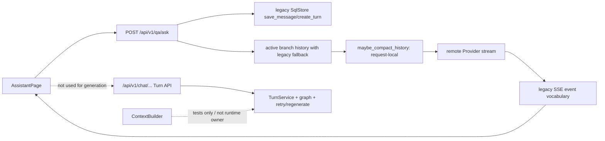

# 00 — Current State and Gap Analysis

> Status: Draft — Awaiting User Confirmation  
> Evidence date: 2026-08-14

## 1. 当前判定

| 能力 | 当前判定 | 证据与限制 |
|---|---|---|
| 新建、列表、切换、删除、重命名 | 部分可用 | 已有持久化 API 与浏览器接入；标题竞争规则仍需统一 |
| 线性多轮上下文 | 基本可用 | `/qa/ask` 优先读取 active branch，旧 schema/graph 失败时回退 legacy history |
| 刷新后消息恢复 | 基本可用 | canonical message 可读取；正在生成的 stream 不能从 cursor 恢复 |
| 分支读取与切换 | 基本可用 | active branch 和 parent-chain 已接入；生成、retry、regenerate 未统一进入 graph Turn 主链 |
| 长对话 | 不达标 | 临时 summary/hard truncate 非持久化；固定 context window；没有最终预算不越界硬保证 |
| Streaming | 部分可用 | 有 SSE、seq、心跳适配和 delta 合并；无事件事实表和 cursor replay |
| Stop | 部分可用 | 有 cancel 请求和流轮询；未形成生成任务级 durable cancel + late-delta CAS 合同 |
| Retry | 不达标 | 后端新 Turn API 存在；浏览器只是恢复问题到输入框手动再发 |
| Regenerate | 不达标 | 后端分支 API 存在；浏览器未接入真实 regenerate |
| Markdown / Code | 不达标 | 消息正文以纯文本 div 渲染，无 GFM、代码高亮、复制与 XSS 渲染合同 |
| 无知识库普通聊天 | 不达标 | 浏览器发送被 `selectedKbId` 强制阻断，和 KB 可选目标冲突 |
| 附件/图片 | 部分可用 | 已有真实绑定和 Vision capability 检查；长轮次复用、预算、失效和 fallback 仍需主链统一 |
| Provider/Model | 基本可用 | 活动模型与实际路由已接入；每 Turn capability/context 快照仍需固化 |

因此对用户问题的直接回答是：**当前 EKB 可以做普通多轮，但不能保证长对话“上下文不断”，也不能判定已达到 Grok 对话同等级。**

“上下文不断”在工程上不等于无限发送全部历史。正确含义是：原始历史永久保留；服务端根据模型窗口生成可审计的有效上下文；被压缩的事实由持久 summary 承接；刷新、重启、重连和分支切换后仍得到相同的上下文投影。

## 2. 当前真实主链

关键源码事实：

- `apps/api/ekb_api/routers/qa.py:193-235`：多轮优先 materialize active branch。
- `apps/api/ekb_api/routers/qa.py:538-580`：用户消息、助手占位和 legacy turn 分步写入，不是新 `TurnService` 的单事务创建。
- `apps/api/ekb_api/routers/qa.py:858-889`：实际生成调用 request-local `maybe_compact_history`。
- `apps/api/ekb_api/services/context.py:1-23`：规范预算器已经定义正确原则，但目前不是实际生成主链的 owner。
- `apps/api/ekb_api/routers/chat_graph.py:337-430`：新 Turn、Stop、Retry、Regenerate API 已存在。
- `apps/web/src/app-v2/pages/AssistantPage.tsx:521-604`：浏览器仍调用 `services.qaStream.ask`。
- `apps/web/src/app-v2/pages/AssistantPage.tsx:879`：Retry 仅恢复最后问题。
- `apps/web/src/app-v2/components/assistant/AssistantMessageList.tsx:49`：消息仍为纯文本。

## 3. 长对话为何仍不可靠

当前 `maybe_compact_history` 的缺陷：

1. context window 取全局配置而不是实际模型 capability；切换模型不会自动重算真实窗口。
2. summary 仅存在于本次请求内，没有写入 `context_summaries`；下一轮会重复总结并发生漂移。
3. summary 没有绑定 branch、精确 covered message IDs、source hash、model、prompt version。
4. fallback 最多进行有限轮 hard truncate，且可能按 message 条目而不是完整 user/assistant turn 删除。
5. 当前图片成本、输出预留和 Provider safety margin 没有共同进入一个权威预算。
6. 压缩后没有最终断言 `input_tokens <= available_input`；极端情况下仍可能把超窗请求发给 Provider。
7. 实际主链没有保存 context manifest，无法回答“这一轮究竟用了哪些历史、知识库和附件”。

## 4. Gap Analysis

| 优先级 | 缺口 | 影响 | 必须完成的方案 |
|---|---|---|---|
| P0 | 两套 Turn 写入/生成路径 | 状态机、幂等、Retry/Regenerate 与实际回答不一致 | 统一为一个 authoritative Turn Engine；`/qa/ask` 只做兼容代理并最终移除写职责 |
| P0 | ContextBuilder 未进入 runtime | 长对话预算无法证明、summary 不持久 | 所有 Provider request 必须由 Context Engine 产出并持久 context manifest |
| P0 | 无 durable stream event/replay | 断线、刷新、进程切换会丢流或重复 | 持久 `turn_events`，单调 seq，`Last-Event-ID` 重放，terminal first-wins |
| P0 | Retry/Regenerate 未接浏览器主链 | 用户无法获得真实语义 | 接入真实 Turn API；旧回答保留；分支可切换 |
| P0 | Stop 未闭环到 generation job | 可能只是本地停显，late delta 污染状态 | durable cancellation + Provider close/token + CAS 丢弃 late delta |
| P1 | 固定全局 context window | 不同模型会浪费窗口或溢出 | 每 Turn 保存实际 model capability snapshot 和预算 |
| P1 | KB 被 UI 强制为必选 | 普通 AI 对话不可用 | Knowledge Base 改为 0..N 可选；无 KB 时明确通用知识模式 |
| P1 | Markdown 纯文本 | 体验与安全不达标 | GFM + sanitize + stable streaming code blocks + copy |
| P1 | 自动 retry 分类不足 | 429/5xx/auth/context overflow 语义混淆 | 明确错误分类、指数退避、次数与 UI `turn.retrying` 事件 |
| P1 | 标题/模型/summary 竞争规则不完整 | 异步更新覆盖手动选择或导致投影失效 | 乐观锁/CAS；模型变化使未使用 summary cache 失效 |
| P2 | Context 可观测性不足 | 无法诊断“忘记了什么” | 管理/调试视图只显示 IDs、token、hash，不显示敏感原文 |

## 5. 已有资产的处理原则

- 保留 `ConversationGraphService`、`TurnService`、`ContextBuilder`、Provider registry、attachment ACL、active branch 和已应用 v4 schema。
- 不重写为 Grok 的 Rust Actor/JSONL；在 EKB 中用 PostgreSQL transaction、job/outbox、SSE event log 表达相同行为。
- `/qa/ask` 在迁移期可以做协议兼容，但不能继续直接写 message/turn 或直接调用 Provider。
- legacy message 数据必须通过 disposition/backfill 可读；不能因统一主链而批量覆盖历史。
- 禁止通过增加另一个“临时聊天 API”规避收敛。

## 6. 实施前必须纳入回归的当前缺陷

以下问题不能被“切到新 API”掩盖，必须各自有回归测试：

- 当前 `/qa/ask` 分步提交 User、attachment binding、Assistant placeholder 和 Turn；Turn 注册异常只告警并继续，可能留下孤立记录或重复生成。统一后必须一事务提交并 fail closed。
- legacy 路径仍使用 lowercase wire status，而正式 `TurnService`/migration 使用 uppercase canonical state。数据库新写入必须统一 uppercase，lowercase 仅保留在旧 API read projection。
- 当前 Provider idle timeout 与 SSE heartbeat 共用/更新同一活动时钟；持续心跳可能掩盖 Provider 长时间无 token。新引擎必须分离 `last_provider_activity_at` 与 `last_sse_write_at`。
- 当前 `done` payload 的 `last_seq` 在 envelope seq 自增前取值，存在 terminal seq 偏移风险。SSE v3 必须以数据库分配后的 seq 生成 envelope 和 terminal payload。
- 当前 delta 主要在浏览器累计，服务端通常在终止路径写全文；进程崩溃可能丢失已显示 partial。新引擎必须有界批量持久 delta/partial。
- 当前刷新后的 message projection 会丢失部分 status、finish reason、parts 和 citations。canonical message API 必须完整恢复这些字段。
- 当前 RAG 只用本轮 question 检索，“它的第二条是什么”之类指代问题可能检索失败。Context Engine 必须生成可审计的 contextual retrieval query。
- 当前历史 message 只重建文本，不重载历史附件/图片 parts。后续轮次引用旧文件必须走 message parts + ACL/state revalidation。
