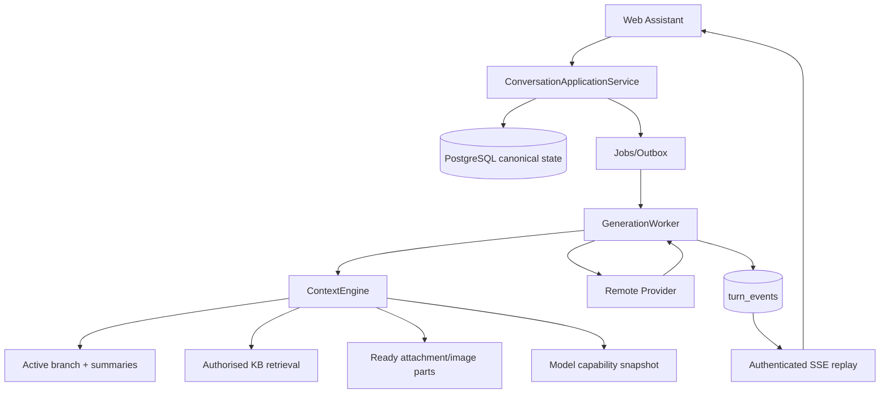
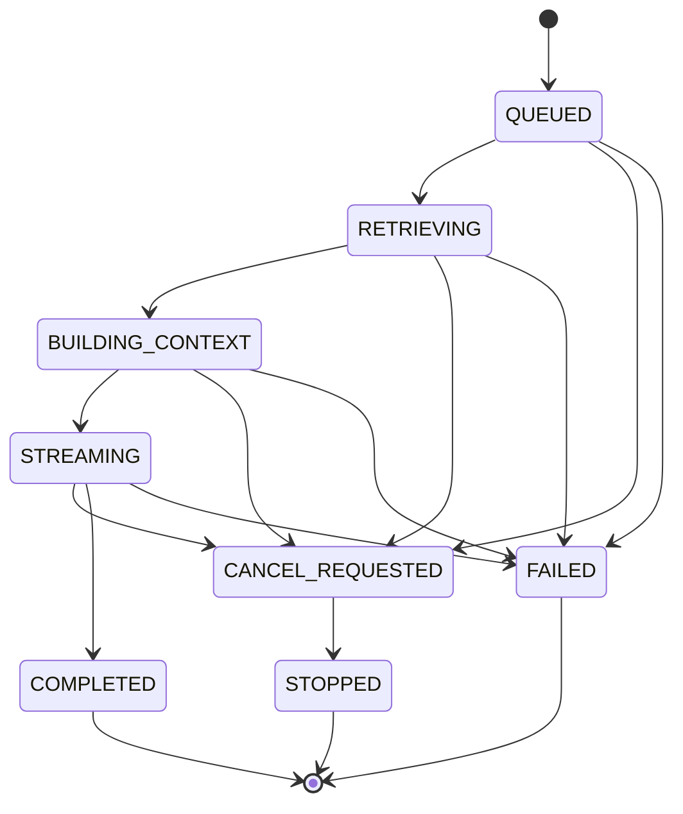

# 02 — Conversation Engine Specification

> Status: Draft — Awaiting User Confirmation  
> Requirement level: MUST / SHOULD / MAY

## 1. Product goal

EKB AI Assistant MUST support ordinary AI chat and optional enterprise knowledge enhancement in the same conversation engine:

```text
0..N Knowledge Bases
+ 0..N ready Attachments
+ optional Images
+ active Conversation Branch
+ persisted Summary
+ recent complete Turns
+ current User Message
→ selected remote Provider/Model
→ durable Streaming Assistant Answer
```

The product MUST NOT require a KB for ordinary chat. When no KB is selected, the UI MUST state that the answer uses general model knowledge. Web Search is not part of this engine.

## 2. Non-goals

- Exact text equality with Grok answers.
- Web/Internet Search or search citations.
- Coding-agent tool execution, shell, filesystem edits, MCP, browser automation.
- Replacing EKB's PostgreSQL/object storage/job architecture with Grok JSONL or Rust actors.
- Sending all historical messages forever.

## 3. Canonical ownership

Only `ConversationApplicationService` may create a user message, assistant placeholder, Turn, resource snapshot and generation job. Only `GenerationWorker` may advance generation states and append assistant deltas. Only `ContextEngine` may build Provider input.



`/api/v1/qa/ask` MAY remain during migration as a compatibility adapter, but it MUST call this application service and MUST NOT directly write messages/turns or invoke a Provider. After frontend cutover and observation, it MUST return a deprecation header and then be removed in a later additive release.

## 4. Conversation and branch rules

1. A Conversation belongs to one tenant and actor/team scope and has exactly one active branch.
2. A canonical message is immutable in content. Feedback/status metadata may be updated under separate rules.
3. A branch is a materialized parent chain. Context uses only the active branch unless a Turn explicitly pins another authorized branch.
4. Regenerate forks at the source user message and creates a new assistant version; it never overwrites the old answer.
5. Editing an old user message forks before the edited message, creates a new user message, and excludes the old branch's descendants from the new context.
6. Switching branch while a Turn is streaming is rejected unless the active Turn is stopped first; alternatively the UI may keep it running in background but MUST display which branch owns it.
7. Conversation deletion uses existing trash/retention governance; active generation is stopped before the conversation becomes unavailable.
8. Auto-title runs after the first completed text Turn. `title_locked=true` means a manual title cannot be overwritten by delayed auto-title work.

## 5. Turn state machine

Canonical states use uppercase database values only:



Rules:

- `COMPLETED`, `STOPPED`, `FAILED` are terminal and first-terminal-wins by compare-and-set.
- A Turn has one user message and one assistant placeholder; a successful assistant message becomes `completed` only with `turn.completed`.
- Cancelled/failed partial text is retained with `partial` status and is excluded from later Provider context by default.
- A generation worker MUST verify current state/version before every persisted delta batch and terminal event.
- A duplicate `client_turn_id` for the same tenant/actor/conversation returns the same Turn and MUST NOT create duplicate messages or Provider calls.
- Legacy lowercase status is projection-only compatibility; no new database write may use it.

## 6. Retry semantics

### 6.1 Transport auto retry

- Applies inside one Turn attempt only to retryable network failures, timeouts, HTTP 408/429 and selected 5xx.
- Uses exponential backoff with jitter; default delays 2, 4, 8, 16 seconds, capped at 30 seconds.
- 429 has a separately configurable maximum; `Retry-After` is honored within a bounded cap.
- Authentication/authorization, invalid request, attachment ACL, model disabled and schema/persistence errors MUST NOT retry.
- Context overflow invokes compaction/rebuild once; it MUST NOT be retried as a network error.
- UI receives `turn.retrying` with attempt number, safe error code and next retry time.
- Failed attempts never become canonical assistant messages.

### 6.2 User Retry

- Allowed only for a failed Turn.
- Reuses the original canonical user message semantics and current authorized resource disposition.
- Creates a new Turn/attempt with a new `client_turn_id`; no duplicate user bubble is added.
- The UI shows relationship to the source failed Turn.

### 6.3 Regenerate

- Allowed for an assistant answer with an identifiable parent user message.
- Forks a new branch at that user message and creates a new Turn.
- Old answer remains readable and selectable.
- Default activates the new branch only after Turn creation succeeds; failure does not corrupt the prior active branch.

## 7. Stop generation

1. Client posts Stop; server writes `CANCEL_REQUESTED` with CAS and signals the generation job.
2. Worker closes/cancels the Provider stream where supported.
3. Any delta arriving after cancel/terminal is discarded by state/version check.
4. Buffered partial text is persisted as `partial`; one `turn.stopped` terminal event is written.
5. Repeated Stop is idempotent and returns current state.
6. Closing the browser connection alone does not cancel the Turn. A user Stop action must be explicit.
7. If the Provider cannot cancel an in-flight HTTP request, EKB MUST still stop accepting deltas and record `provider_cancel_supported=false` in the attempt audit.

## 8. Long-context engine

### 8.1 Budget

For every Turn:

```text
available_input = actual_model_context_window
                - reserved_output_tokens
                - provider_safety_margin
```

- `actual_model_context_window` comes from the selected model capability snapshot, never only from a global environment default.
- The snapshot is immutable for the Turn even if the model is later edited or disabled.
- Tokenizer SHOULD match the Provider/model. A conservative estimator MAY be used only with a documented additional margin.
- Before Provider call, the engine MUST assert `estimated_input <= available_input`; otherwise it fails with `CONTEXT_BUDGET_EXCEEDED` and makes no Provider call.

### 8.2 Context order and selection

Wire order is:

1. system/policy prompt;
2. applicable persisted summary segments;
3. recent complete turns on the selected branch, oldest-to-newest after selection;
4. diversified authorized RAG evidence;
5. current/historical referenced attachment and image parts allowed by policy;
6. current user message.

Pinned material is system/policy + current user message + explicitly submitted current-turn attachment/image descriptors. If pinned material alone exceeds budget, fail closed with an actionable error; never silently drop a submitted file/image.

History selection MUST preserve complete turns. A partial/failed assistant answer is not a complete turn unless an explicit product policy later permits it.

RAG selection MUST apply per-KB and per-document quotas. Retrieval query generation MAY use a small recent context/summary to resolve pronouns, but the query and result IDs must be audited.

### 8.3 Persistent compaction

When old complete turns do not fit:

1. Identify a contiguous old prefix on the active branch using complete-turn boundaries.
2. Compute `source_hash` from ordered message IDs, content hashes, branch ID, model slug and summary prompt version.
3. Reuse an existing valid summary with the exact key when available.
4. Otherwise create summary through a bounded Provider request, validate non-empty output, token reduction and covered range, then persist it.
5. Rebuild the manifest using summary + recent complete turns.
6. If summarization fails, deterministically drop the oldest complete turns until within budget and emit `context.compaction_degraded`.
7. If still over budget, fail closed before Provider call.

Summary invalidation:

- branch edit/fork affecting the covered prefix;
- source message content-hash mismatch;
- model slug or tokenizer contract change;
- summary prompt version change;
- ACL/resource disposition change when resource-derived facts are included.

Original messages MUST remain unchanged. Summary records are projections, not conversation truth.

### 8.4 Context manifest

Every attempt persists an audit manifest containing only:

- included/dropped message IDs and content hashes;
- summary IDs and covered range;
- evidence/chunk/version IDs and scores;
- attachment IDs, versions and capability disposition;
- system prompt version;
- actual model capability snapshot hash;
- estimated tokens by segment, reserve, margin and total;
- retrieval query hash and manifest hash.

The manifest MUST NOT store API keys, attachment plaintext, full prompt, full RAG chunk text or image base64.

## 9. Attachment and image continuity

- Message parts are immutable references. Later turns such as “继续总结这个文件” may reuse authorized historical attachments from the active branch without requiring the browser to resubmit raw content.
- Every turn revalidates tenant, actor, message, attachment state, retention and object availability. Revoked/deleted/expired items fail closed or are explicitly omitted with a visible warning.
- Text attachments enter context only in `READY` state, with parser/version/checksum snapshot.
- Images are structured Provider content, not base64 embedded in text history.
- Vision selection order: selected model native Vision → configured remote Vision Adapter/caption service → `VISION_UNAVAILABLE`.
- If an old inline image is removed for request budget, the user is explicitly told to reshare it; silent removal is prohibited.

## 10. Provider and model behavior

Each Turn/attempt stores:

- requested and actual provider/model IDs and remote model name;
- capability snapshot: context window, Vision, streaming, tokenizer, max output;
- sampling parameters and answer mode;
- route/fallback reason.

Explicit model selection never silently falls back. Default model policy may choose a fallback before Turn acceptance and must show it to the user. Model switching during a running Turn is rejected. A later model change invalidates incompatible unused summary cache but does not rewrite completed Turn metadata.

## 11. Frontend contract

### 11.1 State ownership

- Conversation/messages/branches/turn status are server state.
- Optimistic user/assistant bubbles are keyed by stable `client_turn_id`, then reconciled with server IDs.
- Stream reducer is keyed by `turn_id`; stale events from another Turn are ignored.
- On refresh, the page loads canonical messages, queries non-terminal Turn status, then reconnects with last persisted seq.
- Switching conversations does not cancel background Turns. The sidebar shows running/failed state.

### 11.2 Required controls

- New, rename, delete/restore, branch/version switch.
- Stop, Retry failed Turn, Regenerate answer, edit/fork user message.
- 0..N KB selector and clear “general model knowledge” mode.
- attachment/image status and historical attachment context indicator.
- model selector driven by active Provider models.
- context diagnostics: model/window, used/reserved tokens, compaction range; no sensitive content.

### 11.3 Markdown and code

- Completed messages use `react-markdown` + `remark-gfm` and an explicit sanitization schema (for example `rehype-sanitize`).
- Raw HTML is disabled unless allowlisted and sanitized.
- `javascript:` and unsafe external links are blocked; external links use safe rel attributes.
- Fenced code blocks have language label and copy button.
- During streaming, stable completed blocks are memoized/frozen; only the unfinished tail is reparsed.
- Unterminated code fences, tables and emphasis MUST not break surrounding DOM.
- Test payloads include script tags, event handlers, malicious links and oversized code blocks.

## 12. Observability and security

- Metrics: Turn counts by state, time-to-first-token, duration, retry count/reason, cancel latency, event replay count, compaction rate/failure, context utilization, Provider errors.
- Logs use request/turn/attempt IDs and safe error codes; no key, token, full prompt, attachment text, image base64 or private URL.
- Every read/write/replay validates tenant and actor. `Last-Event-ID` cannot be used to access another Turn.
- Rate limits apply to turn creation, regenerate, attachment parsing, summary generation and event replay.
- Title/summary generation is untrusted model output and is escaped/sanitized before display.

## 13. Failure handling

| Failure | Required behavior |
|---|---|
| Database transaction fails before Turn commit | no Provider call, no optimistic success; client may safely repeat the same `client_turn_id` |
| Outbox/job lease is delayed | Turn remains `QUEUED`, UI shows queued state; lease retry is observable |
| Worker dies during generation | lease expires; replacement worker recovers from canonical attempt/event state without duplicating completed text |
| Provider stream resets | eligible transport retry resumes as a new attempt; canonical text is reconciled, not blindly appended twice |
| Provider idle timeout | attempt fails/retries according to policy; SSE heartbeats do not reset Provider idle clock |
| Summary generation fails | deterministic oldest-complete-turn truncation; visible degraded compaction event; never fake a summary |
| Replay cursor expired | return canonical message/status plus `replay_unavailable`; never synthesize missing deltas |
| Attachment deleted/revoked/not READY | fail closed or explicitly omit according to request policy; UI names safe error, model is not called with missing content |
| Selected model disabled after acceptance | current Turn uses its immutable capability/route snapshot; future Turn requires explicit valid selection/policy fallback |
| Browser disconnects | Turn continues on server; reconnect follows persisted seq; disconnect alone is not Stop |

## 14. Performance and accessibility

Targets are measured separately from external Provider latency:

- Turn create transaction p95 ≤ 500 ms under normal production load.
- SSE accepted/replay connection p95 ≤ 1 s; replay of 1,000 bounded events p95 ≤ 2 s.
- Context manifest assembly excluding RAG and new summary Provider calls p95 ≤ 500 ms.
- Delta batches flush at ≤ 100 ms or a bounded byte/character threshold; database writes are batched, not one row per token.
- Stop API acknowledgement p95 ≤ 1 s; terminal `turn.stopped` p95 ≤ 5 s when Provider transport is cancellable.
- Web message list uses virtualization/pagination for long sessions and avoids reparsing stable Markdown blocks.

Accessibility requirements:

- All send/stop/retry/regenerate/branch/model/attachment controls are keyboard reachable with visible focus.
- Streaming uses a non-disruptive `aria-live` strategy; screen readers are not forced to announce every token.
- Status is conveyed by text/icon, never color alone.
- After Stop/failure, focus returns to the appropriate composer/action without trapping the user.
- Code copy has an accessible name and success announcement.
- Reduced-motion preference disables nonessential streaming/typing animations.
