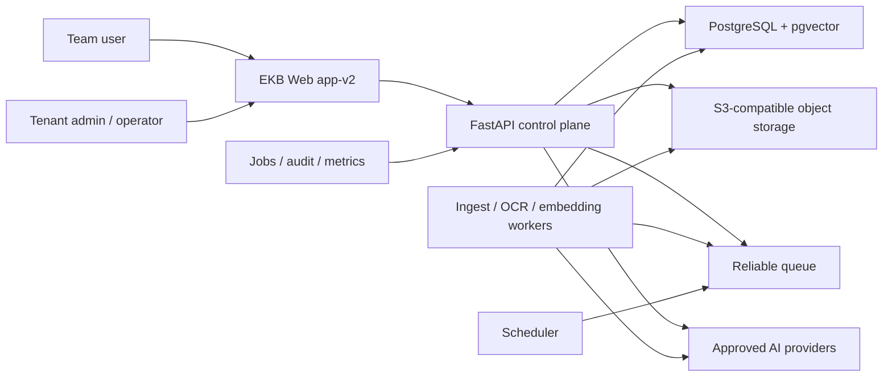
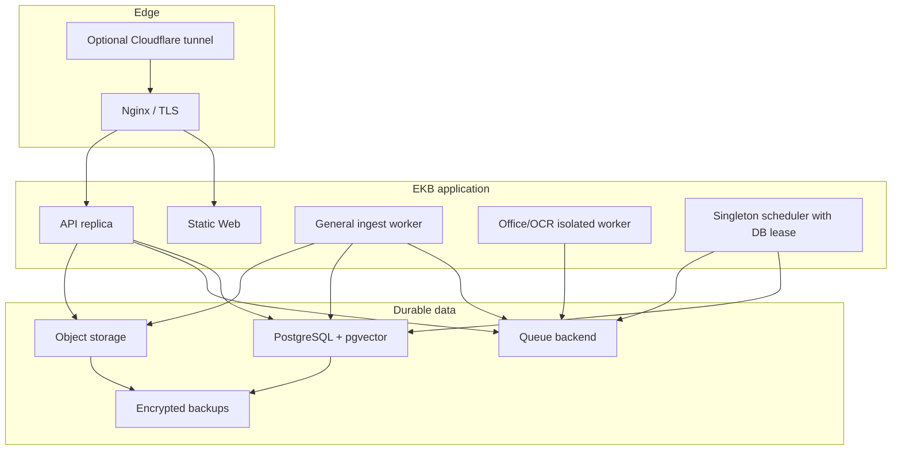
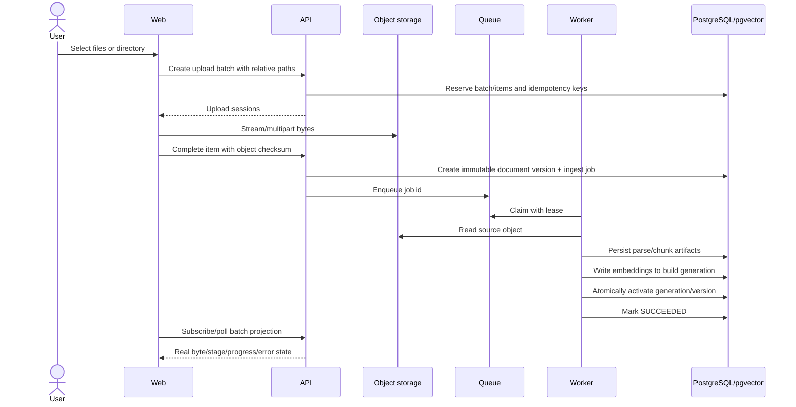
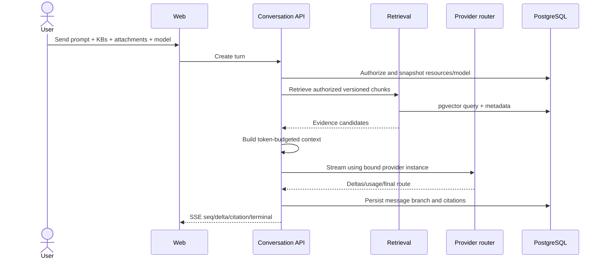

# EKB 核心重构总体架构

## 1. 架构目标

在保留 React app-v2、FastAPI 模块化单体、租户/ACL 和审计控制面的前提下，把不可恢复的同步/进程内路径替换为“数据库真值 + 对象存储 + 可靠任务 + 可观测状态机”。组件必须可独立扩容，但首期不拆成大量微服务。

需求见 [01-requirements.md](./01-requirements.md)，当前差距见 [02-gap-analysis.md](./02-gap-analysis.md)。

## 2. 系统上下文

## 3. 逻辑组件

| 组件 | 责任 | 不负责 |
|---|---|---|
| Web app-v2 | 页面、可恢复 UI state、上传中心、SSE 消费、证据展示 | 资源授权、伪造进度、保存密钥 |
| API control plane | 认证、ACL、命令、查询、事务、签名上传、Provider routing | 长时间解析和随机后台线程 |
| Conversation service | 会话图、Turn 状态、上下文构建、SSE、Stop/branch | 文档摄取和密钥明文输出 |
| Knowledge service | KB/文档/版本/ACL/上传命令 | 直接执行 CPU 密集解析 |
| Retrieval service | ACL 后检索、rerank、citation materialization | 访问撤权/删除内容 |
| Provider registry | Provider/Model/capability/credential/fallback | 硬编码全局模型列表 |
| Object storage | 原文件、派生产物、图片和临时附件对象 | 业务授权真值 |
| PostgreSQL | 业务/任务/审计真值和 pgvector | 保存密钥明文 |
| Queue | 至少一次投递、延迟重试、DLQ | 业务完成真值 |
| Workers | 转换、解析、OCR、Chunk、Embedding、Index、purge | 绕过租户/版本校验 |
| Scheduler | 到期清理、陈旧任务恢复、周期 reconcile | 直接删除无审计业务数据 |

## 4. 部署容器边界

小型生产主机可以在早期承载 API/Web/调度控制面，但高内存 OCR/Office 转换和大量 Embedding worker 必须支持迁出或严格并发限制。

## 5. 知识摄取数据流

“成功”由数据库中的 active document version、完整 stage ledger、对象 checksum 和可检索向量共同决定。Queue ack 不是成功。

## 6. 对话与 RAG 数据流

普通对话可跳过 Retrieval；Strict grounded 在证据阈值不足时不调用生成或要求模型输出受控拒答。所有资源在 Turn 创建时重新授权并形成不可变快照。

## 7. 数据一致性模型

### 7.1 强一致部分

- 租户/主体授权和资源存在性判断。
- Document/version/job 的创建事务。
- Conversation/user message/turn 创建。
- 模型选择、fallback policy 和实际路由记录。
- soft delete、restore 和 purge claim。

### 7.2 最终一致部分

- 对象上传完成后的解析/索引。
- 标题生成、摘要和异步 usage 聚合。
- 对象物理删除和 vector generation 回收。

最终一致必须由可查询状态机表达；不能通过前端推断。

## 8. 状态所有权

| 状态 | 唯一权威 |
|---|---|
| 登录/角色/ACL | PostgreSQL live membership/ACL |
| 上传字节 | 对象存储 multipart + upload item projection |
| 摄取阶段 | ingest job/stage rows |
| 文档当前版本 | document.active_version_id |
| Turn/Stop | turn row scoped by tenant+actor |
| 消息/分支/引用 | message/branch/citation rows |
| 模型列表/能力 | provider/model registry |
| Queue delivery | Queue，仅投递状态 |
| 业务完成 | PostgreSQL 状态，不是 Queue ack |
| 主题 | 客户端 preference + semantic token build |

## 9. 安全与信任边界

1. 浏览器输入、路径、mime、checksum、KB/model/attachment ID 均不可信。
2. API 在命令入口执行 live tenant+actor+ACL；worker 领取后再次校验 job/resource generation。
3. Provider credential 只在服务端解密到短生命周期内存；日志和审计仅记录 credential id/key version。
4. Object key 不暴露业务路径；预签名 URL 短期、限定 method/size/content hash。
5. Office/OCR worker 使用无特权用户、只读输入、隔离临时目录、资源限制和禁止宏执行。
6. 消息正文与附件内容不进入通用审计；只保存 hash、大小、路由和状态元数据。
7. 数据外发前执行 KB/provider policy；禁止的团队资料不能发送给个人 Provider。

## 10. 失败语义

| 故障 | 行为 |
|---|---|
| 对象上传中断 | 保留可恢复 multipart；超时后 abort 并标失败 |
| Worker 崩溃 | lease 到期重新领取；stage 幂等 |
| Parser 不支持 | `FAILED/PARSER_UNSUPPORTED`，不创建 active version |
| Embedding Provider 不可用 | retry/backoff 后 dead；不得词法静默成功 |
| Vector 写入部分失败 | generation 不激活；清理未激活 generation |
| SSE 客户端断线 | Turn 继续或按策略取消；客户端查询 Turn，不宣称 replay |
| Stop 重复请求 | 返回同一终态，不产生多条部分消息 |
| 当前模型禁用 | 使用显式 fallback 或 409 阻止发送 |
| Scheduler 重复执行 | purge claim/CAS 保证幂等 |
| Migration 失败 | 非零退出，API/worker 不启动新版本 |

## 11. 架构决策记录

| ADR | 决策 | 原因 | 拒绝方案 |
|---|---|---|---|
| CR-ADR-001 | 保留 EKB 模块化单体控制面 | 现有租户/ACL/审计可复用 | 整体替换为 Dify/RAGFlow |
| CR-ADR-002 | PostgreSQL+pgvector 为主数据/向量真值 | 消除 SQLite/向量双真值 | SQLite 长期生产、独立黑盒向量库优先 |
| CR-ADR-003 | S3-compatible object storage 保存不可变原件 | 支持版本、重试、校验和清理 | DB blob、本地临时文件作为真值 |
| CR-ADR-004 | 可靠队列 + DB job ledger | 至少一次投递且业务状态可审计 | FastAPI BackgroundTasks |
| CR-ADR-005 | Attachment 为独立资源 | 生命周期/ACL 与 KB 不同 | 继续把 doc id 混入 kb ids |
| CR-ADR-006 | Regenerate 建立回答分支 | 保留历史与可复现上下文 | 覆盖原消息 |
| CR-ADR-007 | 原生 Provider adapter 优先，兼容层受控 | 能力和错误语义不同 | 全部伪装成 OpenAI |
| CR-ADR-008 | Embedding profile 不可变 | 防止维度和语义混用 | 静默切模型 |
| CR-ADR-009 | 语义 token 驱动主题 | 消除页面 dark 分叉 | 继续追加 `.dark` 修补 |
| CR-ADR-010 | Scheduler 只创建/领取可审计 purge job | 幂等、可恢复、可观察 | 前端隐藏或进程内 timer |
| CR-ADR-011 | 不实现 Web Search/工具/Agent | 聚焦可靠知识库与普通对话 | 从 grok-build 移植完整 Agent runtime |

## 12. 版本与发布边界

- 新 DB 变化只追加新的唯一 migration id；历史文件/checksum 不变。
- API 采用 expand → backfill → dual-read/dual-write（仅必要时）→ switch → contract。
- 每个 Phase 在 QA tenant 通过后才可进入生产备份/迁移/原子切换。
- 生产出网、对象存储、队列、加密密钥任一未满足时，相应 Phase 保持关闭。
- 详细数据和 API 合同分别在 `10-database-changes.md`、`11-api-design.md` 中定义。
