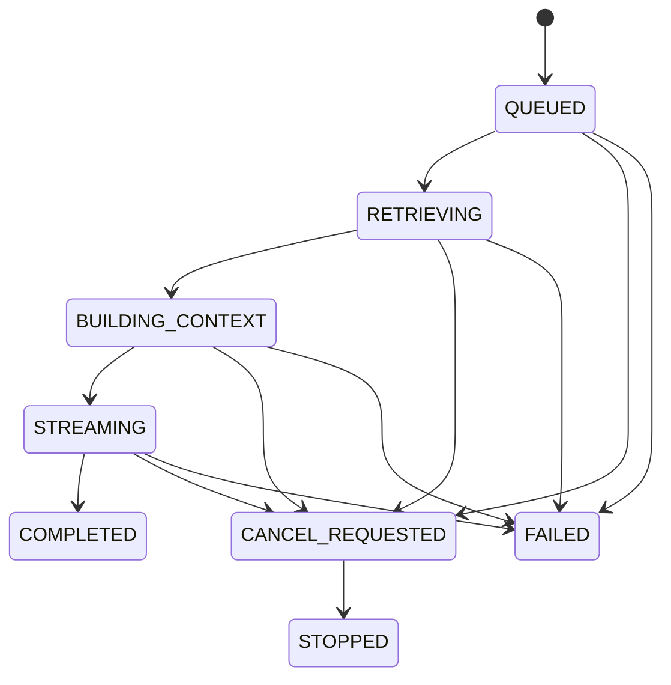

# EKB AI 对话引擎规格

## 1. 范围

本文件定义 [EKB-CR-FR-021 至 EKB-CR-FR-033](./01-requirements.md)。EKB 继续使用现有 FastAPI/DB/SSE 基础，吸收 grok-build 的状态完整性和预算治理思想，不迁移 Agent runtime。

## 2. 会话图模型

| 实体 | 关键字段 | 说明 |
|---|---|---|
| `conversations` | tenant、owner、title、title_locked、active_branch_id、deleted_at | 用户级资源，可选团队策略 |
| `conversation_kb_defaults` | conversation、kb、mode、position | 默认 0..N KB，不是历史快照 |
| `conversation_branches` | conversation、parent_branch、fork_message、created_by | 回答分支 |
| `messages` | conversation、branch、role、status、content、parent_message | User/Assistant/System，正文受保护 |
| `message_parts` | message、type、ordinal、text/json/ref | text、image、attachment、citation marker |
| `turns` | conversation、actor、user_message、assistant_message、state、seq | tenant+actor 所有权 |
| `turn_resource_snapshots` | turn、type、resource/version、params | KB、文档、附件、模型和检索快照 |
| `message_citations` | assistant_message、chunk/version、locator、rank | 不随当前 active version 漂移 |
| `context_summaries` | conversation/branch、range、model、token counts、summary | 有来源范围和版本 |

角色首期为 `system/user/assistant`；schema 的 `message_parts` 为未来工具结果保留类型扩展，但本轮 API 拒绝 tool/MCP/code-execution part。

## 3. Conversation 生命周期

- 新会话可以在首条消息事务内惰性创建。
- 列表按 owner、更新时间、archive 和 cursor 查询；切换后服务端读取活动分支消息。
- 删除进入 30 天回收站；恢复时保留分支、附件关系和标题锁。
- 用户重命名将 `title_locked=true`。
- 首个完成 Turn 触发异步标题 job；失败或超时保留首问截断标题。
- 删除/撤权的默认 KB 从新 Turn 选择中移除，但历史 snapshot/citation 保留合规可见性标记。

## 4. Turn 创建事务

客户端提交 `client_turn_id`、conversation、prompt、requested model、answer mode、KB ids、attachment ids。服务端在一个事务中：

1. live 解析 tenant/actor；
2. 锁定 conversation 并验证 owner；
3. 重新授权 KB/附件/model；
4. 创建 User message；
5. 创建 Turn `QUEUED` 和 snapshot；
6. 创建 Assistant message placeholder `pending`；
7. 提交后开始/入队生成。

`(conversation_id, actor_id, client_turn_id)` 唯一；重复提交返回原 Turn，不生成双消息。

## 5. Turn 状态机



终态只有 `COMPLETED|STOPPED|FAILED`。每个 Turn 只产生一个 terminal event。状态更新必须包含 `tenant_id + actor_id + turn_id + expected_state`，采用 **first-terminal-wins**：completion 与 cancel 竞争时，首个成功 CAS 的终态为权威；失败方读取并返回实际终态，绝不再写消息状态或发第二个 terminal event。

## 6. SSE v2 合同

Wire contract 保持现有 SSE v2 兼容：`Content-Type: text/event-stream`；每个数据事件严格为：

```text
id: <turn_id>:<seq>
event: <event_name>
data: {"turn_id":"...","request_id":"...","seq":1,"timestamp":"UTC RFC3339","payload":{...}}

```

首个数据事件 `seq=1`，之后每个数据事件递增 1；`id` 与 JSON `seq` 必须一致。heartbeat 保持 SSE comment `: heartbeat <timestamp>`，不带 id/data、也不消耗 seq。为兼容旧 v2，payload 中的 `conversation_id`、`message_id`、`stream_version` 可同时提升到 data envelope 顶层。`seq` 单调递增但首期不承诺断线 replay。

| event | payload |
|---|---|
| `turn.accepted` | conversation/message ids、snapshot summary |
| `turn.stage` | retrieving/building/streaming、非随机 progress |
| `message.delta` | assistant message id、text delta |
| `citation.upsert` | stable citation id、document/version/locator、display title |
| `context.compacted` | covered message range、before/after tokens、strategy |
| `route.selected` | requested/actual provider+model、fallback disclosed |
| `usage.updated` | input/output tokens（可为估算→最终） |
| `turn.completed` | final message/status/usage；terminal |
| `turn.stopped` | persisted partial message/status；terminal |
| `turn.failed` | stable error code、retryable、request id；terminal |

`Last-Event-ID` 在首期仅用于诊断，不宣称恢复；断线后客户端查询 Turn 和已持久化消息。若以后实现 replay，必须新增事件存储、TTL、游标授权和跨实例测试。

Heartbeat 是 transport comment，不是上表中的领域 data event；exact bytes 为 `: heartbeat <UTC timestamp>\n\n`，不消耗 seq。

## 7. Stop、Retry 与 Regenerate

### Stop

- `POST cancel` 只能由 Turn owner 调用；管理员代办不在首期。
- 重复调用返回当前 cancel/terminal 状态。
- Provider 支持取消时传递取消；不支持时停止向客户端转发并丢弃晚到 delta。
- 已可见内容写入 Assistant message，status=`stopped`；空内容 placeholder 可保留状态但不渲染为回答。

### Retry

用于 `FAILED` Turn。创建新 Turn/attempt，复用原 User message 内容与用户确认后仍有效的资源；资源必须重新授权，模型可以由用户重新选择。

### Regenerate

用于完成或停止的 Assistant 回答。以同一 User message 为 fork point 创建新 branch 和 Turn；旧回答不可覆盖。完成后可自动把新分支设为 active，UI 允许切换版本。

## 8. 上下文构建

预算计算：

```text
available_input = model_context_window
                - reserved_output
                - provider_safety_margin
used = system + recent_history + summaries + attachments + images + rag_evidence
```

策略顺序：

1. 固定系统与安全提示。
2. 当前用户消息和直接附件。
3. RAG 证据，按多样性/相关性/KB 配额选择。
4. 最近完整 Turn，不能拆开 user/assistant 对。
5. 既有有效 summary。
6. 超预算时异步/同步生成有界 summary；失败则确定性截断最旧完整 Turn。

Summary 保存 covered message ids/hash、生成模型、prompt version、before/after tokens 和质量/失败状态。图片和附件使用 Provider tokenizer 或保守成本估算。每个 Turn 保存最终 context manifest hash，审计不保存正文。

## 9. RAG 模式

- `none`：不检索 KB；附件仍可使用。
- `strict_grounded`：检索证据低于阈值则返回结构化拒答，不用常识填补。
- `knowledge_enhanced`：证据优先；模型常识段落必须标记“补充说明”，不得伪造引用。

检索和引用细节见 `04-knowledge-base.md` 与后续 API/数据库文档。

## 10. Markdown 与消息 UI

- CommonMark/GFM 子集、表格、任务列表、代码 fenced blocks、语法高亮和复制。
- 原始 HTML 默认禁用；链接使用安全 scheme 和新窗口隔离策略。
- 流式时使用增量缓冲，未闭合代码 fence 显示稳定占位；终态再完整解析。
- 引用标记映射 stable citation id，点击打开生成时版本定位；无权限时显示“来源当前不可访问”而不泄露正文。
- 错误、停止和分支状态不用仅颜色表达。

## 11. 模型路由与失败

Conversation service 只依赖 Provider Router 接口，不直接拼接供应商 URL。Turn 保存 requested route 和 actual route。Provider error 可重试/fallback；下列错误禁止 fallback：tenant/ACL、附件违规、数据外发策略、迁移/schema、内部持久化失败。

## 12. 审计与隐私

审计字段：actor、conversation/turn/message id、requested/actual provider/model、fallback reason、tokens、latency、status、resource counts、prompt/context hash、request id。禁止存消息正文、附件文本、密钥或 Provider 原始错误正文。

## 13. 明确移除

删除助手 UI 的联网搜索开关、搜索结果卡、搜索引用；API 不接受 web search option；Provider Router 不注册 Tavily/web-search tool；既有代码在兼容期返回明确 `FEATURE_REMOVED`，随后移除死代码和配置文档。
