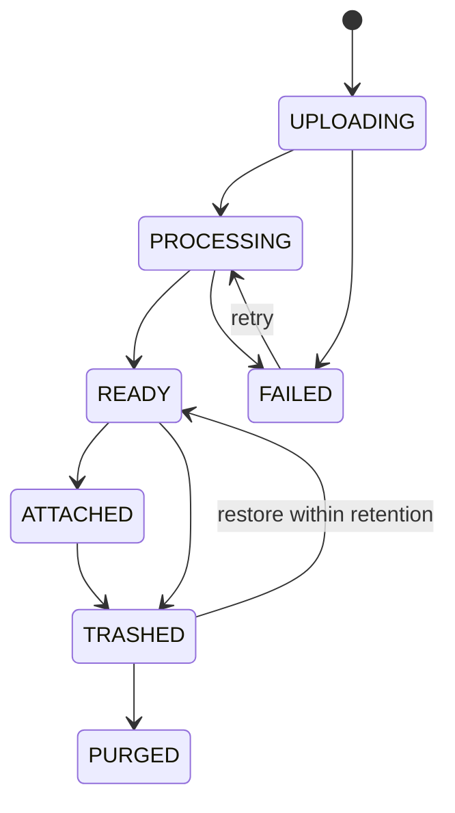

# EKB 聊天附件、文件与图片规格

## 1. 边界

附件属于聊天资源，不是知识库。它可以复用知识摄取的对象存储、解析器和 Chunk 基础，但必须拥有独立 owner、生命周期、索引 scope 和权限。本文件覆盖 [EKB-CR-FR-034 至 EKB-CR-FR-040](./01-requirements.md)。

## 2. 数据模型

| 实体 | 关键字段 |
|---|---|
| `attachments` | tenant、owner、conversation、source_object、mime、size、sha256、status、expires_at |
| `attachment_artifacts` | attachment、parser_version、text_object、metadata、token_estimate、status |
| `attachment_chunks` | attachment、ordinal、text、metadata、embedding profile/vector |
| `message_attachments` | message、attachment、ordinal、usage_mode |
| `image_artifacts` | attachment、width/height、ocr text、caption、provider/method、confidence |
| `attachment_promotions` | attachment、target KB/path、document/version/job、status |

Attachment id 不得在任何 API 中解释为 KB id/document id。跨资源引用必须显式命名。

## 3. 生命周期

消息发送前附件可处于 READY；发送事务创建 `message_attachments`。上传后未发送的孤立附件使用较短可配置保留期；已绑定消息的附件随会话 30 天回收站策略。

## 4. 文件处理策略

| 类型/规模 | 策略 |
|---|---|
| 小文本，解析后在 per-attachment 和 turn token budget 内 | 直接插入带文件边界的 context part |
| 大文本/表格/PDF | 持久解析 + attachment scoped retrieval |
| 图片且模型支持 Vision | 受控传原图或压缩派生图 + OCR 可选 |
| 图片且模型不支持 Vision | OCR + 本地/批准的 caption adapter，披露 fallback |
| 扫描 PDF | page render + OCR；支持 Vision 时可选择关键页图像 |
| 旧 Office | 与 KB 相同的隔离转换；不执行宏 |

“小文件”不是固定字节阈值；由解析 token、模型 context、附件数量和输出预留共同决定。默认每 Turn 附件数、总字节和图片像素均需配置并服务端校验。

## 5. Vision 路由

1. 从实际 model capability 判断 Vision，不能仅按模型名猜测。
2. 校验 PNG/JPEG/WebP 解码、MIME magic、尺寸、像素、动画/帧策略和恶意 payload。
3. 生成去 metadata、限制分辨率的派生图；原图保留在对象存储但不默认外发。
4. 执行 tenant/provider data egress policy。
5. 按 Provider adapter 的 typed content 构建请求。
6. 保存 method=`native_vision|ocr_caption`、实际 provider/model、派生对象 hash 和 token/成本元数据。

若 fallback 只得到 OCR 文本，UI 显示“已通过 OCR 读取”；若生成 caption，显示“已通过图像描述兼容处理”。不得让用户误以为非 Vision 模型直接看到了图片。

## 6. 表格与文档上下文

- XLSX 按 sheet/cell range 建立 chunk；公式和显示值的选择记录在 parser metadata。
- PDF/DOCX 引用保留 page/paragraph/table locator。
- 附件检索结果标记 `attachment_id`，不会写入 KB citation namespace。
- 多附件使用每附件最低/最高 token 配额，防止单一大文件吞掉全部上下文。
- 检索前校验 attachment owner、conversation binding、status、expiry 和 soft delete。

## 7. 提升到知识库

Promotion 不是复制 UI 标签，而是引用同一 source object 创建目标 KB upload command：

1. 用户选择目标 KB 和 relative path；
2. 检查 editor 权限和路径冲突；
3. 创建 promotion 与 document/version/ingest job；
4. 使用 KB 的 embedding profile 完整摄取；
5. 成功后显示目标文档；附件仍按原生命周期存在；
6. 失败可重试且不生成假文档。

## 8. 安全

- 文件名只作显示；对象 key 随机化。
- parser/OCR/converter 运行时限、内存、CPU、解压比和输出大小受限。
- 对象下载必须按 tenant+owner/ACL 签发短期 URL。
- 对高风险文件可预留 malware scanner hook；未配置时不能宣称已扫描。
- EXIF、文档属性和隐藏 sheet/notes 的处理策略可配置并在 UI 披露。
- 附件文本和图片不进入审计正文。

## 9. 错误与 UI

附件行显示 Uploading/Processing/Ready/Failed、真实进度、解析方式、大小和移除操作。消息发送时：

- processing 附件默认阻止发送并允许等待/移除；
- failed 附件必须移除或重试；
- 模型不支持 Vision 时在发送前披露 fallback；
- 权限失效返回具体但不泄露资源存在性的错误；
- 上传成功但解析失败不能显示为可用附件。

## 10. 验收

使用固定 PDF、DOCX、TXT、Markdown、XLSX、PNG/JPEG/WebP 和扫描 PDF，证明模型回答引用了文件实际内容；刷新后附件/消息关系仍在；跨用户 ID、撤权、软删、过期、未就绪均不能进入上下文。
