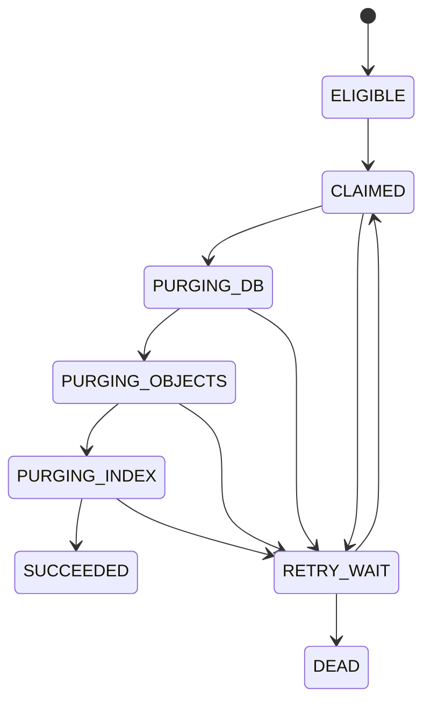

# EKB 回收站、Scheduler 与 Jobs Center 规格

## 1. 范围

本文件覆盖 [EKB-CR-FR-055 至 EKB-CR-FR-058](./01-requirements.md)。内容资源使用 30 天 soft-delete；Provider/Model 不进入内容回收站，使用 disabled 状态和审计。

## 2. 资源与保留规则

| 资源 | 删除行为 | 恢复 | 到期清理 |
|---|---|---|---|
| Knowledge Base | cascade 标记子文档/版本，记录 deletion batch | 同批次恢复或显式冲突 | metadata、对象引用、向量 generation |
| Document | active version 不再检索 | 恢复路径无冲突时 | versions/chunks/vectors/object refs |
| Document version | 默认从 UI 隐藏；active version 删除需选替代 | 可恢复并重新激活 | version artifacts |
| Conversation | 隐藏会话和消息/附件关系 | 完整恢复分支 | messages、parts、citations、attachment refs |
| Attachment | 不进入新上下文 | 未到期可恢复 | artifacts/index/object refs |
| Provider/Model | `disabled_at` + reason | enable | 不走 30 天内容 purge |

统一时钟使用 UTC。事务同时写 `deleted_at`、`expires_at = deleted_at + interval '30 days'`、`deleted_by`、`deletion_batch_id` 和 reason。

## 3. 删除与恢复

### 删除

- 检查 tenant+actor+ACL。
- 为级联创建 deletion batch，锁定根资源。
- 只标记属于本次级联且当前未删除的后代。
- 使资源立即从列表、检索、RAG 和新附件上下文消失。
- 创建审计；大规模物理清理由到期 job 完成。

### 恢复

- 只允许 `now < expires_at` 且尚未 claimed for purge。
- 恢复子项时若父 KB/Conversation 仍删除，返回 `PARENT_DELETED`，可以请求恢复同一 batch 的父链。
- 软删文档在 30 天内继续保留路径占用；新建/上传相同路径返回 `PATH_RESERVED_BY_TRASH`，提示先恢复后创建新版本或选择新路径。因此正常 restore 不会出现新资源抢占；legacy 数据若违反唯一约束在 PH1 迁移前阻断。
- 恢复不会自动把失败索引标成功；必要时创建 reconcile/reindex job。

## 4. Scheduler

Scheduler 使用 PostgreSQL advisory lock 或 lease table 保证同一 schedule 同时只有一个 leader。每个周期：

1. 以 bounded batch 查询 `expires_at <= now` 且未 claimed 的资源；
2. 原子创建 `PURGE_RESOURCE` jobs 并标记 claim token；
3. 推送到可靠队列；
4. 记录 scanned/enqueued/skipped/error；
5. 下一周期 reconcile 已过期 claim 和陈旧任务。

Scheduler 不直接执行大规模删除。测试使用注入 clock，不等待真实 30 天。

## 5. Purge 状态机

删除顺序以引用安全为准：先阻止业务可见并物化待删 object/vector refs；事务删除业务派生行/递减 ref count；提交后删除 ref count=0 的对象和废弃 generation。对象删除失败可重试，不能回滚为业务可见。

审计日志、migration ledger、job terminal summary 和合规保留数据不得由内容 purge 删除。

## 6. 幂等与竞争

- job idempotency key=`resource_type/resource_id/deletion_generation`。
- restore 与 purge claim 通过行锁/CAS 竞争；claim 成功后 restore 返回 `PURGE_IN_PROGRESS`。
- 对象删除把 404 视为幂等成功；其他错误重试。
- 每个 purge stage 可重入，不能假设上一步仅执行一次。
- 重新删除同一已恢复资源产生新 deletion generation 和新的 30 天窗口。

## 7. Jobs Center

管理员 UI 至少提供：

- summary：queued/running/retry/dead、worker online/stale、scheduler last run；
- filters：job type、state、tenant/resource、时间、request id；
- detail：stage timeline、attempt、lease/heartbeat、sanitized error、关联 batch/turn/resource；
- commands：retry dead/failed、cancel queued/running（若 job 支持）、reconcile stale；
- cleanup report：扫描、入队、成功、失败、对象/vector 清理数量；
- permission：默认 tenant admin 只看本租户；平台运维视图必须另有 capability。

Jobs Center 不显示文件正文、消息正文、密钥或 Provider 原始响应。

## 8. Worker Heartbeat 与 Dead Job

Worker 每个可配置间隔写 heartbeat；job lease 必须长于 heartbeat 并可续租。超过阈值标 worker stale，lease 过期 job 重新排队。超过最大 attempt 或不可重试错误进入 DEAD；不能自动无限重试。

取消是请求状态；worker 在安全检查点确认。索引 generation 激活等原子阶段完成后不能伪装撤销，需执行补偿 job。

## 9. API/UI 语义

回收站列表由服务端返回 `expires_at` 和基于服务端 `now` 的 `remaining_seconds`；前端倒计时仅作展示，不决定资格。永久删除需二次确认和权限，返回 purge job id，而不是在长请求中阻塞。

## 10. 验收

- 删除→列表消失→回收站出现→恢复→重新可用。
- 时间推进至 30 天前不清理，到期后自动 enqueue/purge。
- Scheduler/worker 重启、重复投递、对象 404、暂时失败均得到幂等结果。
- 审计仍可查，Provider/Model 未误入内容回收站。
