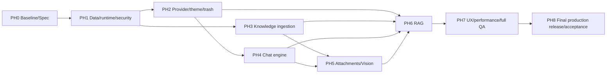

# EKB 核心重构实施计划

## 1. 执行原则

1. Incremental Refactor，不推倒 EKB 控制面，也不保留已确认的错误架构。
2. 所有业务源码、测试、运行配置和 migration 写入由 `luna_max_worker` 串行执行；Sol 拆解、决策、审查和最终门禁。
3. 当前脏工作树属于用户。实施前创建独立 baseline branch/commit 并推送 origin，禁止 reset/clean。
4. 已应用 migration/checksum 不改；新 migration additive、可验证、可回滚/前滚。
5. 每个实现 Phase 完成后必须更新本目录状态、证据、项目记忆，推送最新代码并部署到服务器；门禁失败不切换生产。
6. Spec/研究阶段只更新文档和记忆，不因没有运行时代码变化而做无意义生产重启。
7. 生产出网、对象存储、队列或密钥前置条件不满足时，阻止对应 Phase 发布。

## 2. 依赖顺序

## 3. PH0 — 文档批准与安全基线

### 目标

冻结本 Spec、工作树和生产数据事实，避免后续无法判断改动来源。

### 任务

- `CR-PH0-T01`：完成 00–14 文档链接、FR/NFR/AC/Phase、API/DB 一致性审查。
- `CR-PH0-T02`：复核已建立的 `docs/README.md` authority/supersession 入口，记录用户最终确认和后续状态差异；更新项目 `MEMORY.md`，不存凭据。
- `CR-PH0-T03`：审计当前 290+ 脏/未跟踪项，生成仅内容/路径/状态的 manifest。
- `CR-PH0-T04`：在 `codex/` 前缀独立 baseline branch 提交当前基线并推送 origin；不整理/丢弃用户改动。
- `CR-PH0-T05`：固定第三方研究 commit、license、SBOM/provenance 决策；不引入代码。

### Exit Gate

用户批准 Spec；文档检查通过；baseline 可从远端恢复。此 Phase 无业务运行时代码变化，不重启生产。

### PH0 当前执行记录（2026-08-12）

- 分支已创建并切换为 `codex/ekb-core-baseline-20260812`；未执行 commit、push、reset、checkout 覆盖、clean 或生产写操作。
- 已形成 [`PH0 baseline evidence`](../../evidence/ekb-core-rebuild/ph0/2026-08-12-baseline/manifest.md)：工作树 manifest、范围、生产只读限制、provenance、secret scan、verification 和 included/excluded paths。
- 本次断点续作仅收紧 `scripts/deploy/**` 的运行时目标、管理员凭据和日志边界：`DEPLOY_HOST`/`DEPLOY_USER` 缺失或占位时拒绝运行，受管管理员设置缺失或使用默认身份时拒绝运行，密码注入不可用时不回退交互式输入；生产目标、凭据、provider 端点和原始响应不写入证据。
- 本阶段证据中的生产 health、迁移 ledger、备份和浏览器状态均为 `BLOCKED/NOT RUN`；详见 [`production-readonly.md`](../../evidence/ekb-core-rebuild/ph0/2026-08-12-baseline/production-readonly.md)。
- `scripts/deploy/` 的运行时目标与 SSH 密码策略已脱敏并 fail closed；不属于业务运行时代码、测试、migration、依赖或部署执行。
- 00–14 本地 Markdown 链接、FR/NFR/AC/Phase ID 交叉检查已完成；生产 health/ledger/backup 复核为 `BLOCKED/NOT RUN`，不作为通过证据。
- PH1–PH8 仍为未实施计划，不得以本记录作为任何业务实现、迁移、生产部署、备份恢复或用户验收完成声明。

## 4. PH1 — 数据、任务与安全基础

### 目标

消除迁移、认证、持久存储和后台任务 P0，使后续功能有可靠底座。

本 Phase 严格 apply `v4_001_migration_provenance`、`v4_002_runtime_jobs`、`v4_003_provider_security`、`v4_004_postgres_cutover`；先完成 credential 加密/明文依赖清除，再在全部 rehearsal/回滚门禁通过后把生产主库原子切到 PostgreSQL，不得提前 apply 后续版本。

### 任务

- `CR-PH1-T01`：创建 migration provenance ADR/manifest，修复 entrypoint fail-closed；新增 verifier。
- `CR-PH1-T02`：部署 PostgreSQL+pgvector schema、对象存储、可靠 queue、worker、scheduler、health/metrics。
- `CR-PH1-T03`：实现 background jobs/outbox、lease、heartbeat、retry/DLQ 和 tenant-scoped Jobs API 基础。
- `CR-PH1-T04`：统一 live auth；修复 QA turn tenant+actor read/cancel/terminal scope。
- `CR-PH1-T05`：建立 secret master-key/redaction/rotation 接口，迁移 Provider credential 为 encrypted-first，生产缺 key fail closed；PH2 再实现完整 adapter/capability/UI。
- `CR-PH1-T06`：SQLite→PostgreSQL rehearsal、数据/约束/回滚报告；通过后在≤5分钟写冻结窗口原子切换生产 DSN，旧 SQLite 只读归档。

### Checks

迁移重复执行/失败启动、逐表/租户/关系对账、tenant isolation、turn actor negative、queue crash/duplicate、secret scan、storage/pgvector health、旧 API compatibility、DSN 切换/回滚。

### Deploy Gate

QA 全链部署 → 备份生产 → additive migration/import/verify → canary health/browser → PostgreSQL DSN 与代码原子发布。PH1 失败保持 SQLite 旧版本；PH1 成功后 SQLite 只读，后续 Phase 不得双写。任何基础组件未健康则不切换。

## 5. PH2 — Provider、主题与回收站闭环

### 目标

先提供 Chat 依赖的可信模型路由，同时关闭 Dark Mode 和 30 天清理的现存缺口。

本 Phase apply `v4_005_retention_governance`；Provider security schema 已在 PH1 完成，本 Phase 只在其上实现 adapter/capability/UI。

### 任务

- `CR-PH2-T01`：原生 OpenAI/Anthropic/Gemini adapter 和受控 compatible profiles。
- `CR-PH2-T02`：Provider/Model canonical registry、capability、ownership、health、fallback 和 available-models projection。
- `CR-PH2-T03`：个人中心 UI、真实同步、Logo registry、禁用/删除/selector fallback。
- `CR-PH2-T04`：语义 token、共享组件/portal theme bridge、raw-color lint，迁移全部主要页面。
- `CR-PH2-T05`：统一 trash deletion generation、Scheduler purge、Jobs Center cleanup projection。

### Checks/Deploy

Provider real-call matrix（出网是硬门禁）、key leak scan、Light/Dark browser matrix、clock-controlled 30-day purge、审计保留。通过后推送并原子部署。

## 6. PH3 — 知识库可靠上传与索引

### 目标

让单文件、批量和目录真正进入对象存储、版本、Chunk、Embedding 和 pgvector。

本 Phase apply `v4_006_storage_ingestion`。

### 任务

- `CR-PH3-T01`：upload batch/item、预签名 multipart、path normalization、limits、幂等。
- `CR-PH3-T02`：source object/document version/profile/generation schema 和迁移/backfill。
- `CR-PH3-T03`：parser registry、隔离 LibreOffice、PDF/Office/文本处理与错误分类。
- `CR-PH3-T04`：ingest worker stage、lease/retry/cancel/reconcile、真实进度。
- `CR-PH3-T05`：Embedding/pgvector build/swap/reindex/rollback。
- `CR-PH3-T06`：全局 Upload Center、逐项状态/失败/重试和刷新恢复。
- `CR-PH3-T07`：KB ACL 在命令/worker/检索/恢复全链统一。

### Checks/Deploy

执行 KB-E2E-01..10、对象/DB/vector 对账、worker crash、10+ 文件和目录浏览器测试。全绿后备份、推送、部署；失败保持旧上传入口并关闭 feature flag。

## 7. PH4 — AI Chat Engine

### 目标

完成普通多轮对话、分支、流式和上下文治理；移除联网搜索。

本 Phase apply `v4_007_chat_graph`，不提前暴露附件 API。

### 任务

- `CR-PH4-T01`：conversation branch/message parts/turn snapshots/citation 基础迁移和 legacy backfill。
- `CR-PH4-T02`：新 Turn transaction、SSE v2 reducer、唯一终态和状态查询。
- `CR-PH4-T03`：Stop/Retry/Regenerate/active branch 和部分消息持久化。
- `CR-PH4-T04`：Token Budget、summary report、最近完整 Turn 和 deterministic fallback。
- `CR-PH4-T05`：异步标题/用户 title lock。
- `CR-PH4-T06`：安全 Markdown/Code UI、conversation CRUD/history/branch UI。
- `CR-PH4-T07`：删除 web-search UI/API/runtime/config，并保持 KB search 独立。

### Checks/Deploy

CHAT-E2E-01..10、actor isolation、Provider failure classification、刷新/断线/分支 browser。通过后推送和原子部署。

## 8. PH5 — 附件、OCR 与 Vision

### 目标

聊天文件/图片实际进入 Context，并能安全提升到 KB。

本 Phase apply `v4_008_attachments`。

### 任务

- `CR-PH5-T01`：attachments/artifacts/message relation 生命周期、上传和权限。
- `CR-PH5-T02`：小文件 inline、大文件 attachment retrieval 和 token quota。
- `CR-PH5-T03`：图片 decode/derivative、native Vision routing、OCR/caption fallback。
- `CR-PH5-T04`：扫描 PDF/OCR locator、Office/XLSX 上下文。
- `CR-PH5-T05`：attachment promotion 复用 PH3 ingestion。
- `CR-PH5-T06`：Composer/消息附件 UI、处理方式披露、恢复/失败操作。

### Checks/Deploy

ATT-E2E-01..08、恶意/超限输入、撤权/过期/跨用户、真实 Vision/OCR。通过后推送和部署；未配置 Vision 时只启用已验收 fallback，不能标原生 Vision 完成。

## 9. PH6 — Knowledge Base + AI RAG

### 目标

让 0..N KB、Strict/Enhanced、精确引用和 ACL 在 Chat 内闭环。

### 任务

- `CR-PH6-T01`：retrieval scope snapshot、ACL、version/profile/generation filtering。
- `CR-PH6-T02`：pgvector/hybrid（若启用）retrieval、per-KB quota、dedupe/rerank。
- `CR-PH6-T03`：Strict evidence gate/refusal；Enhanced knowledge separation。
- `CR-PH6-T04`：message citation persistence、版本定位和失权 UI。
- `CR-PH6-T05`：RAG eval fixtures、retrieval preview 和回答证据 viewer。

### Checks/Deploy

0/1/N KB、严格拒答、增强分隔、版本/删除/撤权/reindex negative、TXT/PDF 用户验收。全绿后推送和部署。

## 10. PH7 — 全系统 UX、性能与回归

### 目标

把各纵向功能组合为稳定产品，达到浏览器和 grok-build 能力级对比标准。

### 任务

- `CR-PH7-T01`：全路由 Light/Dark/desktop/mobile/state matrix 和 accessibility。
- `CR-PH7-T02`：200 用户/30 并发/目标数据规模的列表、SSE、队列和检索性能验证。
- `CR-PH7-T03`：全量 compatibility/security/secret/supply-chain/SBOM 门禁。
- `CR-PH7-T04`：与 grok-build/成熟 Web Chat 的同模型场景对比并修复 P0/P1/P2。
- `CR-PH7-T05`：运维手册、用户手册、故障/回滚和 evidence manifest。

### Exit/Deploy

P0/P1/P2=0、console=0、核心旅程全部真实浏览器通过；推送并部署 canary。性能或安全不达标不进入 PH8。

## 11. PH8 — 生产最终发布与验收

### 前置条件

生产稳定出网/受管代理、Provider 凭据、对象存储、队列、master key、备份恢复演练和用户批准窗口全部满足。

生产主库已在 PH1 切到 PostgreSQL；本 Phase 不新增“补做切库”migration，而是对 PH1 以来的主库、对象和索引执行最终增量对账。任何差异阻止最终验收。

### 最终发布 Runbook

1. 发布前备份 PostgreSQL/object/config，并验证恢复；PH1 留存的 SQLite 只读快照继续按保留策略保存。
2. 验证 migration manifest 无漂移/缺失、所有 `v4_001–008` verify 通过；失败立即停止。
3. QA tenant 执行全链 smoke 和 GROK-CMP-01–06。
4. 对 PH1 以来 PostgreSQL、对象和向量做最终增量/引用对账，不从 SQLite 覆盖新数据。
5. 原子切换应用镜像和最终 feature flags，启动/滚动 API、workers、scheduler；目标用户中断≤5分钟。
6. 健康、真实 Provider、上传、Chat、RAG、Trash 浏览器 smoke。
7. 观察错误、队列、数据库和资源；超阈值按应用/flag 回滚矩阵执行，主库保持 PostgreSQL。
8. 用户验收后结束观察窗，归档证据和 Remaining Issues。

### 最终交付

输出 `EKB Core Upgrade Report`：原问题、Root Cause、修改、架构/DB/API/UI、GitHub benchmark、自动测试、浏览器测试、失败/修复、Remaining Issues 和只勾真实完成项的 checklist。

## 12. 每阶段强制同步

每个 PH 完成后：

1. 更新本目录相关文档的 status/decision/evidence link；
2. 更新 `docs/README.md` authority/status；
3. 更新项目 `MEMORY.md`：日期、完成、决策、验证、未决事项，不写凭据；
4. 将该 Phase 精确变更提交并推送远端；
5. 实施 Phase 上传/部署最新代码到服务器，执行健康和浏览器 smoke；
6. 保存 deployment/rollback evidence；
7. Sol 审查 diff 和证据，明确是否进入下一 Phase。

## 13. 停止条件

- 发现历史 migration/checksum 将被改写；
- 需要删除/重置用户工作树；
- 安全/租户/密钥/数据完整性测试失败；
- 生产备份或回滚不可验证；
- 出网/Provider/存储等外部前置未满足却要求勾选验收；
- 第三方许可证/来源不清；
- 新架构决策超出本 Spec 且会改变产品边界。

出现停止条件时保持生产旧版本可用，记录 BLOCKED 和所需用户/外部决策，不用 mock 绕过。

## PH1 foundation local execution record (2026-08-12)

CR-PH1-T01 + CR-PH1-T03 第一真实业务切片已在本地工作树执行：新增 v4_001/v4_002 provenance/runtime migration 与 DB-backed jobs service，补齐 v4 runner、entrypoint fail-closed 和 v4 targeted tests。实现保留历史 v3 migration/schema contract，不修改历史 v3 migration。

本地门禁包括 v4 apply/verify/repeat/rollback dry-run、checksum drift、immutable ledger、tenant-scoped idempotent enqueue、claim/heartbeat/complete/retry/dead-DLQ/outbox、entrypoint migration/verify/admin/config failure no-start，以及相关 v3 migration regression。证据入口为 `docs/evidence/ekb-core-rebuild/ph1/2026-08-12-foundation/`。

状态只记为 `PH1_FOUNDATION_REPAIR_LOCAL_PASS / PENDING SOL REVIEW`：SQLite 与 disposable 本地 PostgreSQL+pgvector 已验证；未执行生产 DSN 切换、生产 migration/deploy/restart、真实 uvicorn 启动或生产管理员初始化。v4 runner 不隐式调用 ORM `create_all`，生产缺少 imported legacy schema 时 fail closed；不得将本记录解释为 PH1 总体 exit gate 已通过。

## Local business closure record (2026-08-13)

本地真实上传批次、开发对象存储、checksum complete、后台 ingest worker、远程 Embedding 缺失时的 `EMBEDDING_UNAVAILABLE` fail-closed、附件问答与引用、文档中心真实浏览器验收和回归结果见 [`docs/evidence/ekb-core-rebuild/local/2026-08-13-local-business.md`](../../evidence/ekb-core-rebuild/local/2026-08-13-local-business.md)。该记录仅标记已执行的本地切片，不改变 PH1–PH8 的生产阻塞状态；生产 PostgreSQL/pgvector、对象存储、可靠队列、Provider 凭据、部署、备份和回滚仍未执行。
