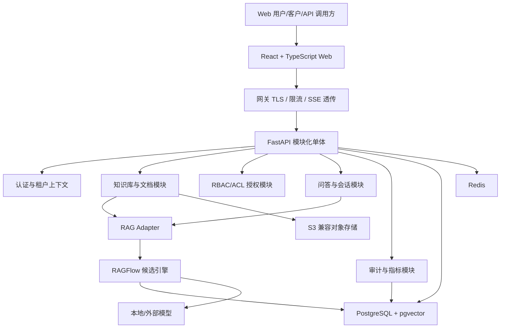
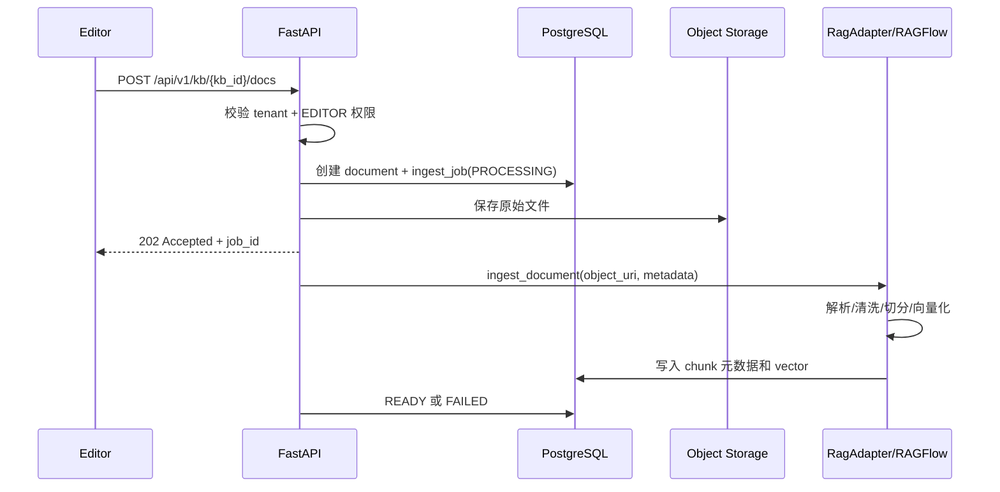
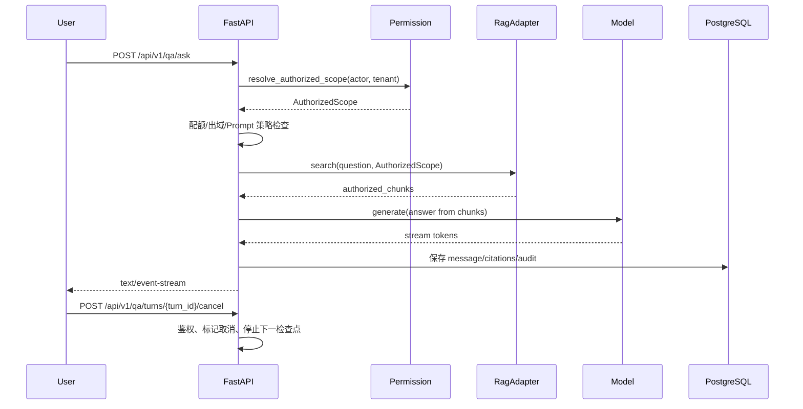

# EKB 技术架构与详细设计

> **配套文档**：[企业级知识库 Spec](./企业级知识库Spec_v1.0_2026-08-07.md) · [API 接口契约](./API接口契约_v1.0_2026-08-07.md) · [数据模型与数据库设计](./数据模型与数据库设计_v1.0_2026-08-07.md) · [知识库 AI 对话流式交互升级设计](./知识库AI对话流式交互升级设计_v1.0_2026-08-08.md) · [开发 Skills 与使用规范](./开发Skills与使用规范_v1.0_2026-08-07.md)
> **文档版本**：v1.0（待评审）  
> **编写日期**：2026-08-07  
> **用途**：把项目架构拆成可实现的模块、数据流、接口边界和部署拓扑，作为 M0/M1 技术评审与开发输入。

---

## 1. 架构目标

| 目标 | 设计要求 | 验收方式 |
|---|---|---|
| 可替换 RAG 引擎 | 业务层只依赖内部 `RagAdapter`，不把 RAGFlow 内部模型暴露给租户 | Adapter 契约测试 |
| 租户隔离 | API、DB、索引、对象存储、缓存、审计都显式带 `tenant_id` | 权限专项测试 |
| 可信问答 | 证据先行、系统侧引用、低证据拒答 | RAG 评估集 |
| 私有化交付 | Docker Compose 可 PoC，生产按容量增强 | 部署演练和恢复演练 |
| 渐进扩展 | MVP 不默认引入复杂组件，保留升级触发条件 | M4 容量评估 |

实现边界按任务读取对应本地 skill：React 组件使用 `react-best-practices` 和 `composition-patterns`，浏览器流程使用 `playwright`，API、租户和模型路由使用 `security-best-practices`，新增信任边界时补充 `security-threat-model`。这些参考不能绕过 `AuthContext`、`AuthorizedScope` 或 Adapter 契约。

## 2. 逻辑架构



## 3. 服务与模块边界

| 模块 | 职责 | 不负责 | 关键需求 |
|---|---|---|---|
| Web 前端 | 页面、状态、SSE 展示、引用跳转、反馈入口 | 自行判断真实权限 | `FR-QA-01`、`FR-QA-02`、`FR-AC-04` |
| Gateway | TLS、路由、限流、请求 ID、SSE 透传 | 业务鉴权和 RAG 编排 | NFR 安全/性能 |
| Auth/Tenant | 登录、Token、租户上下文、成员身份 | 知识库 ACL 细节 | `FR-AC-01`、`FR-AC-02` |
| Permission | 角色、ACL、有效授权范围、缓存失效事件 | 只做 UI 隐藏 | `FR-AC-02`、`FR-AC-03` |
| Knowledge | 知识库、文档、版本、入库任务、对象存储引用 | 模型推理 | `FR-KB-01`–`FR-KB-06` |
| QA/Search | 会话、消息、检索请求、Prompt 策略、SSE 输出 | 直接访问未授权索引 | `FR-QA-*`、`FR-SE-*` |
| RagAdapter | 解析、索引、检索、生成的内部契约适配 | 保存业务权限真相 | `FR-SE-01`、`FR-QA-05` |
| Audit/Metric | 审计、指标、脱敏、留存、导出审批 | 保存明文密钥 | `FR-OP-01`、`FR-OP-02` |

## 4. 内部契约

### 4.1 `AuthContext`

```json
{
  "actor_id": "uuid",
  "tenant_id": "uuid",
  "tenant_role": "OWNER|ADMIN|MEMBER|CUSTOMER",
  "platform_role": "NONE|SUPPORT|ADMIN",
  "capabilities": ["kb:read", "qa:ask"],
  "policy_version": 3,
  "trace_id": "string"
}
```

所有业务入口必须显式接收或构造 `AuthContext`。禁止通过前端传入的 `tenant_id` 直接决定数据范围；客户端只可传当前租户意图，服务端以 Token 和成员关系为准。

### 4.2 `AuthorizedScope`

```json
{
  "tenant_id": "uuid",
  "kb_ids": ["uuid"],
  "doc_ids": ["uuid"],
  "visibility_rules": ["PUBLIC", "TEAM", "PRIVATE"],
  "principal_hash": "sha256",
  "policy_version": 3,
  "expires_at": "2026-08-07T08:00:00Z"
}
```

`AuthorizedScope` 是检索、引用、缓存和对象签名的共同输入。权限变更后必须让相关 `policy_version` 或主体权限摘要变化，从而使缓存失效。

### 4.3 `RagAdapter`

| 方法 | 输入 | 输出 | 约束 |
|---|---|---|---|
| `ingest_document` | 文档元数据、对象 URI、切分策略、权限元数据 | 入库任务 ID、状态 | 幂等，失败可重试 |
| `delete_document` | `tenant_id`、`doc_id`、版本 | 删除/下线结果 | 不能硬删审计所需元数据 |
| `search` | 问题、`AuthorizedScope`、过滤器、top_k | 授权 chunk 列表 | 不返回未授权片段 |
| `generate` | 问题、授权上下文、Prompt 版本、模型策略 | 流式 token 或完整结果 | 外部模型调用必须经过出域策略 |

业务层保留所有实体主键和审计记录；RAG 引擎只保存检索所需的派生数据和可回溯引用。

## 5. 关键数据流

### 5.1 文档入库写读链路



**链路要求**：

- 写入口：`POST /api/v1/kb/{kb_id}/docs`。
- 存储目标：`documents`、`document_versions`、`ingest_jobs`、`chunks`、对象存储。
- 读入口：`POST /api/v1/search`、`POST /api/v1/qa/ask`。
- 状态过滤：只有 `READY` 文档和有效版本参与检索。

### 5.2 在线问答链路



**关键约束**：

- Query Rewrite 只有在数据策略允许时才能调用模型。
- 检索、重排、上下文、引用和缓存使用同一份授权范围。
- SSE 失败、取消、超时都必须产生可审计事件。
- Conversation Stream v2 通过 `turn_id + seq` 隔离旧流；`qa_turns` 只保存轮次状态和取消标记，不作为事件回放日志。
- v2 首版使用心跳和分阶段空闲超时保持可观测性；断线恢复和 `Last-Event-ID` 回放必须等 M3 事件存储决策后再实现。

## 6. 部署拓扑

### 6.1 PoC/MVP

```text
Browser
  -> Gateway
  -> web container
  -> api container
  -> rag container
  -> postgres / redis / object-storage
  -> local-model or approved external API
```

PoC 可以把 Web、API、RAG、数据库和对象存储部署在单台测试机器上，但必须使用独立配置、独立密钥和脱敏数据。

### 6.2 生产强化

生产阶段按 M4 压测和安全要求决定是否引入：

| 组件 | 触发条件 | 迁移要求 |
|---|---|---|
| Kubernetes | 多副本、滚动发布、资源隔离成为刚需 | 镜像、配置、健康检查和回滚脚本先在 staging 演练 |
| Elasticsearch | PostgreSQL 全文检索或引擎索引不能满足容量/查询需求 | 保持 `SearchAdapter` 契约不变 |
| Milvus | pgvector 在向量量级或延迟上不足 | chunk 元数据仍由业务库保持租户边界 |
| 消息队列 | 入库任务可靠投递、峰值削峰或跨服务异步成为瓶颈 | 任务表与队列状态需要一致性设计 |

## 7. 失败模式与降级

| 场景 | 系统行为 | 审计/告警 |
|---|---|---|
| 文档解析失败 | 标记 `FAILED`，保留原因和重试入口，不参与检索 | 记录 `document.ingest.failed` |
| RAG 检索超时 | 返回可解释错误或降级到关键词检索 | 记录 `rag.search.timeout` |
| LLM 超时 | 按租户策略切备用模型或返回降级结果 | 记录模型、耗时、降级原因 |
| 权限变更 | 新请求立即使用新授权，相关缓存失效 | 记录 `permission.changed` |
| 对象存储不可用 | 上传失败或引用预览降级，不暴露内部路径 | 记录 `object_storage.error` |
| 外部模型被策略禁止 | 不调用外部模型，返回本地路径或拒绝 | 记录 `model_route.blocked` |

## 8. 设计评审清单

- [ ] M0 冻结 RAGFlow 版本、许可证、部署依赖和替换策略。
- [ ] 所有模块接口都有 `tenant_id`、`trace_id` 和统一错误形状。
- [ ] 文档入库和问答两条写读链路都有状态机、幂等和重试设计。
- [ ] 检索期权限过滤在 Adapter 契约中不可绕过。
- [ ] 外部模型调用前有数据分类、租户策略和审计记录。
- [ ] 缓存键包含租户、主体权限摘要、知识版本、模型/Prompt 版本和策略版本。
- [ ] M1 tracer bullet 能从上传一个文档走到带引用的问答结果。

---

_架构的核心不是组件多，而是边界稳：业务真相在 FastAPI/数据库，RAG 能力通过 Adapter 可替换，租户权限贯穿所有读写链路。_
