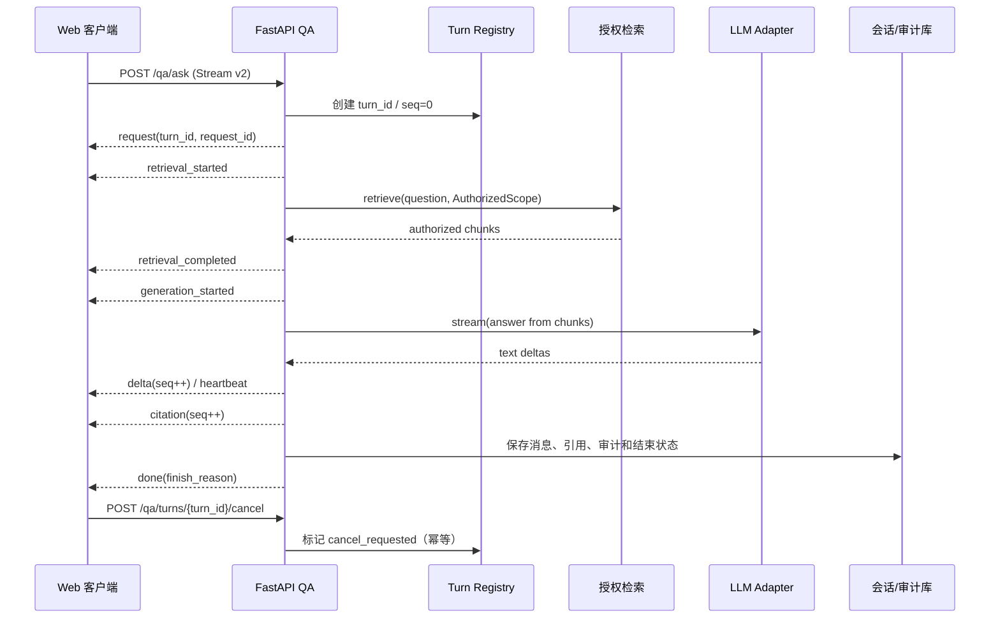

# EKB 知识库 AI 对话流式交互升级设计

> **文档类型**：Engineering Design Doc
> **版本**：v1.0
> **状态**：Draft
> **作者**：Codex（基于 EKB 当前实现与 Grok 源码快照整理）
> **评审人**：EKB 技术负责人、后端负责人、前端负责人、QA 负责人、安全负责人
> **最后更新**：2026-08-08
> **关联文档**：[API 接口契约](./API接口契约_v1.0_2026-08-07.md)、[MVP 需求与验收标准](./MVP需求与验收标准_v1.0_2026-08-07.md)、[测试策略与质量门禁](./测试策略与质量门禁_v1.0_2026-08-07.md)、[项目任务分解与 Backlog](./项目任务分解与Backlog_v1.0_2026-08-07.md)、[项目决策记录](./项目决策记录与开放问题_v1.0_2026-08-07.md)

---

## 1. TL;DR

EKB 已有可工作的 SSE 问答链路，但缺少稳定的轮次标识、事件序号、阶段状态、空闲超时和明确取消语义，长回答或快速重发时容易出现旧流污染、重复渲染和状态错乱。本方案借鉴 `/Users/alin/Openclaw项目/grok-build` 中 Grok 的流生命周期、乱序隔离、取消恢复和增量渲染思想，原生实现 EKB Conversation Stream v2。首版只升级知识库问答体验，不嵌入 Grok 的 Rust TUI、工具调用、代理权限或内部思考内容。主要取舍是先保证可审计和租户边界，再把断线续传与事件回放延后到 M3，因此首版难度为中高、完整 Grok 级能力为高到很高。

## 2. 背景与现状

### 2.1 EKB 当前链路

- 后端入口为 `apps/api/ekb_api/routers/qa.py` 的 `POST /api/v1/qa/ask`。
- 当前事件顺序为 `request -> retrieval -> token* -> citation* -> done`，异常时发送 `error -> done`。
- 已有租户/知识库授权、配额、模型出域检查、总超时、断连取消、拒答、引用、审计、部分输出落库和降级逻辑。
- 前端 `apps/web/src/lib/api.ts` 使用 `fetch + ReadableStream` 手工解析 SSE，`apps/web/src/App.tsx` 在每个 token 到达时更新 React 消息。
- 前端会先调用 `/search` 做预览，再用预览结果补全 SSE 的 `citation`；这使展示引用依赖第二次请求，不能保证与实际生成上下文完全一致。

### 2.2 Grok 源码核验

| 项 | 快照 |
|---|---|
| 本地路径 | `/Users/alin/Openclaw项目/grok-build` |
| 当前提交 | `8adf9013a0929e5c7f1d4e849492d2387837a28d` |
| `SOURCE_REV` | `2ec0f0c8488842da03a71eeee3c61154957ca919` |
| 许可证 | 上游根目录 Apache-2.0 |
| 工作树注意 | 存在用户未跟踪文件 `run-grok.sh`，本设计不修改该目录 |
| 性质 | Rust TUI/ACP 编码代理，不是可直接嵌入 Web 的聊天组件 |

Grok 的源码位置和用途：

- `crates/codegen/xai-grok-sampling-types/src/messages.rs`：显式的 `message_start`、`content_block_start/delta/stop`、`message_delta`、`message_stop`、`ping`、`error` 生命周期；delta 分类包含文本、thinking、输入 JSON 和签名。
- `crates/codegen/xai-grok-pager/src/app/agent.rs`：`TurnRunning`、`TurnCancelling`、`Idle` 状态和 `current_prompt_id` 乱序隔离。
- `crates/codegen/xai-grok-pager/src/scrollback/state/mod.rs`：增量追加、局部缓存失效和脏区高度更新。
- `crates/codegen/xai-grok-shell/src/agent/update_chunk_merge.rs`：按数量、字节和时间窗口合并流片段，默认约 100 项、2 KB、10 ms。
- `crates/codegen/xai-grok-shell/src/agent/config.rs`：按片段空闲超时，而不是只设置总时长超时。
- `crates/codegen/xai-grok-pager/tests/pty_e2e/`：覆盖中途取消恢复、首 token 前撤回、取消后重发和队列消息不重复渲染。

## 3. 目标与非目标

### 3.1 目标

1. 让每次问答具备不可预测且可审计的 `turn_id`，旧流、重发和取消后的事件不能污染当前轮次。
2. 让客户端能准确表达 `queued/retrieving/generating/cancelling/completed/failed` 阶段，并在首个可见输出前后采用不同的取消恢复策略。
3. 将引用直接绑定在 SSE 事件 payload，保证 UI 展示的引用就是服务端实际授权上下文的引用。
4. 在不破坏 v1 调用方的前提下，提供事件序号、心跳、分阶段空闲超时和统一的完成原因。
5. 将协议、状态机和失败路径纳入可重复的单元、契约、E2E 和压测门禁。

### 3.2 非目标

| 非目标 | 原因 |
|---|---|
| 直接嵌入 Grok Rust TUI/ACP | 运行时、渲染目标、认证和工具权限模型与 EKB Web/多租户服务不兼容；借鉴协议思想的成本更低且可控。 |
| 引入 Grok 的浏览器、文件系统、终端和代理工具调用 | 知识库问答当前是只读检索产品，工具调用会扩大出域、注入和审计攻击面。 |
| 展示 `thinking/reasoning` 内容 | 内部推理不是可审计证据，可能泄露策略或敏感信息；EKB 只展示答案、状态和系统生成引用。 |
| 首版实现断线续传、事件回放和跨实例恢复 | 需要事件存储、TTL、幂等和安全校验，属于 M3 独立能力，不与体验升级捆绑。 |
| 替换 EKB 的多租户会话、审计和消息持久化 | Grok 的会话模型服务于本地代理，不能替代 EKB 的租户留存和合规边界。 |

## 4. 评估结论与实现难度

### 4.1 对照结论

| 维度 | Grok 可借鉴 | EKB 需要新增或调整 | 难度 |
|---|---|---|---|
| 流生命周期 | start/delta/stop、显式错误和心跳 | v2 阶段事件、统一 envelope、`seq` | 中高 |
| 轮次隔离 | `prompt_id` 丢弃旧更新 | `turn_id` + 当前轮校验 + 单调序号 | 中 |
| 取消 | 首 token 前撤回，已有输出后保留部分输出 | 明确 cancel API、服务端取消标记、审计 | 中高 |
| 增量渲染 | 追加 chunk、局部缓存失效、批量合并 | 前端 RAF/16–50 ms 合并，避免每 token setState | 中 |
| 超时 | per-chunk idle timeout | 检索/生成分别计时，心跳不掩盖上游空闲 | 中高 |
| 重连回放 | 代理侧可恢复的事件语义 | 需要事件存储、Last-Event-ID 和安全重放 | 高（M3） |
| 工具/代理任务 | Grok 原生能力 | EKB 当前边界不需要 | 很高，不纳入 |

### 4.2 工期与依赖（单团队估算）

| 阶段 | 范围 | 估算 | 依赖 | 退出条件 |
|---|---|---:|---|---|
| M0 设计冻结 | 协议 v2、状态机、字段、兼容策略、指标 | 1–2 人日 | API/安全/QA 评审 | 契约与 OQ 关闭 |
| M1 后端协议 | envelope、序号、阶段、心跳、分段空闲超时、turn registry | 3–5 人日 | M0、数据库迁移 | 契约测试和旧客户端兼容通过 |
| M1 前端体验 | SSE 解析器、状态机、旧流隔离、渲染批处理、引用直连 | 3–5 人日 | 后端事件样例 | E2E 成功/取消/重发/失败通过 |
| M1/M2 取消闭环 | `POST /qa/turns/{turn_id}/cancel`、轮询标记、审计 | 2–3 人日 | turn registry、权限 | 取消竞态和审计测试通过 |
| M3 重连回放 | 事件 TTL、Last-Event-ID、跨实例恢复 | 5–10 人日 | Redis/事件存储、部署拓扑 | 断线恢复和安全重放验收 |

**总体判断**：只做 M1/M2 的流体验升级为中高难度，约 8–15 人日；包含 M3 重连回放约 13–25 人日。若再加入 Grok 级工具调用、后台队列和代理权限，属于新的产品域，难度很高，不建议纳入本项目当前版本。

## 5. 方案概览



数据流必须保持：鉴权 → 授权范围计算 → 检索/重排 → 上下文构建 → 外部模型出域检查 → 流式生成 → 系统侧引用 → 消息与审计落库。任何模型调用不得早于授权过滤和出域策略检查。

**核心取舍**：服务端 envelope 增加少量字节和状态管理成本，但换取事件可验证、旧流可丢弃和问题可回放；首版不保存完整事件历史，以控制数据库和隐私成本，断线恢复另行设计。

## 6. 详细设计

### 6.1 SSE v2 协议

客户端在请求头声明 `X-EKB-Stream-Version: 2`；未声明时继续返回 v1 事件，兼容窗口至少保留一个发布周期。v2 每个事件都包含以下 envelope：

```json
{
  "turn_id": "turn_01J...",
  "request_id": "req_01J...",
  "seq": 4,
  "timestamp": "2026-08-08T08:00:00.120Z",
  "payload": {}
}
```

约束：

- `turn_id` 由服务端使用不可预测随机值生成，绑定 `tenant_id`、`actor_id`、`conversation_id` 和 assistant message；客户端不能自定义或跨租户复用。
- `seq` 从 1 开始，单个 turn 严格递增；同一 `seq` 重复时客户端丢弃，出现倒退时记录告警并丢弃。
- `request_id` 继续承担 trace/audit 关联；`turn_id` 承担用户轮次和取消目标，二者不能混用。
- `timestamp` 为 UTC ISO 8601；SSE `id` 可编码为 `${turn_id}:${seq}`，但 M1 不承诺回放。
- 事件数据只允许文本、阶段、引用、完成和错误，不返回 `thinking/reasoning`、原始 prompt、未授权 chunk 或上游 secret。

| 事件 | `payload` 关键字段 | 说明 |
|---|---|---|
| `request` | `message_id,conversation_id` | 建立本轮服务端身份；第一个事件 |
| `queued` | `position?` | 可选的排队阶段，M1 无队列时可省略 |
| `retrieval_started` | `authorized_kb_count` | 开始授权检索 |
| `retrieval_completed` | `chunk_count,duration_ms` | 检索完成；不返回未授权细节 |
| `generation_started` | `model_alias,prompt_version` | 开始生成；不得返回真实模型密钥 |
| `delta` | `kind:"text",text` | 文本增量；拒答文本也可走此事件 |
| `citation` | `citation_id,doc_id,chunk_id,title,section_path,version,updated_at` | 直接使用服务端实际证据 |
| `heartbeat` | `stage` | 每 10 秒以内一次，仅用于保持连接；不代表上游有 token |
| `error` | `code,message,retryable` | 面向用户的安全错误 |
| `done` | `message_id,finish_reason,confidence` | 终态；`stop|refusal|timeout|cancelled|error` |

示例：

```text
id: turn_01J...:1
event: request
data: {"turn_id":"turn_01J...","request_id":"req_01J...","seq":1,"timestamp":"2026-08-08T08:00:00Z","payload":{"message_id":"msg_01J...","conversation_id":"conv_01J..."}}

id: turn_01J...:5
event: delta
data: {"turn_id":"turn_01J...","request_id":"req_01J...","seq":5,"timestamp":"2026-08-08T08:00:00.120Z","payload":{"kind":"text","text":"先检查连接池使用率。"}}

id: turn_01J...:7
event: done
data: {"turn_id":"turn_01J...","request_id":"req_01J...","seq":7,"timestamp":"2026-08-08T08:00:01Z","payload":{"message_id":"msg_01J...","finish_reason":"stop","confidence":"medium"}}
```

SSE 解析器必须接受 `\n\n` 和 `\r\n\r\n` 分隔、多个 `data:` 行和注释心跳；收到 `done` 后停止读取并关闭 reader；JSON 无法解析时以协议错误结束，不把半截数据拼进答案。

### 6.2 取消、重发与状态机

前端状态：`idle -> queued -> retrieving -> generating -> cancelling -> completed|failed|cancelled`。每次发送都创建新的本地 `turnNonce`，收到 `request` 后绑定服务端 `turn_id`；只处理当前 turn 且 `seq > lastSeq` 的事件。

取消有两条路径：

1. 浏览器立即对 `AbortController` 发出 abort，停止 UI 读取。
2. 已获得 `turn_id` 时并行调用 `POST /api/v1/qa/turns/{turn_id}/cancel`；服务端将取消标记写入 turn registry，检索和生成循环在下一检查点停止，并发送一次 `done(cancelled)`（若连接仍在）。

取消 API：

```http
POST /api/v1/qa/turns/{turn_id}/cancel
Authorization: Bearer <access_token>
```

```json
{"turn_id":"turn_01J...","status":"cancelling"}
```

重复调用返回相同结果；目标 turn 不属于当前主体时返回统一 `404 NOT_FOUND`。取消接口不删除审计记录。

取消后的 UI 规则借鉴 Grok，但适配 EKB 审计：

- 首个可见 `delta`、`citation` 或拒答文本前取消：本地撤回乐观 user/assistant 对，恢复草稿；服务端保留取消审计，并在普通会话历史中隐藏空 assistant 和 `cancelled_before_visible` 用户消息，重发只出现一次。
- 已有可见输出后取消：保留已生成内容、引用和 `finish_reason=cancelled`，允许用户重试；不得用新回答覆盖旧的部分输出。
- 取消后重发：新 turn、新 assistant message、新 `seq`；旧 turn 的事件全部丢弃，不能重复追加 user 消息。
- 切换知识库、会话或退出登录：先取消当前 turn，再清理本地 active turn；迟到事件不得写入新会话。

### 6.3 服务端 turn registry 与数据模型

首版增加轻量 `qa_turns` 表（不保存完整事件正文），并为消息增加可空关联字段：

| 字段 | 类型/约束 | 说明 |
|---|---|---|
| `turn_id` | `varchar(64)` PK | 不可预测，服务端生成 |
| `request_id` | `varchar(64)` NOT NULL, index | trace 关联 |
| `tenant_id`,`actor_id` | UUID/索引 | 所有权和取消鉴权 |
| `conversation_id`,`assistant_message_id` | UUID/索引 | 关联会话和回答 |
| `stream_version` | smallint, default 2 | 协议版本 |
| `status` | enum | `running|cancelling|completed|failed|cancelled` |
| `last_seq` | integer >= 0 | 已发事件序号；并发更新需原子递增 |
| `first_visible_at` | timestamp nullable | 首个可见事件时间 |
| `cancel_requested_at` | timestamp nullable | 取消请求时间 |
| `finish_reason` | enum nullable | 终态原因 |
| `created_at`,`completed_at` | timestamp | 生命周期 |

`messages.turn_id` 可空以兼容历史消息；新增 `visibility_state`（`visible|cancelled_before_visible|hidden_empty`）或等价查询条件，历史记录无需回填。M1 不做完整事件表和回放 TTL；M3 设计事件存储前，不允许客户端根据 `Last-Event-ID` 声称已恢复。

### 6.4 超时、心跳与批处理

- 检索空闲超时默认 15 秒、生成上游片段空闲超时默认 20 秒、整轮总超时继续默认 60 秒；配置项分别命名，避免总超时掩盖 provider 卡死。
- 服务端每 10 秒发送 `heartbeat`，代理层设置 `Cache-Control: no-cache` 与 `X-Accel-Buffering: no`；心跳不能重置上游片段空闲计时。
- 服务端可按最多 100 个片段、2 KB 或 10 ms 合并 `delta`；前端以 `requestAnimationFrame` 或 16–50 ms 窗口批量提交 React state。用户可见首个 delta 的延迟预算为 200 ms，批处理不得超过该预算。
- 取消检查点至少位于检索前、检索后、每个上游片段后和落库前；线程无法强制中断时，以停止继续读取、标记取消和保留已生成内容作为降级。

### 6.5 前后端改造点

| 组件 | 改造 |
|---|---|
| `qa.py` | 生成并登记 turn；统一 envelope；阶段/心跳/序号；分段空闲计时；取消标记检查；直接发送 citation payload；落库终态 |
| `api.ts` | 抽取符合 SSE 规范的 parser；支持版本 header、CRLF、多 data、AbortSignal 和协议错误；向上层暴露 `turn_id/seq` |
| `App.tsx` | 将单一 `isAsking` 替换为 turn 状态机；active turn/last seq 隔离；RAF 批处理；首 token 前撤回与重发策略；取消 API |
| `ChatPanel.tsx` | 展示检索、生成、取消、超时、拒答、部分输出状态；引用直接使用 SSE payload；不展示 thinking |
| 测试 | 后端契约、取消竞态、乱序/重复事件、前端 parser、E2E 和压测 |

## 7. 备选方案

| 方案 | 取舍 | 为什么不选 |
|---|---|---|
| A. 保持 v1，只修 UI 文案 | 成本最低、无迁移 | 无法解决旧流污染、引用与实际证据脱节、空闲卡死和取消审计；只能作为临时回滚 |
| B. 直接嵌入 Grok Rust/TUI | 可复用较多现成交互代码 | 运行时和渲染目标不匹配，带入代理工具和权限边界，部署/许可证/安全成本不合理 |
| C. 采用通用第三方聊天 SDK | 可能快速得到重连和 UI 组件 | 难以表达 EKB 授权引用、拒答、审计和多租户；引入供应商耦合 |
| D. EKB 原生 Conversation Stream v2（推荐） | 改造中高，契约和状态可完全控制 | 需要一次协议迁移和前后端联调，但边界清晰、可逐步灰度 |

## 8. 安全、隐私、观测与性能

| 关注项 | 设计 |
|---|---|
| 安全 | `turn_id` 绑定租户/主体；cancel 重新鉴权；事件只含授权引用；旧流事件丢弃；提示注入仍由现有 RAG 安全策略处理。 |
| 隐私 | 不记录 thinking、原始上游 payload 或 secret；审计继续使用问题摘要和指纹；消息/turn 按现有留存与加密策略处理。 |
| 合规 | 遵守项目现有数据分类、最小权限、审计留存和外部模型出域策略；若客户部署涉及额外监管，先关闭 OQ-005/OQ-009。 |
| 观测 | 指标：首 request/检索完成/首 delta/完成延迟、各 finish reason、空闲超时、取消成功率、重复/乱序事件数；日志含 `turn_id`、`request_id`、tenant 摘要；trace 覆盖检索、生成和取消。 |
| 性能 | 目标：首个可见事件 P95 ≤ 1 s、首 delta P95 ≤ 3 s、正常完成 P95 ≤ 30 s；单 API 实例基线 2 QPS，压测后再调整；前端增量渲染 CPU 不超过单核 30%。 |
| 成本 | M1 仅增加少量 turn 行和心跳流量；按每轮约 10–20 个阶段/终态事件估算，事件正文不落库，成本低于引入完整回放存储；M3 另做容量预算。 |

## 9. 迁移、灰度与回滚

| 阶段 | 动作 | 进入/退出条件 | 回滚触发与动作 |
|---|---|---|---|
| M0 | 批准协议、字段、状态机、SLO 和安全规则 | API/前端/QA/安全评审完成 | 任何字段争议未解决则不改代码 |
| M1-a | 后端 v2 envelope、turn registry、心跳、空闲超时，feature flag 默认关闭 | v1 与 v2 契约测试通过 | P0 越权/错引或首 delta P95 > 5 s：关闭 flag，恢复 v1 |
| M1-b | 前端 v2 parser、阶段 UI、批量渲染、直接引用、旧流隔离 | 成功/拒答/取消/重发 E2E 通过 | 重复消息率 > 0.1% 或 parser 错误 > 0.5%：回退前端 v1 |
| M1-c/M2 | 显式 cancel API 和审计闭环，按租户 5% → 25% → 100% 灰度 | 取消竞态、断连、权限专项通过 | cancel 越权或无法终止上游：关闭 cancel flag，仅保留断连取消 |
| M3 | 事件 TTL、Last-Event-ID、重连回放和跨实例恢复 | 事件存储、重放安全和容量演练通过 | 重放跨租户、内存/存储超预算：停用回放，保留 v2 实时流 |

无历史消息数据回填；`messages.turn_id` 与 `visibility_state` 使用兼容迁移，先部署可读旧字段的代码，再执行字段迁移。v1 兼容窗口结束后（M2 发布完成且调用方迁移率 100%）再移除 `token/retrieval` 别名，不删除历史审计数据。

## 10. 测试与验证

| 层级 | 必测场景 | 通过标准 |
|---|---|---|
| 单元 | envelope、seq、SSE parser（LF/CRLF/multi-data）、状态机、取消状态和渲染合并 | 关键分支覆盖率 ≥90%，乱序/重复事件断言丢弃 |
| 后端集成 | turn 创建、授权、心跳、检索/生成空闲超时、显式 cancel、审计 | 每个终态只出现一次 `done`；越权 cancel 为统一 404 |
| 前端 E2E | 首 token 前取消、输出后取消、取消后重发、切换会话、断开连接、拒答、引用 | 不重复 user/assistant；旧 turn 不改变当前消息；草稿恢复符合规则 |
| 契约 | v1 客户端、v2 客户端与错误响应 | v1 兼容窗口内均通过 |
| 负载 | 2 QPS 基线、长回答、慢 provider、并发取消 | P95/SLO 达标；无事件队列无限增长 |
| 故障注入 | provider 卡住、半帧 JSON、代理缓冲、DB 落库失败、客户端刷新 | 安全错误、部分输出保留、审计可追溯、可重试 |
| 生产验证 | 5% 租户灰度、synthetic 问答、错误与延迟看板 | 24 小时无 P0，核心指标不劣于 v1 |

## 11. 运行准备

| 能力 | 基线 |
|---|---|
| On-call | 后端值守负责人（姓名待项目任命） |
| Dashboard | `qa_stream_latency`、`qa_stream_outcomes`、`qa_stream_protocol_errors`（链接待部署后补） |
| Page alert | 5 分钟内 `error+timeout` 占比 > 5%，或 P0 权限/引用告警 |
| Runbook | 复用[值守与故障响应手册](./值守与故障响应手册_M5-3_v1.0_2026-08-08.md)，新增“流式问答取消/协议错误”章节；Owner：后端负责人，M1 退出前 |
| SLO | 问答流可用性 ≥99.5%；首事件 p50 ≤500 ms/p99 ≤2 s；首 delta p50 ≤1.5 s/p99 ≤5 s；完整回答 p50 ≤10 s/p99 ≤60 s |

## 12. 风险与开放问题

| 项目 | 类型 | 可能性/影响 | 缓解或 Owner/截止 |
|---|---|---|---|
| 上游模型不支持及时取消 | 风险 | 中/高：连接断开但费用仍持续 | 每片段检查取消；provider adapter 增加 cancel；M2 前验证 |
| 代理或网关缓冲 SSE | 风险 | 中/高：用户看不到增量 | 心跳、禁止缓冲、staging 真实代理 E2E；后端负责人/M1 |
| 旧客户端误解析 v2 envelope | 风险 | 中/中：答案为空或 JSON 错误 | header 协商和 feature flag；M1 灰度 |
| 事件序号在多副本下竞争 | 风险 | 中/高：乱序或重复 | turn registry 原子递增；M1 集成测试 |
| 取消前的 user 消息是否在合规历史中可见 | 开放问题 | 中/中 | 产品/安全负责人，M0 评审前；默认隐藏 UI、保留审计 |
| M3 回放是否需要跨实例 Redis 或持久事件库 | 开放问题 | 中/高 | 技术负责人，M2 评审前；未决定前不实现回放 |
| **重写风险：** 未来要求工具调用或后台代理任务 | 风险 | 低/很高：会改变权限、队列和事件模型 | 明确拆为独立产品设计，不在本方案中扩展 |

## 13. 里程碑与 Backlog

| ID | 任务 | 优先级 | 依赖 | Skill refs | 交付证据 |
|---|---|---|---|---|---|
| QA-STREAM-01 | 冻结 v2 envelope、事件枚举、状态机和兼容 header | P0 | 无 | `coding-standards`, `karpathy-guidelines` | API 契约评审记录 |
| QA-STREAM-02 | `qa_turns` 迁移、message 关联和状态查询 | P0 | 01 | `backend-patterns`, `security-review` | migration、schema、集成测试 |
| QA-STREAM-03 | 后端阶段事件、seq、心跳、分段空闲超时 | P0 | 02 | `backend-patterns` | SSE 契约测试、指标截图 |
| QA-STREAM-04 | Web SSE parser、turn/seq 隔离和批量增量渲染 | P0 | 01/03 | `frontend-patterns`, `react-expert` | 单元测试、类型检查、长回答性能 |
| QA-STREAM-05 | 引用改为直接消费 SSE payload，移除问答主链路的预搜索依赖 | P1 | 03/04 | `frontend-patterns`, `security-review` | 引用契约与权限测试 |
| QA-STREAM-06 | 首 token 前撤回/恢复草稿、输出后保留部分回答，旧流不污染新轮次 | P1 | 04 | `react-expert`, `playwright` | 取消/重发/切换会话 E2E |
| QA-STREAM-07 | 显式 cancel API、幂等和权限审计 | P0 | 02/03 | `backend-patterns`, `security-review` | 取消竞态、越权和断连测试 |
| QA-STREAM-08 | v1/v2 灰度、看板、告警、feature flag、回滚和运行手册 | P0 | 03–07 | `playwright`, `security-review` | 5%/25%/100% 灰度报告 |
| QA-STREAM-09 | M3 Last-Event-ID 事件回放（独立立项） | P2 | 08、事件存储决策 | `backend-patterns`, `security-review`, `postgres-mcp` | 重连恢复、TTL 和跨租户测试 |

## 14. 附录：来源与边界

- Grok 上游提交：本地快照 `/Users/alin/Openclaw项目/grok-build`，Apache-2.0；本设计只引用源码结构和交互思想，不复制其代码。
- EKB 实现入口：[qa.py](../apps/api/ekb_api/routers/qa.py)、[api.ts](../apps/web/src/lib/api.ts)、[App.tsx](../apps/web/src/App.tsx)、[ChatPanel.tsx](../apps/web/src/components/ChatPanel.tsx)。
- 任何实现必须遵守 [开发 Skills 与使用规范](./开发Skills与使用规范_v1.0_2026-08-07.md) 和 [MCP 工具与项目使用规范](./MCP工具与项目使用规范_v1.0_2026-08-07.md)，任务完成记录实际读取的 `SKILL.md`、MCP 快照和验证证据。

---

_本设计评估的是“Grok 类流式交互体验”嵌入 EKB 的可行性，不是把 Grok 代理产品整体移植进知识库。开发前必须先批准第 6 节协议和第 9 节灰度方案。_
